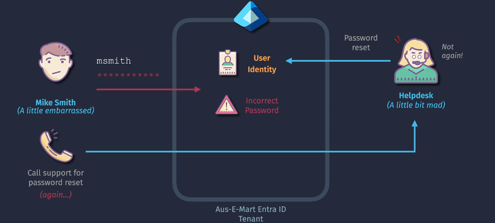
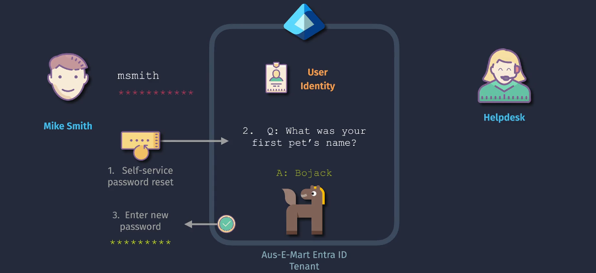
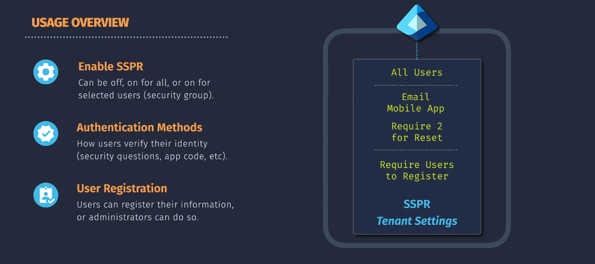

# Microsoft Entra Self-Service Password Reset (SSPR)

**Self-Service Password Reset (SSPR)** is a feature in Microsoft Entra ID that allows users to reset their passwords or unlock their accounts without needing to contact IT support. This helps reduce downtime and support costs by empowering users to resolve common password issues on their own.

## Implementations

### 1. Enable SSPR

1. **Sign in to the Entra Admin Center**:

   - Go to the [Microsoft Entra admin center](https://entra.microsoft.com) and sign in with an account that has administrative permissions.

2. **Navigate to SSPR Settings**:

   - In the left-hand menu, select **Azure Active Directory**.
   - Under **Security**, select **Password reset**.

3. **Enable SSPR**:

   - On the **Properties** page, toggle the **Self-service password reset** setting to **Selected**.
   - Choose the users or groups for whom you want to enable SSPR. You can select specific groups or enable it for all users.

4. **Save Changes**:
   - Click **Save** to apply the changes.

### 2. Authentication Methods

1. **Navigate to Authentication Methods**:

   - In the SSPR settings under **Password reset**, select **Authentication methods**.

2. **Configure Methods**:

   - Choose the authentication methods users can use to verify their identity when resetting their password. Common methods include:
     - **Email**: Users receive a verification code via email.
     - **Mobile Phone**: Users receive a verification code via SMS.
     - **Security Questions**: Users answer predefined security questions.
     - **Mobile App Notification**: Users receive a notification on a registered mobile app.
     - **Mobile App Code**: Users enter a code generated by a registered mobile app.

3. **Set Number of Methods Required**:

   - Specify how many methods users must verify before they can reset their password. Typically, one or two methods are required.

4. **Save Changes**:
   - Click **Save** to apply the settings.

### 3. User Registration

1. **Registration Policy**:

   - In the SSPR settings, select **Registration**.

2. **Require Users to Register**:

   - Enable the option to **Require users to register when signing in**. This forces users to register their authentication methods during their next sign-in.

3. **Specify Registration Requirements**:

   - Set how often users need to re-confirm their authentication information. For example, you might require users to re-confirm their information every 180 days.

4. **Notify Users**:

   - Inform your users about the SSPR feature and guide them on how to register their authentication methods. You can use email notifications or internal communication channels.

5. **Monitor Registration**:
   - Use the reporting tools in the Entra admin center to monitor user registration status and ensure compliance.

## Important Considerations

1. **Settings and Scope**:

   - **Non-Admin Users**: SSPR settings you configure will apply to non-administrative users. For administrators, the default policies will apply unless specifically configured otherwise.
   - **Scope**: Carefully select the users or groups that need SSPR. Start with a pilot group to test and gather feedback before rolling out to the entire organization.

2. **Licensing Requirements**:

   - **M365 Licensing**: At least Microsoft 365 licensing is required to use SSPR.
   - **Premium Licensing**: For more advanced features, such as password writeback in hybrid environments, you'll need Azure Active Directory Premium P1 licensing.

3. **Global Administrator Privileges**:

   - **Configuration**: Setting up SSPR requires global administrator privileges within Microsoft Entra ID. Ensure the appropriate administrators have the necessary permissions to configure and manage SSPR settings.

4. **Hybrid Identity Considerations**:

   - **Password Writeback**: If using SSPR with hybrid identities (integrated with on-premises Active Directory via Microsoft Entra Connect), you must enable password writeback.
   - **Infrastructure**: Ensure that your on-premises infrastructure is properly configured to support password writeback, including necessary firewall rules and network configurations.

5. **User Education and Training**:

   - **Awareness**: Inform users about SSPR and provide clear instructions on how to use it. Use internal communication channels like email or intranet announcements.
   - **Training**: Conduct training sessions or provide user guides to help users understand how to register for and use SSPR effectively.

6. **Monitoring and Reporting**:

   - **Registration Monitoring**: Use the reporting tools in the Entra admin center to monitor user registration status and compliance.
   - **Audit Logs**: Regularly review audit logs to ensure that SSPR is being used appropriately and to detect any potential security issues.

7. **Security Considerations**:
   - **Authentication Methods**: Choose secure and reliable authentication methods for identity verification. Consider requiring multiple methods to enhance security.
   - **Regular Reviews**: Periodically review and update SSPR policies and settings to adapt to changing security requirements and organizational needs.

## Summary

Implementing SSPR in Microsoft Entra ID involves careful planning and consideration of settings, licensing, user training, and security measures. By addressing these key considerations, you can ensure a smooth and secure rollout of SSPR, empowering users to reset their passwords independently while maintaining strong security practices.

**References**:

- [Microsoft Entra SSPR Documentation](https://learn.microsoft.com/en-us/azure/active-directory/authentication/tutorial-sspr)
