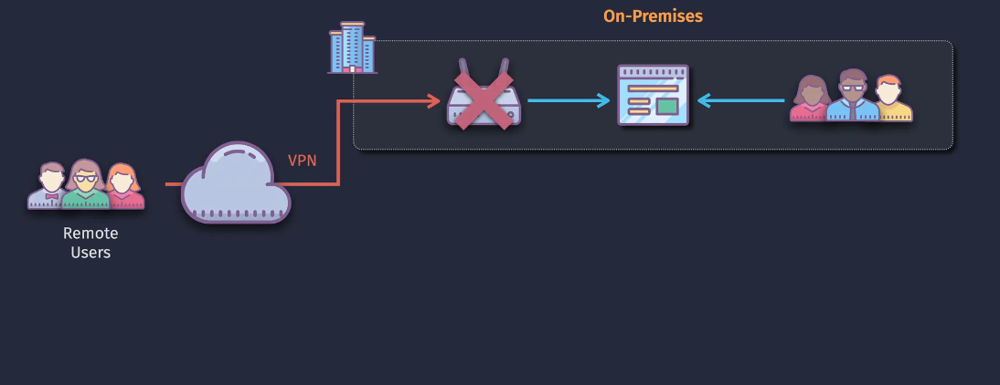
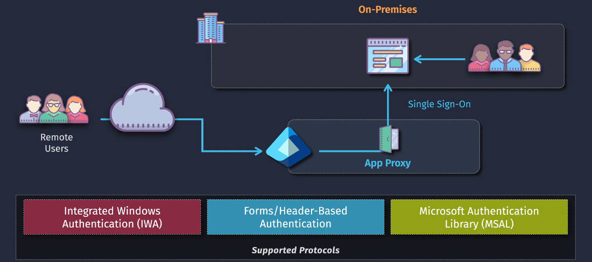
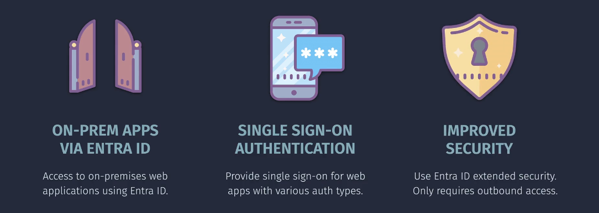
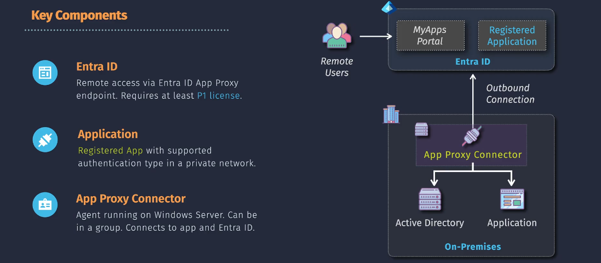
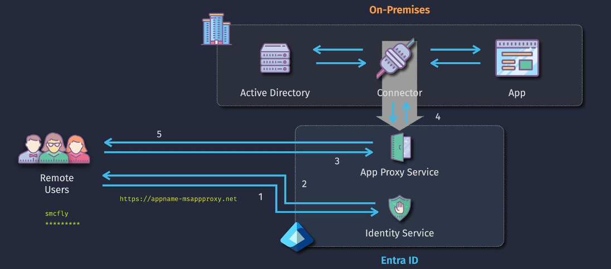

# Microsoft Entra Application Proxy

**Microsoft Entra Application Proxy** allows users to securely access on-premises applications from anywhere, without needing a VPN. It provides **secure remote access** and **single sign-on (SSO)** capabilities, making it easy for users to connect to internal applications as if they were cloud-based.

**Example Scenario:**

Imagine an employee needs to access an internal SharePoint site while working from home:

1. **Access Application Proxy**: The employee navigates to the external URL provided by the application proxy.
2. **Single Sign-On**: They sign in using their Microsoft Entra ID credentials.
3. **Secure Access**: The application proxy securely routes the request to the on-premises SharePoint server.

## Key Features

1. **Integration with Microsoft Entra ID**: Leverages existing Microsoft Entra ID infrastructure for authentication and authorization.
2. **Single Sign-On (SSO)**: Users sign in once and gain access to both cloud and on-premises applications.
3. **Secure Remote Access**: Users can access on-premises applications securely over the internet.
4. **No Firewall Changes**: No need to open inbound connections through your firewall.

## How Microsoft Entra Application Proxy Works

**Microsoft Entra Application Proxy** acts as a bridge between users and on-premises applications, allowing secure remote access without the need for a VPN. Here’s a step-by-step breakdown of how it works:

### 1. **User Requests Access**

- A user attempts to access an on-premises application from a remote location via a web browser.

### 2. **Authentication via Microsoft Entra ID**

- The user's request is routed to Microsoft Entra ID for authentication.
- The user logs in using their Microsoft Entra ID credentials. Conditional Access policies can be applied here, requiring multifactor authentication (MFA) if needed.

### 3. **Proxy Connector**

- The request is then securely forwarded to the Microsoft Entra Application Proxy connector, which is installed on a server in the corporate network.
- This connector doesn't require any inbound connections from the internet, enhancing security.

### 4. **Securely Routes Request**

- The connector securely routes the authenticated request to the on-premises application.

### 5. **Application Response**

- The on-premises application processes the request and sends the response back through the connector.
- The response is securely returned to the user via the Application Proxy.

### Example Flow

1. **User Access**: An employee working from home accesses the company’s internal SharePoint site using a URL provided by Application Proxy.
2. **Authentication**: The employee is prompted to authenticate with Microsoft Entra ID and complete MFA.
3. **Proxy Connector**: The request is securely routed through the Application Proxy connector to the on-premises SharePoint server.
4. **Response**: The SharePoint server processes the request and the data is sent back through the connector to the employee’s browser.

## Summary

Microsoft Entra Application Proxy simplifies secure access to on-premises applications by acting as an intermediary between users and internal resources. It ensures that users can securely access applications from anywhere, without compromising security or requiring complex infrastructure changes.

**References**:

- [Microsoft Entra Application Proxy Documentation](https://learn.microsoft.com/en-us/azure/active-directory/app-proxy/what-is-application-proxy)
