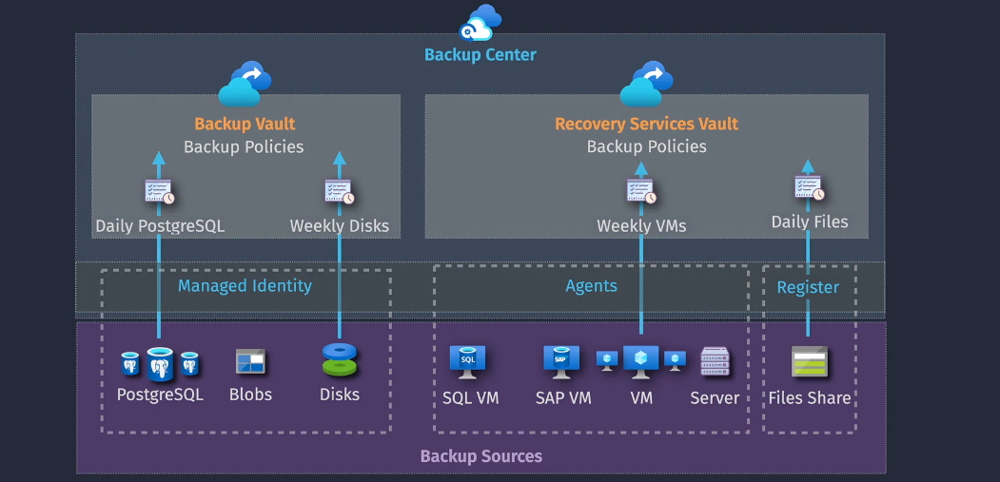

# Azure Backup

**Azure Backup** is a cloud-based service provided by Microsoft that offers simple, secure, and cost-effective solutions for backing up your data and recovering it from the Microsoft Azure cloud


## Key Features

Azure Backup is like a magical safety net for your important stuff in the cloud. It helps you save copies of your data so you don't lose anything, even if something goes wrong.


### **App Consistent Backups**

**Azure App Consistent Backups** ensure that your applications are in a consistent state when backups are taken, which is crucial for applications that require transactional consistency. This means that when you restore from an **App Consistent Backup**, your applications start up correctly without requiring additional fixes.

### **Short to Long-term Retention**

**Long-term Retention** means Azure Backup can save your data for many years, so you can always go back and find it whenever you need it.

### **Comprehensive Compatibility**

Azure Backup can protect almost everything! Whether you're using Windows or Linux computers, virtual machines, databases, or apps, it can back them up. It's like having a superhero that can save any toy you have, no matter what it is.

## Key Components


Azure Backup has three main parts that work together to keep your data safe:

### **1. Vault**

A **Vault** is like a big, secure treasure chest in the cloud. This is where all your backup copies are stored. Only you and the people you trust can open it and see what's inside.

A **Vault** is an entity that stores the backups and restore points created over time. the vault also contains the backup policies that are associated with the protected virtual machines.

**Vault Types:**

1. **Recovery Services Vault**

   - **Purpose**: Modern vault used for backing up and recovering **Azure resources**.
   - **Model**: Azure Resource Manager (ARM).
   - **Capabilities**: Central monitoring, soft delete, cross-region restore, Azure RBAC.
   - **Supported Data Sources**:
     - Azure IaaS VMs (Linux and Windows)
     - SQL Server in Azure VMs
     - Azure Files (Azure Storage)
     - SAP HANA in Azure VMs
     - Azure Backup Server
     - Azure Backup Agent
     - System Center Data Protection Manager (DPM)

2. **Backup Vault**

   - **Purpose**: Legacy vault used for basic backups.
   - **Model**: Azure Service Manager (ASM).
   - **Capabilities**: Basic backup and restore functionalities.
   - **Supported Data Sources**:
     - Azure Disks
     - Azure Blobs
     - Azure Database for PostgreSQL servers

### **2. Backup Policy**

A **Backup Policy** is like a schedule for when you save your game. It tells Azure Backup how often to make copies of your data and how long to keep them. For example, you might want to save a new copy every day and keep each copy for a month.

### **3. Backup Item**

A **Backup Item** is the actual game you want to save. It can be a file, a folder, a virtual machine, or an application. Each item you want to back up is treated separately, so you can manage them easily.

## Implementation Overview

Setting up Azure Backup is like building a LEGO set. You put all the pieces together to create a strong and safe system for your data. Before you start the building process, it's important to understand all the parts you'll be working with:


### Steps to Implement Azure Backup

1. **Create a Recovery Services Vault:**

   Start by setting up your main treasure chest in Azure. This vault will hold all your backups securely.

   ```bash
   az backup vault create --resource-group myResourceGroup --name myRecoveryVault --location eastus
   ```

2. **Define Backup Policies:**

   Decide how often you want to save your data and how long to keep the backups. This is like setting a schedule for saving your game progress.

   ```bash
   az backup policy create --resource-group myResourceGroup --vault-name myRecoveryVault --name myBackupPolicy --backup-management-type AzureIaasVM --policy @"policy.json"
   ```

   _Example `policy.json`:_

   ```json
   {
     "schedulePolicy": {
       "scheduleRunFrequency": "Daily",
       "scheduleRunTimes": ["2024-05-01T02:00:00Z"]
     },
     "retentionPolicy": {
       "retentionPolicyType": "LongTermRetentionPolicy",
       "dailyRetention": {
         "count": 30
       }
     }
   }
   ```

3. **Select Backup Items:**

   Choose which files, apps, or machines you want to protect. These are the specific games or projects you want to save.

   ```bash
   az backup protection enable-for-vm --resource-group myResourceGroup --vault-name myRecoveryVault --vm myVirtualMachine --policy-name myBackupPolicy
   ```

4. **Start Backing Up:**

   Let Azure Backup automatically save copies of your selected items based on your policies. It's like having an automatic save feature in your game that does the saving for you.

   ```bash
   az backup protection backup-now --resource-group myResourceGroup --vault-name myRecoveryVault --container-name myVMContainer --item-name myVirtualMachine
   ```

## Summary

**Azure Backup** is like having a reliable safety net for all your important digital stuff. Whether it's your school projects, favorite games, or business data, Azure Backup ensures that you always have a copy saved and ready to use if something goes wrong.

- **Key Features:** It keeps your backups neat, stores them for a long time, and works with almost everything.
- **Key Components:** Vaults hold your backups, policies decide how and when to back up, and backup items are the things you're saving.
- **Implementation Overview:** Setting it up is simple and organized, much like following instructions to build a LEGO set. You also interact with important parts like the Recovery Services Vault, Backup Vault, and Backup Store to ensure everything is secure and well-managed.
- **App Service Backup:** Protects your websites and apps, making sure your online presence is always safe.
- **Azure Site Recovery:** Acts as a backup playground, ready to take over if your main one faces issues.
