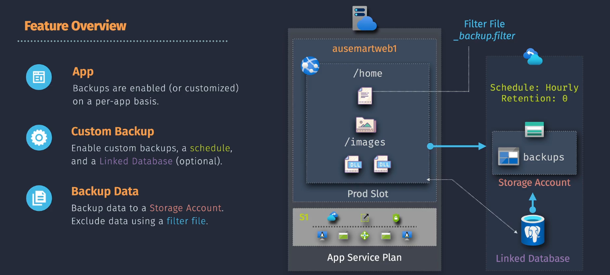
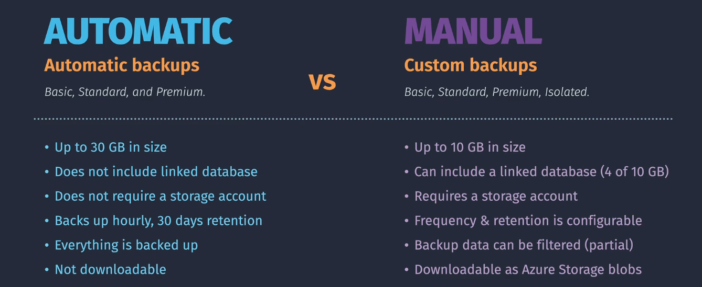

# Azure App Service Backup

**Azure App Service Backup** is a feature that allows you to create automated and manual backups of your web applications and their associated data. This helps protect your applications from data loss, corruption, and other issues, ensuring that you can restore them to a previous state if needed.



## **Key Features**

1. **Automated Backups**: Azure schedules and manages backups for your web applications at regular intervals. This is ideal for routine backups with minimal user intervention.
2. **Custom Backups**: You can create on-demand backups whenever needed. This provides flexibility for specific backup requirements.
3. **Backup Content**: Backups can include the app configuration, file system content, and any connected databases such as SQL Database, Azure Database for MySQL, or MongoDB.
4. **Retention Policies**: You can set retention policies to manage how long backups are kept, helping to manage storage costs.
5. **Encrypted Backups**: Data in backups is encrypted to ensure security and compliance with data protection regulations.
6. **Restore Options**: You can restore backups by overwriting an existing app or by restoring to a new app or slot.

## **Use Cases**

- **Data Protection**: Regularly backing up your app to protect against accidental deletions, data corruption, or application errors.
- **Testing and Development**: Create backups before deploying changes to ensure you can easily revert if something goes wrong.
- **Disaster Recovery**: Quickly restore your app to a previous state in case of a major failure or disaster.

## **Automatic vs. Manual Backups**



| Feature                            | Automatic Backups                             | Manual Backups                                                                      |
| ---------------------------------- | --------------------------------------------- | ----------------------------------------------------------------------------------- |
| **Initiation**                     | Scheduled and managed by Azure                | Initiated by the user                                                               |
| **Frequency**                      | Regular intervals (e.g., daily)               | On-demand                                                                           |
| **Configuration**                  | Limited or predetermined settings             | User-defined settings                                                               |
| **Convenience**                    | Easier to set up and requires less management | Requires more user involvement and setup                                            |
| **Retention Policy**               | Typically predefined by Azure                 | User-defined, allowing flexibility                                                  |
| **Backup Size**                    | 30 GB                                         | 10 GB, with 4 GB for linked databases                                               |
| **Linked Database**                | Not backed up                                 | SQL Database, Azure Database for MySQL, Azure Database for PostgreSQL, MySQL in-app |
| **Storage Account**                | Not required                                  | Required                                                                            |
| **Downloadable**                   | No                                            | Yes, as Azure Storage blobs                                                         |
| **Partial Backups**                | Not supported                                 | Supported                                                                           |
| **Backups over a Virtual Network** | Not supported                                 | Supported                                                                           |

You're right! Let me add the details on using the **\_backup.filter** file with a sample.

## **How It Works**

1. **Configuring Backups**: In the Azure portal, navigate to your App Service app, then go to the 'Backups' option. You can set up scheduled backups and specify what content and databases to include in the backup.
2. **Running Backups**: Azure App Service will automatically perform backups based on the schedule you've configured.
3. **Restoring Backups**: In the event of data loss or corruption, you can restore your app from a backup. The restore process can target the existing app or a new app, allowing for flexibility in recovery scenarios.

## **Filtering with \_backup.filter in App Service Backup**

The **\_backup.filter** file allows you to specify which files or folders should be excluded from a manual backup in Azure App Service. This helps you control what gets backed up and what doesn't, reducing backup size and focusing on essential data.

### **Steps to Use \_backup.filter**

1. **Create the File**:

   - Create a text file named **\_backup.filter**.

2. **List Exclusions**:

   - Add the paths of the files or folders you want to exclude. Each path should be on a new line.

3. **Upload the File**:

   - Place the **\_backup.filter** file in the root directory of your web app (typically the **wwwroot** folder).

4. **Run the Backup**:
   - When you initiate a manual backup, Azure App Service will automatically read the **\_backup.filter** file and exclude the listed items.

### **Sample \_backup.filter File**

```text
# Exclude the temp folder
/temp

# Exclude log files
/logs/*

# Exclude specific file
/secrets.txt
```

## **Integration with Other Services**

While Azure App Service Backup focuses on protecting your web applications, it can be integrated with other Azure services for a comprehensive backup and disaster recovery strategy. For example, you can use **Azure Site Recovery** to replicate entire workloads and ensure business continuity during outages.
