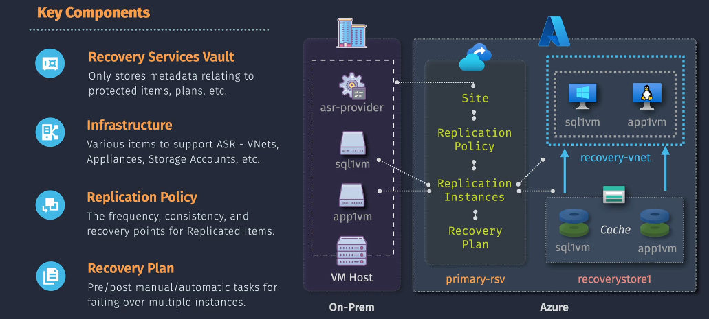

# **Azure Site Recovery Made Simple**

Imagine you have a favorite toy. You love it so much that you always want to make sure it’s safe, no matter what happens. What if something bad happens, like your toy breaks or gets lost? You’d want a backup plan, right? Maybe you have a spare toy stored safely somewhere else. This way, if something happens to your favorite toy, you can quickly get the backup and keep playing without much interruption.

**Azure Site Recovery (ASR)** works just like that backup plan, but for your business’s important computer systems and data. Let’s break it down in the simplest way possible!

## **What is Azure Site Recovery?**

Azure Site Recovery is a service from Microsoft that helps protect your business’s computer systems and data. It makes sure that if something goes wrong—like a power outage, a natural disaster, or a cyber-attack—your business can keep running by quickly switching to a backup system stored in the cloud (which is like a super-safe online storage).

## **Why Do You Need Azure Site Recovery?**

1. **Stay Open Even When Bad Things Happen:** If something unexpected stops your main systems, ASR helps you switch to a backup system quickly so your business doesn’t have to stop working.
2. **Save Money:** Instead of buying and maintaining extra hardware for backups, you use Azure’s cloud services, which can be cheaper and easier to manage.
3. **Protect Your Data:** ASR helps keep your important information safe and accessible, even during problems.
4. **Grow Easily:** Whether your business is small or big, ASR can adjust to fit your needs.

## **How Does Azure Site Recovery Work?**

### **1. Copying Your Data (Replication)**

ASR makes copies of your important data and systems and stores them in Azure’s cloud. It does this continuously, so your backup is always up-to-date.

### **2. Switching Over When Needed (Failover)**

If something goes wrong with your main systems, ASR can quickly switch your operations to the backup in Azure. This switch happens smoothly, so your business experiences very little downtime.

### **3. Going Back (Failback)**

Once your main systems are fixed, ASR can switch everything back from the cloud to your original setup without any hassle.

## **Key Features of Azure Site Recovery**

- **Works with Many Systems:** Whether you use Windows, Linux, VMware, or Hyper-V, ASR can handle it.
- **Automatic Protection:** It automatically keeps your backups updated without you having to do much.
- **Easy to Plan:** You can set up specific plans for how and when to switch to backups.
- **Monitors Health:** ASR constantly checks that your backups are working correctly and alerts you if there’s an issue.
- **Integrates with Other Azure Tools:** You can use other Microsoft Azure services to enhance your protection and performance.

## **Benefits of Using Azure Site Recovery**

- **Minimal Downtime:** Your business keeps running almost without interruption.
- **Simple Setup:** It’s easy to set up with guided steps and user-friendly interfaces.
- **Strong Security:** Your data is protected with Azure’s top security measures.
- **Flexible Options:** Choose to store your backups in Azure or another safe location.
- **Automatic Updates:** ASR stays up-to-date with the latest features automatically.

## **Real-Life Examples**

- **Retail Store:** During a big sale, if your online store’s servers crash due to too many visitors, ASR can switch to the backup quickly so customers can keep shopping without problems.
- **Healthcare Clinic:** Protect patient records from ransomware attacks by keeping a safe copy in Azure, ensuring doctors can always access important information.
- **Manufacturing Plant:** Avoid production delays by having backup systems ready if your main equipment fails.

## **Getting Started with Azure Site Recovery**

1. **Identify What to Protect:** Decide which applications and data are most important for your business.
2. **Set Up ASR:** Follow easy steps in Azure to start copying your data to the cloud.
3. **Create a Recovery Plan:** Plan how you’ll switch to backups if something goes wrong.
4. **Test Your Plan:** Regularly check to make sure everything works smoothly.
5. **Stay Protected:** Let ASR handle the backups while you focus on running your business.

## **Conclusion: Peace of Mind for Your Business**

Azure Site Recovery is like having a reliable backup plan that ensures your business can keep running smoothly, no matter what happens. It’s easy to set up, cost-effective, and keeps your important data safe. With ASR, you can focus on growing your business without worrying about unexpected disruptions.

**Ready to Protect Your Business?**  
Learn more about [Azure Site Recovery](https://azure.microsoft.com/en-us/services/site-recovery/) and give your business the safety it deserves!
