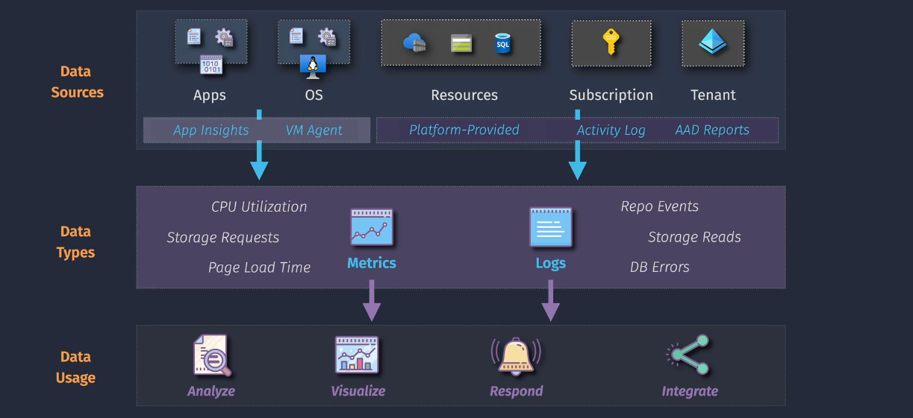

# Azure Monitoring

Azure Monitor is a comprehensive monitoring solution provided by Microsoft Azure. It helps you collect, analyze, and respond to monitoring data from your cloud and on-premises environments. It ensures that your applications and services are performing well and helps you troubleshoot issues quickly.

## **Key Features of Azure Monitor**

1. **Data Collection**: Azure Monitor collects data from various sources, including:

   - **Virtual Machines**: Monitor the performance and health of your VMs.
   - **Applications**: Track the performance and availability of your web apps and services.
   - **Containers**: Monitor the health and performance of your containerized applications.
   - **Databases**: Keep an eye on the performance and health of your databases.
   - **Custom Sources**: You can also integrate custom data sources using APIs.

2. **Data Analysis**: Once the data is collected, Azure Monitor analyzes it to provide insights into your system's performance and health. It uses tools like:

   - **Metrics**: Track performance indicators over time.
   - **Logs**: Store detailed information about events and operations.
   - **Traces**: Capture detailed information about the execution of your code.

3. **Visualization**: Azure Monitor provides various tools to visualize the collected data, helping you understand your system's performance:

   - **Dashboards**: Create custom dashboards to display key metrics and logs.
   - **Workbooks**: Build interactive reports that combine data from different sources.
   - **Power BI Integration**: Integrate with Power BI for advanced data visualization and reporting.

4. **Alerts and Notifications**: Set up alerts to notify you when specific conditions are met, such as performance issues or outages. You can configure automated actions to respond to these alerts, like restarting a VM or scaling out resources.

5. **Automated Actions**: Azure Monitor can automatically respond to issues by taking actions like:

   - **Autoscaling**: Automatically scale your resources based on the load.
   - **Automated Remediation**: Execute predefined actions to resolve issues without manual intervention.

6. **Integration with Other Tools**: Azure Monitor integrates with other Microsoft and third-party tools, such as:
   - **Azure Security Center**: Monitor and protect your resources.
   - **Azure Sentinel**: Use advanced threat detection and response.
   - **Third-Party Monitoring Tools**: Integrate with other monitoring and visualization tools.

## **Use Cases**

- **Performance Monitoring**: Keep track of the performance and health of your applications and infrastructure.
- **Troubleshooting**: Quickly identify and resolve issues affecting your services.
- **Disaster Recovery**: Ensure business continuity by monitoring and responding to outages.
- **Compliance**: Meet regulatory requirements by monitoring and logging data.

## **Getting Started with Azure Monitor**

1. **Set Up Data Collection**: Configure data collection for the resources you want to monitor.
2. **Create Dashboards**: Build dashboards to visualize key metrics and logs.
3. **Set Up Alerts**: Configure alerts to notify you of any issues or performance problems.
4. **Automate Responses**: Set up automated actions to respond to alerts and resolve issues.

## **Diagnostic Settings**

Diagnostic settings define what data to collect and where to send it. They help you monitor the performance, health, and usage of your Azure resources.

### **Key Components**

1. **Sources**: The type of data to collect, such as platform metrics, resource logs, and activity logs.
2. **Destinations**: Where the collected data is sent, such as:
   - **Log Analytics workspaces**: For detailed analysis and visualization.
   - **Azure Storage accounts**: For archiving data.
   - **Azure Event Hubs**: For streaming data to other systems.
   - **Azure Monitor Metrics**: For tracking performance indicators.

### **How to Configure Diagnostic Settings**

1. **Navigate to the Resource**: Go to the Azure portal and select the resource you want to monitor.
2. **Select Diagnostic Settings**: Under the "Monitoring" section, find and select "Diagnostic settings."
3. **Add Diagnostic Setting**: Click "Add diagnostic setting" to create a new configuration.
4. **Choose Data to Collect**: Select the metrics and logs you want to collect.
5. **Select Destinations**: Choose where you want to send the collected data.
6. **Save the Settings**: Save your configuration to start collecting and sending data.

### **Use Cases**

- **Performance Monitoring**: Track the performance and health of your applications and infrastructure.
- **Troubleshooting**: Quickly identify and resolve issues affecting your services.
- **Compliance**: Meet regulatory requirements by monitoring and logging data.
- **Disaster Recovery**: Ensure business continuity by monitoring and responding to outages.

### **Example Scenario**

Imagine you have an Azure Virtual Machine (VM) that you want to monitor. You can set up diagnostic settings to collect performance metrics and logs and send them to a Log Analytics workspace for analysis. This helps you keep an eye on the VM's health and performance and quickly troubleshoot any issues that arise.

## **Data Collection Rules**

Data Collection Rules are sets of instructions that specify:

- **What data to collect**: Metrics, logs, and other telemetry data from your resources.
- **How to process the data**: Transformations and filtering to clean and prepare the data.
- **Where to send the data**: Destinations like Log Analytics workspaces, Azure Storage accounts, or Event Hubs.

### **Key Features**

1. **Consistency**: Provides a standardized method for configuring data collection across different resources.
2. **Scalability**: Supports scalable configurations, making it suitable for large environments.
3. **Flexibility**: Allows for custom transformations and filtering of incoming data.
4. **Centralized Management**: DCRs are stored in Azure, allowing for centralized deployment and management.

### **How to Use Data Collection Rules**

1. **Create a DCR**: Define the data collection settings, including what data to collect, any transformations, and where to send the data.
2. **Associate the DCR**: Link the DCR to the resources you want to monitor. This can be done for multiple resources, and a single resource can have multiple DCRs.
3. **Manage and Monitor**: Use the Azure portal or CLI/PowerShell to manage your DCRs and monitor the collected data.

### **Example Scenario**

Imagine you have multiple virtual machines (VMs) in your Azure environment. You can create a DCR to collect performance metrics from these VMs, apply any necessary transformations, and send the data to a Log Analytics workspace for analysis. This ensures that you have consistent and centralized monitoring across all your VMs.

### **Use Cases**

- **Performance Monitoring**: Collect and analyze performance metrics to ensure your resources are running optimally.
- **Troubleshooting**: Quickly identify and resolve issues by analyzing detailed logs and metrics.
- **Compliance**: Meet regulatory requirements by collecting and storing telemetry data securely.
- **Disaster Recovery**: Ensure business continuity by monitoring the health and performance of your resources.

## **Data Collection Rules (DCRs)** 🆚 **Diagnostic Settings**

### **Diagnostic Settings**

#### **Purpose**:

- Collect and route platform metrics and logs from specific Azure resources to various destinations.

#### **Configuration**:

- Configured directly on individual resources.
- Specify what data (metrics, logs) to collect.
- Select destinations such as Log Analytics workspaces, Azure Storage, or Event Hubs.

#### **Scope**:

- Resource-specific: Each resource has its own diagnostic settings.
- More straightforward setup for collecting basic telemetry data.

#### **Example Use Case**:

- Setting up diagnostic settings on a Virtual Machine to send performance logs to a Log Analytics workspace for monitoring and troubleshooting.

### **Data Collection Rules (DCRs)**

#### **Purpose**:

- Provide a centralized and scalable way to define and manage data collection and processing for multiple resources.

#### **Configuration**:

- Defined as standalone rules that can be associated with multiple resources.
- More flexible and powerful, allowing custom transformations and filtering.
- Centralized management through Azure Monitor.

#### **Scope**:

- Multi-resource: A single DCR can be applied to multiple resources, making it easier to manage large environments.
- Supports complex data processing scenarios.

#### **Example Use Case**:

- Creating a DCR to collect performance metrics from a fleet of virtual machines, apply transformations to the data, and send it to a Log Analytics workspace.

### **Summary of Differences**

| Aspect            | Diagnostic Settings                    | Data Collection Rules (DCRs)                   |
| ----------------- | -------------------------------------- | ---------------------------------------------- |
| **Purpose**       | Collect and route basic telemetry data | Centralized and scalable data collection       |
| **Configuration** | Resource-specific settings             | Standalone rules applied to multiple resources |
| **Flexibility**   | Basic data collection                  | Advanced transformations and filtering         |
| **Management**    | Configured on individual resources     | Centralized management through Azure Monitor   |
| **Scope**         | Limited to specific resources          | Scalable across multiple resources             |

### **When to Use Each**

- **Diagnostic Settings**: Use for simple and direct telemetry data collection from individual resources.
- **Data Collection Rules**: Use for complex, scalable data collection and processing needs across multiple resources.

I hope this clarifies the differences for you! If you have any more questions or need further details, feel free to ask.
