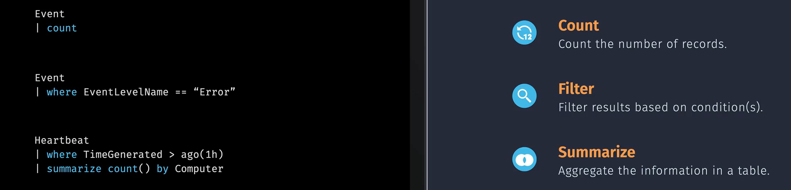

# **Azure Monitor Logs**

**Azure Monitor Logs** is a centralized platform for collecting, analyzing, and acting on telemetry data generated by both Azure and non-Azure resources and applications. Here are some key points:

## **Key Components**

- **Data Collection**: Azure Monitor Logs collects data from various sources, including applications, operating systems, and devices. This data can be ingested in real-time or in batches.
- **Log Analytics Workspace**: The primary resource in Azure Monitor Logs is the **Log Analytics workspace**, which is a data store that holds tables into which you collect data. You can manage and optimize log data and costs within this workspace.
- **Data Transformation**: You can transform data based on your needs, such as optimizing costs, removing personal data, and routing data to tables in your Log Analytics workspace.
- **Querying Data**: You can retrieve data using the **Kusto Query Language (KQL)**, which allows for powerful and flexible querying capabilities. There are also tools and features that don't require KQL knowledge, like the Simple mode in the Log Analytics user interface.
- **Use Cases**: Azure Monitor Logs can be used for a variety of purposes, including troubleshooting, alerting, dashboards, reports, and custom applications.

## **Implementation**

### 1. Log Analytics Workspace

### 2. Connect to Agent

### 3. KUSTO KQL

