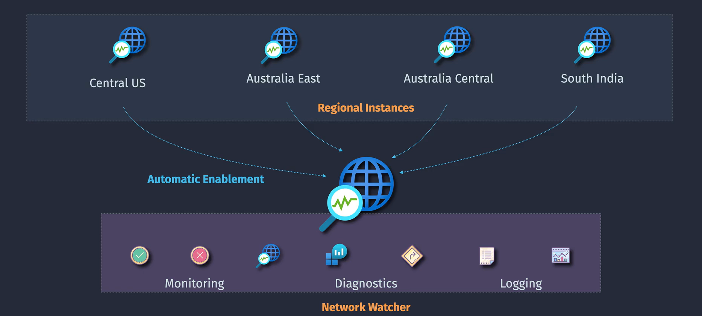

# Azure Network Watcher

**Azure Network Watcher** is like having a smart security camera and a control center for all your network activities in the cloud. It helps you monitor, diagnose, and gain insights into your network traffic, ensuring everything runs smoothly and securely. Whether you're managing virtual networks, diagnosing connectivity issues, or analyzing traffic patterns, Azure Network Watcher provides the tools you need to keep your network healthy and efficient.

## Introduction

Azure Network Watcher is a comprehensive tool provided by Microsoft Azure to monitor, diagnose, and gain insights into your network infrastructure. It is designed to help administrators and engineers manage their Azure network effectively by offering a suite of diagnostic, monitoring, and logging features.

## Key Benefits

1. **Monitoring:** Ensures the health and performance of your Azure network.

2. **Diagnostics:** Identifies and resolves connectivity, routing, and security issues.

3. **Logging:** Tracks network activity for analysis and compliance.

## **1. Monitor Features**

### **1.1. Topology**

- **What it does:** Creates a visual map of your Azure network.\n- **Why it’s useful:** Helps you understand how your resources (like VMs, subnets, and network interfaces) are connected.\n- **Example:** You can quickly see which VM is connected to which subnet and if the connections are properly configured.

### **1.2. Connection Monitor**

- **What it does:** Continuously checks connectivity between two points (e.g., your VM and a website).\n- **Why it’s useful:** Identifies issues like packet loss or high latency.\n- **Example:** Monitor the connection between your web app and the database to ensure there’s no downtime.

## **2. Diagnostic Features**

### **2.1. IP Flow Verify (NSG)**

- **What it does:** Checks if a connection between a source and a destination is allowed or blocked.\n- **Why it’s useful:** Helps debug network security rules (NSGs).\n- **Example:** Verify why a VM cannot communicate with a database by testing if the NSG is blocking traffic.

### **2.2. Effective Security Rules (NSG)**

- **What it does:** Shows all active security rules on a network interface.\n- **Why it’s useful:** Helps find conflicts in NSG rules.\n- **Example:** See why traffic is blocked, even when you think your rules allow it.

### **2.3. Next Hop**

- **What it does:** Tells you where a packet will go next from a specific VM.\n- **Why it’s useful:** Helps debug routing issues.\n- **Example:** If traffic is going to the wrong gateway, use this tool to find and fix the problem.

### **2.4. Packet Capture**

- **What it does:** Records network traffic for analysis.\n- **Why it’s useful:** Debugs complex network issues by letting you see raw traffic data.\n- **Example:** Capture packets to investigate slow communication between your app and a third-party service.

### **2.5. Connection Troubleshooting**

- **What it does:** Tests connectivity between two resources.\n- **Why it’s useful:** Finds problems like blocked ports or unreachable destinations.\n- **Example:** Diagnose why your web app cannot connect to the internet.

### **2.6. VPN Troubleshooting**

- **What it does:** Checks the health of your VPN gateway and connections.\n- **Why it’s useful:** Fixes VPN issues like failed connections.\n- **Example:** Diagnose why your users cannot access Azure resources through the VPN.

---

## **3. Logging Features**

### **3.1. NSG Flow Logs**

- **What it does:** Logs all allowed or denied traffic through an NSG.\n- **Why it’s useful:** Tracks network activity for security and troubleshooting.\n- **Example:** Use these logs to detect unusual traffic patterns or blocked connections.

### **3.2. Traffic Analysis**

- **What it does:** Provides detailed insights into network traffic using data from NSG flow logs.\n- **Why it’s useful:** Helps you understand bandwidth usage and security risks.\n- **Example:** Find out which VMs are consuming the most bandwidth or generating suspicious traffic.

## Implementation Overview

Setting up Azure Network Watcher is like installing a comprehensive security and monitoring system for your home network. You set up sensors (diagnostic tools), create visual maps (topology), and receive alerts when something unusual happens. Here's a simple way to understand how it works:

1. **Enable Network Watcher:** Start by turning on Network Watcher in your Azure subscription.
2. **Configure Diagnostic Tools:** Set up the tools you need to monitor and diagnose your network.
3. **Connect Data Sources:** Link your virtual networks and resources to Network Watcher for continuous monitoring.
4. **Analyze and Visualize:** Use the tools to visualize your network topology and analyze traffic patterns.
5. **Set Up Alerts:** Define alert rules to get notified about important network events.
6. **Respond to Issues:** Use the diagnostic tools to troubleshoot and resolve any network problems.

## **Summary**

- **Monitor Features:** Help you visualize and keep an eye on your network connections.\n- **Diagnostic Features:** Help you troubleshoot specific issues with security, routing, or connectivity.\n- **Logging Features:** Capture and analyze traffic data for monitoring and security.
