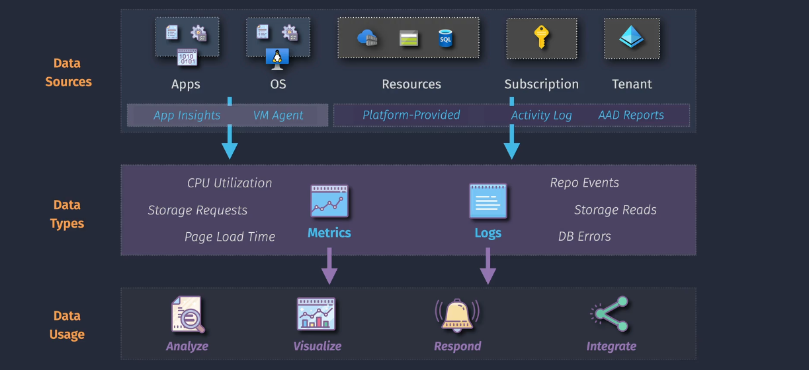

# Azure Monitoring

Azure Monitor is a comprehensive monitoring solution provided by Microsoft Azure. It helps you collect, analyze, and respond to monitoring data from your cloud and on-premises environments. It ensures that your applications and services are performing well and helps you troubleshoot issues quickly.

## **Key Features of Azure Monitor**

1. **Data Collection**: Azure Monitor collects data from various sources, including:

   - **Virtual Machines**: Monitor the performance and health of your VMs.
   - **Applications**: Track the performance and availability of your web apps and services.
   - **Containers**: Monitor the health and performance of your containerized applications.
   - **Databases**: Keep an eye on the performance and health of your databases.
   - **Custom Sources**: You can also integrate custom data sources using APIs.

2. **Data Analysis**: Once the data is collected, Azure Monitor analyzes it to provide insights into your system's performance and health. It uses tools like:

   - **Metrics**: Track performance indicators over time.
   - **Logs**: Store detailed information about events and operations.
   - **Traces**: Capture detailed information about the execution of your code.

3. **Visualization**: Azure Monitor provides various tools to visualize the collected data, helping you understand your system's performance:

   - **Dashboards**: Create custom dashboards to display key metrics and logs.
   - **Workbooks**: Build interactive reports that combine data from different sources.
   - **Power BI Integration**: Integrate with Power BI for advanced data visualization and reporting.

4. **Alerts and Notifications**: Set up alerts to notify you when specific conditions are met, such as performance issues or outages. You can configure automated actions to respond to these alerts, like restarting a VM or scaling out resources.

5. **Automated Actions**: Azure Monitor can automatically respond to issues by taking actions like:

   - **Autoscaling**: Automatically scale your resources based on the load.
   - **Automated Remediation**: Execute predefined actions to resolve issues without manual intervention.

6. **Integration with Other Tools**: Azure Monitor integrates with other Microsoft and third-party tools, such as:
   - **Azure Security Center**: Monitor and protect your resources.
   - **Azure Sentinel**: Use advanced threat detection and response.
   - **Third-Party Monitoring Tools**: Integrate with other monitoring and visualization tools.

## **Use Cases**

- **Performance Monitoring**: Keep track of the performance and health of your applications and infrastructure.
- **Troubleshooting**: Quickly identify and resolve issues affecting your services.
- **Disaster Recovery**: Ensure business continuity by monitoring and responding to outages.
- **Compliance**: Meet regulatory requirements by monitoring and logging data.

## **Getting Started with Azure Monitor**

1. **Set Up Data Collection**: Configure data collection for the resources you want to monitor.
2. **Create Dashboards**: Build dashboards to visualize key metrics and logs.
3. **Set Up Alerts**: Configure alerts to notify you of any issues or performance problems.
4. **Automate Responses**: Set up automated actions to respond to alerts and resolve issues.
