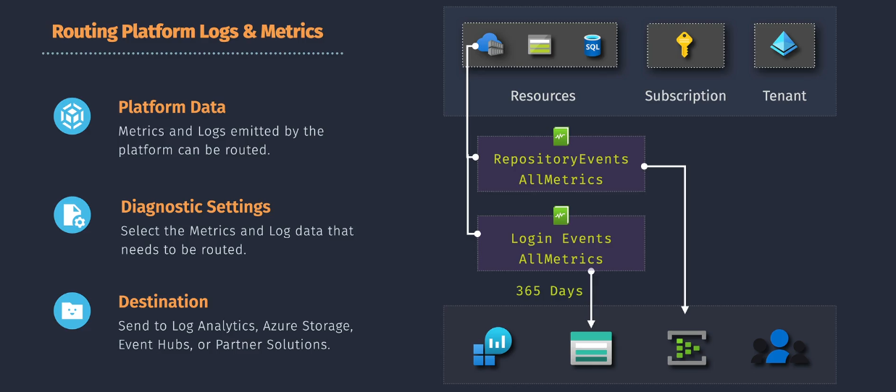
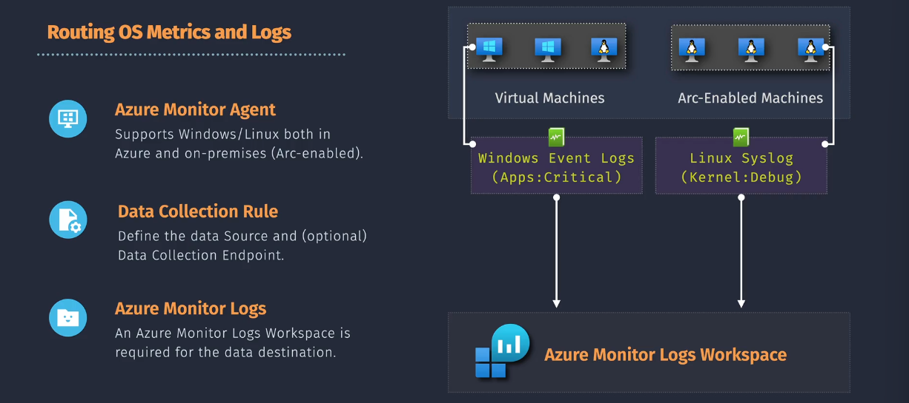

# Collecting Data From Az Resources

**Diagnostic Settings** and **Data Collection Rules (DCRs)** are two important features that help you collect and manage telemetry data from your resources. While they may seem similar at first glance, they serve different purposes and offer distinct capabilities.

## **Diagnostic Settings**

**Diagnostic Settings** are configurations that allow you to collect diagnostic data (**logs** and **metrics**) from your Azure resources. This data helps you monitor the health, performance, and usage of your resources.

### **Key Components**

1. **Sources**: The type of data to collect, such as **platform metrics**, **resource logs**, and **activity logs**.
2. **Destinations**: Where the collected data is sent, such as:
   - **Log Analytics workspaces**: For detailed analysis and visualization.
   - **Azure Storage accounts**: For archiving data.
   - **Azure Event Hubs**: For streaming data to other systems.
   - **Azure Monitor Metrics**: For tracking performance indicators.
3. **Basic Configuration:** Easy to set up with predefined options for most Azure services.

### **How to Configure Diagnostic Settings**

1. **Navigate to the Resource**: Go to the Azure portal and select the resource you want to monitor.
2. **Select Diagnostic Settings**: Under the "Monitoring" section, find and select "Diagnostic settings."
3. **Add Diagnostic Setting**: Click "Add diagnostic setting" to create a new configuration.
4. **Choose Data to Collect**: Select the metrics and logs you want to collect.
5. **Select Destinations**: Choose where you want to send the collected data.
6. **Save the Settings**: Save your configuration to start collecting and sending data.

### **Use Cases**

- **Performance Monitoring**: Track the performance and health of your applications and infrastructure.
- **Troubleshooting**: Quickly identify and resolve issues affecting your services.
- **Compliance**: Meet regulatory requirements by monitoring and logging data.
- **Disaster Recovery**: Ensure business continuity by monitoring and responding to outages.

### **Example Scenario**

Imagine you have an Azure Virtual Machine (VM) that you want to monitor. You can set up diagnostic settings to collect performance metrics and logs and send them to a Log Analytics workspace for analysis. This helps you keep an eye on the VM's health and performance and quickly troubleshoot any issues that arise.

## **Data Collection Rules (DCRs)**

**Data Collection Rules (DCRs)** provide a more flexible and granular approach to collecting telemetry data from your Azure resources `(multiple resources)`. They allow you to define exactly what data to collect and where to send it, offering enhanced control over your monitoring setup.

### **Key Features**

1. **Consistency**: Provides a standardized method for configuring data collection across different resources.
2. **Scalability**: Supports scalable configurations, making it suitable for large environments.
3. **Flexibility**: Allows for custom transformations and filtering of incoming data.
4. **Centralized Management**: DCRs are stored in Azure, allowing for centralized deployment and management.
5. **Advanced Configuration:** Support for complex scenarios, such as collecting custom logs or integrating with third-party services.
6. **Template Support:** Use JSON templates to define and deploy DCRs consistently across environments.

### **How to Use Data Collection Rules**

1. **Create a DCR**: Define the data collection settings, including what data to collect, any transformations, and where to send the data.
2. **Associate the DCR**: Link the DCR to the resources you want to monitor. This can be done for multiple resources, and a single resource can have multiple DCRs.
3. **Manage and Monitor**: Use the Azure portal or CLI/PowerShell to manage your DCRs and monitor the collected data.

### **Example Scenario**

Imagine you have multiple virtual machines (VMs) in your Azure environment. You can create a DCR to collect performance metrics from these VMs, apply any necessary transformations, and send the data to a Log Analytics workspace for analysis. This ensures that you have consistent and centralized monitoring across all your VMs.

### **Use Cases**

- **Performance Monitoring**: Collect and analyze performance metrics to ensure your resources are running optimally.
- **Troubleshooting**: Quickly identify and resolve issues by analyzing detailed logs and metrics.
- **Compliance**: Meet regulatory requirements by collecting and storing telemetry data securely.
- **Disaster Recovery**: Ensure business continuity by monitoring the health and performance of your resources.

## Diagnostic Settings 🆚 Data Collection Rules (DCRs)

### **Diagnostic Settings**

- **Resource-Specific Configuration**: Set up directly on individual Azure resources.
- **Basic Telemetry**: Primarily used for collecting standard platform metrics and logs.
- **Limited Transformation**: Focuses on straightforward data collection without advanced processing.
- **Direct Destinations**: Send data to Log Analytics, Azure Storage, or Event Hubs.

### **Data Collection Rules (DCRs)**

- **Centralized Management**: Define and manage data collection centrally, and apply rules to multiple resources.
- **Advanced Telemetry**: Can include more complex data types and custom metrics.
- **Data Transformation**: Supports transformations, filtering, and enrichment of collected data.
- **Flexible Destinations**: Send processed data to various Azure services and external tools.

### **Use Cases and Flexibility**

- **Diagnostic Settings**: Ideal for quick setup and monitoring of individual resources with basic needs. For example, if you want to monitor a single virtual machine and send its logs to a Log Analytics workspace, diagnostic settings are sufficient.
- **Data Collection Rules**: Suitable for large-scale environments where you need consistent, centralized, and complex data collection across multiple resources. For example, in a large enterprise with many VMs, databases, and services, you can use DCRs to collect and process telemetry data in a standardized way.

### **Summary**

| Aspect              | Diagnostic Settings          | Data Collection Rules (DCRs)             |
| ------------------- | ---------------------------- | ---------------------------------------- |
| **Scope**           | Single resource              | Multiple resources                       |
| **Configuration**   | Set on each resource         | Centralized and reusable                 |
| **Data Processing** | Basic collection             | Advanced transformations and filtering   |
| **Usage**           | Simple setups                | Complex, scalable environments           |
| **Management**      | Individual resource settings | Centralized management via Azure Monitor |

### **Example Scenarios**

- **Diagnostic Settings**: Setting up monitoring for a web app to track error logs and performance metrics.
- **DCRs**: Collecting and transforming data from a fleet of IoT devices across different regions and sending it to a unified analytics platform.
