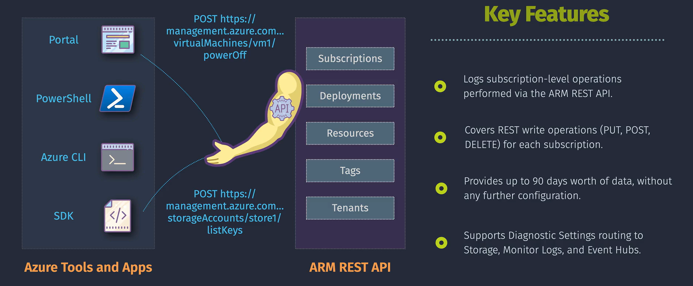

# Activity Logs

Azure Activity Logs are a **platform log** that provides insight into subscription-level events within your Azure environment. They record information about actions taken on resources in your subscription, such as when a resource is modified, a virtual machine is started, or a network security group is deleted.

## **Key points**

- **Event Types**: They capture create, update, delete, and action operations performed through Resource Manager.
- **Retention**: Activity log events are retained for **90 days** by default. You can extend this period by sending logs to a Log Analytics workspace.
- **Access**: You can view the activity logs from the Azure portal, and they can be filtered based on different criteria.
- **Insights**: Activity log insights provide dashboards that monitor changes to resources and resource groups, showing which users or services performed activities and their status.

## **Viewing Activity Logs**

### **Step-by-Step Guide to View Activity Logs**

1. **Navigate to Azure Portal**:

   - Open the Azure portal and sign in.

2. **Access Activity Logs**:

   - In the left-hand menu, select **"Monitor"** and then **"Activity Log"**.

3. **Filter Logs**:
   - Use the filter options to narrow down the logs by time range, resource, or specific operations.

## **Example Scenario**

Imagine you are an administrator managing several Azure resources. One day, you notice that one of your virtual machines (VMs) has been unexpectedly deleted. You want to find out who deleted the VM and when it happened.

### **Steps to Investigate Using Activity Logs**

1. **Go to Activity Logs**:

   - In the Azure portal, navigate to **"Monitor"** and select **"Activity Log"**.

2. **Set Filters**:

   - Filter the logs by the specific time range when the VM was deleted.

3. **View Details**:
   - Look for an entry related to the deletion of the VM. The log will provide details such as the time of the operation, the user who performed it, and any associated comments or details.

### **Components of an Activity Log Entry**

- **Timestamp**: When the operation occurred.
- **Resource**: The specific Azure resource involved in the activity.
- **Operation Name**: The name of the action performed (e.g., "Delete Virtual Machine").
- **Status**: The result of the operation (e.g., "Succeeded," "Failed").
- **Initiated By**: The user or system that initiated the operation.
- **Properties**: Additional details about the operation.

### **Example Activity Log Entry**

Here’s an example of an activity log entry you might find:

- **Timestamp**: 2024-11-27T10:00:00Z
- **Resource**: VM1
- **Operation Name**: Delete Virtual Machine
- **Status**: Succeeded
- **Initiated By**: _john.doe@example.com_
- **Properties**: "Deleted by user request for maintenance."

From this entry, you can see that the VM named "VM1" was deleted on November 27, 2024, at 10:00 AM UTC. The operation was initiated by the user _john.doe@example.com_ and was part of a maintenance activity.

## **Use Cases**

- **Audit and Compliance**: Track changes and activities for audit purposes and ensure compliance with organizational policies.
- **Security Monitoring**: Monitor login attempts and access changes to identify potential security threats.
- **Troubleshooting**: Investigate resource changes and operational issues by reviewing detailed activity logs.
- **Change Management**: Understand the history of changes to resources to manage and plan future changes effectively.
