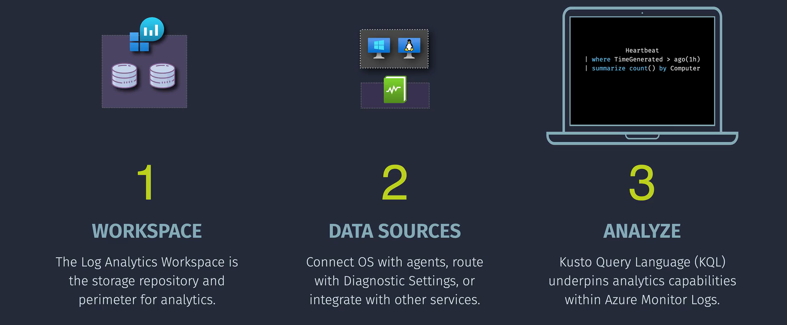

# **Azure Monitor Logs**

**Azure Monitor Logs** is a centralized platform for collecting, analyzing, and acting on telemetry data generated by both Azure and non-Azure resources and applications. Here are some key points:


## **Key Components**

- **Data Collection**: Azure Monitor Logs collects data from various sources, including applications, operating systems, and devices. This data can be ingested in real-time or in batches.

- **Log Analytics Workspace**: The primary resource in Azure Monitor Logs is the **Log Analytics workspace**, which is a data store that holds tables into which you collect data. You can manage and optimize log data and costs within this workspace.

- **Data Transformation**: You can transform data based on your needs, such as optimizing costs, removing personal data, and routing data to tables in your Log Analytics workspace.

- **Querying Data**: You can retrieve data using the **Kusto Query Language (KQL)**, which allows for powerful and flexible querying capabilities. There are also tools and features that don't require KQL knowledge, like the Simple mode in the Log Analytics user interface.
  

- **Use Cases**: Azure Monitor Logs can be used for a variety of purposes, including troubleshooting, alerting, dashboards, reports, and custom applications.

## Implementing Azure Monitor Logs for an Azure Virtual Machine



Let's walk through a simple demo to set up Azure Monitor Logs for an Azure Virtual Machine (VM). This will help you monitor the VM's performance and receive alerts if any issues arise.

### Step 1: Create a Log Analytics Workspace

1. **Log in to Azure Portal:**

   - Go to [Azure Portal](https://portal.azure.com/) and sign in with your Azure account.

2. **Create a Workspace:**

   - Click on **"Create a resource"**.
   - Search for **"Log Analytics Workspace"** and select it.
   - Click **"Create"**.

3. **Configure Workspace:**
   - **Subscription:** Choose your Azure subscription.
   - **Resource Group:** Select an existing resource group or create a new one.
   - **Name:** Enter a name for your workspace (e.g., `MyLogAnalyticsWorkspace`).
   - **Region:** Choose the same region as your VM for better performance.
   - Click **"Review + create"** and then **"Create"**.

### Step 2: Connect Your Azure VM to the Workspace

1. **Navigate to the VM:**

   - In the Azure Portal, go to **"Virtual Machines"** and select the VM you want to monitor.

2. **Enable Monitoring:**

   - In the VM's menu, under **"Monitoring"**, click on **"Insights"**.
   - If prompted, click **"Enable"** to set up monitoring.

3. **Select Workspace:**
   - Choose the **Log Analytics Workspace** you created earlier (`MyLogAnalyticsWorkspace`).
   - Click **"Apply"** to connect the VM to the workspace.

### Step 3: Configure Data Collection

1. **Go to Log Analytics Workspace:**

   - In the Azure Portal, navigate to **"Log Analytics Workspaces"** and select `MyLogAnalyticsWorkspace`.

2. **Configure Data Sources:**
   - Click on **"Agents management"**.
   - Under **"Windows Servers"** or **"Linux Servers"**, ensure that your VM is listed and data collection is enabled.
   - You can customize which logs and metrics to collect based on your needs.

### Step 4: Analyze and Visualize Logs

1. **Access Logs:**

   - In the **Log Analytics Workspace**, click on **"Logs"** under the **"General"** section.

2. **Run a Query:**

   - Use Kusto Query Language (KQL) to search and analyze your logs.
   - **Example Query:** To get CPU usage for your VM:

     ```kql
     Perf
     | where ObjectName == "Processor" and CounterName == "% Processor Time" and InstanceName == "_Total"
     | summarize avg(CounterValue) by bin(TimeGenerated, 5m)
     | render timechart
     ```

   - This query calculates the average CPU usage every 5 minutes and displays it as a time chart.

3. **Create a Dashboard:**
   - Click on **"Pin to dashboard"** to add the query results to your Azure dashboard for easy monitoring.

### Step 5: Set Up Alerts

1. **Define an Alert Rule:**

   - In the **Log Analytics Workspace**, go to **"Alerts"** and click **"New alert rule"**.

2. **Select Resource:**

   - Choose the **Log Analytics Workspace** as the resource.

3. **Configure Condition:**

   - Click on **"Add condition"**.
   - Use a query to define the alert criteria. For example, to alert when CPU usage is over 80%:

     ```kql
     Perf
     | where ObjectName == "Processor" and CounterName == "% Processor Time" and InstanceName == "_Total"
     | summarize avg(CounterValue) by bin(TimeGenerated, 5m)
     | where avg_CounterValue > 80
     ```

4. **Set Alert Details:**

   - **Alert Logic:** Define how often the condition should be checked.
   - **Action Group:** Specify who should be notified (e.g., email, SMS).

5. **Review and Create:**
   - Review your alert settings and click **"Create alert rule"**.

## Summary

**Azure Monitor Logs** is a powerful tool that helps you keep track of what's happening with your Azure resources. By collecting and analyzing logs, you can monitor performance, troubleshoot issues, and ensure your applications run smoothly.

- **Key Features:** Centralized log collection, advanced querying with KQL, real-time monitoring and alerts, integration with other Azure services, and customizable dashboards.
- **Key Components:** Log Analytics Workspace, Data Sources, Kusto Query Language (KQL), Alerts and Actions, and Dashboards.
- **Implementation Demo:** Walked through setting up Azure Monitor Logs for an Azure VM, including creating a workspace, connecting the VM, configuring data collection, analyzing logs, and setting up alerts.
