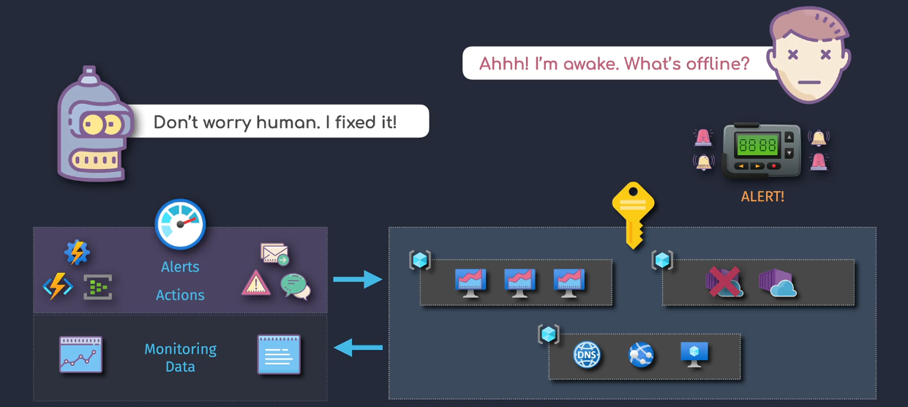
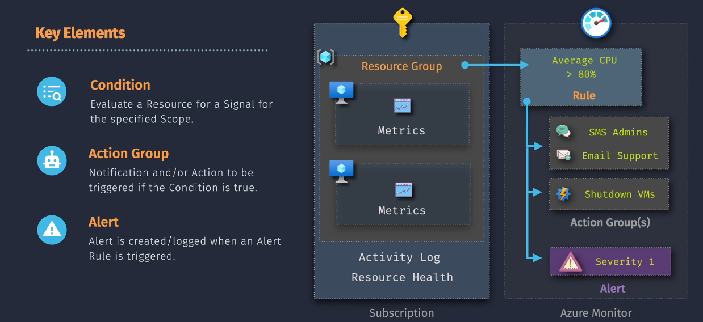

# Azure Monitor Alerts

**Azure Monitor Alerts** are like your personal alarm system for your cloud resources. They help you keep an eye on your applications and services by notifying you when something important happens, such as a performance issue or a security threat. This way, you can take action quickly to keep everything running smoothly.

## Key Features

Azure Monitor Alerts offer several powerful features to help you stay informed and maintain the health of your Azure environment:

### 1. **Real-time Notifications**

- **What It Does:** Sends alerts immediately when certain conditions are met.
- **Why It's Important:** Allows you to respond quickly to issues before they become bigger problems.

### 2. **Customizable Alert Rules**

- **What It Does:** Lets you define specific conditions that trigger alerts based on metrics, logs, or activity logs.
- **Why It's Important:** Provides flexibility to monitor exactly what matters most to your applications and services.

### 3. **Multiple Notification Channels**

- **What It Does:** Sends alerts through various channels such as email, SMS, push notifications, and webhooks.
- **Why It's Important:** Ensures you receive alerts in the most convenient and timely manner.

### 4. **Integration with Action Groups**

- **What It Does:** Connects alerts to predefined groups of actions like sending emails, calling webhooks, or triggering Azure Functions.
- **Why It's Important:** Automates responses to alerts, reducing the need for manual intervention.

### 5. **Historical Data and Analytics**

- **What It Does:** Keeps a history of alerts and provides insights into trends and patterns.
- **Why It's Important:** Helps you understand recurring issues and improve your monitoring strategy.

## Key Components

Azure Monitor Alerts consists of several key components that work together to provide effective monitoring and alerting:

### 1. **Alert Rules**

- **What It Is:** The conditions that define when an alert should be triggered.
- **Function:** Monitors specific metrics or logs and evaluates them against defined thresholds.

### 2. **Action Groups**

- **What It Is:** A collection of notification preferences and actions to take when an alert is triggered.
- **Function:** Specifies how and where to send alerts (e.g., email, SMS) and what actions to perform automatically.

### 3. **Alert Notifications**

- **What It Is:** The actual messages sent to you when an alert is triggered.
- **Function:** Informs you about the issue so you can take appropriate action.

### 4. **Incident Management**

- **What It Is:** Tools and features to manage and resolve alerts efficiently.
- **Function:** Helps track, investigate, and resolve issues highlighted by alerts.

## Implementation Overview

Setting up Azure Monitor Alerts is like setting up a home security system. You install sensors (alert rules) on doors and windows, connect them to an alarm system (action groups), and get notified immediately if something goes wrong. Here's a simple way to understand how it works:

1. **Define Alert Rules:** Decide what events or metrics you want to monitor.
2. **Create Action Groups:** Set up how you want to be notified and what actions to take.
3. **Link Alert Rules to Action Groups:** Connect your monitoring conditions to your notification preferences.
4. **Monitor and Respond:** Receive alerts and take necessary actions to resolve issues.

## Summary

**Azure Monitor Alerts** act as your early warning system, notifying you about important events and potential issues within your Azure environment. By setting up alerts, you can:

- **Stay Informed:** Receive real-time notifications about critical issues.
- **Enhance Security:** Monitor and respond to suspicious activities.
- **Maintain Performance:** Keep track of resource performance and address bottlenecks promptly.
- **Automate Responses:** Use action groups to automate tasks like sending notifications or triggering functions.
