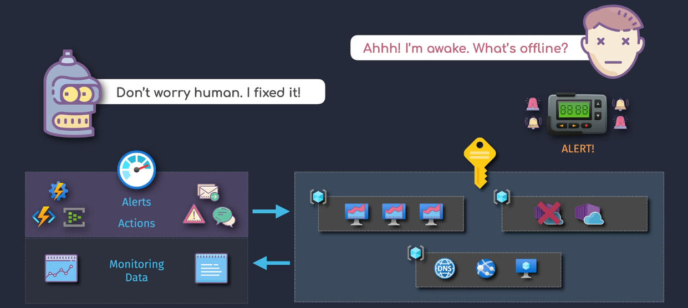
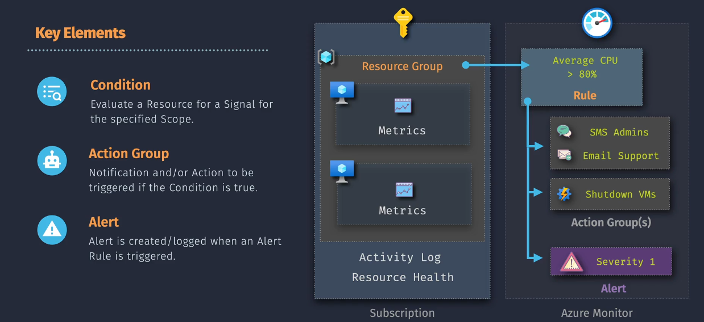

# Azure Monitor Alerts

## Introduction

**Azure Monitor Alerts** are like your personal alarm system for your cloud resources. They help you keep an eye on your applications and services by notifying you when something important happens, such as a performance issue or a security threat. This way, you can take action quickly to keep everything running smoothly.

## Key Features

Azure Monitor Alerts offer several powerful features to help you stay informed and maintain the health of your Azure environment:

### 1. **Real-time Notifications**

- **What It Does:** Sends alerts immediately when certain conditions are met.
- **Why It's Important:** Allows you to respond quickly to issues before they become bigger problems.

### 2. **Customizable Alert Rules**

- **What It Does:** Lets you define specific conditions that trigger alerts based on metrics, logs, or activity logs.
- **Why It's Important:** Provides flexibility to monitor exactly what matters most to your applications and services.

### 3. **Multiple Notification Channels**

- **What It Does:** Sends alerts through various channels such as email, SMS, push notifications, and webhooks.
- **Why It's Important:** Ensures you receive alerts in the most convenient and timely manner.

### 4. **Integration with Action Groups**

- **What It Does:** Connects alerts to predefined groups of actions like sending emails, calling webhooks, or triggering Azure Functions.
- **Why It's Important:** Automates responses to alerts, reducing the need for manual intervention.

### 5. **Historical Data and Analytics**

- **What It Does:** Keeps a history of alerts and provides insights into trends and patterns.
- **Why It's Important:** Helps you understand recurring issues and improve your monitoring strategy.

## Key Components

Azure Monitor Alerts consists of several key components that work together to provide effective monitoring and alerting:

### 1. **Alert Rules**

- **What It Is:** The conditions that define when an alert should be triggered.
- **Function:** Monitors specific metrics or logs and evaluates them against defined thresholds.

### 2. **Action Groups**

- **What It Is:** A collection of notification preferences and actions to take when an alert is triggered.
- **Function:** Specifies how and where to send alerts (e.g., email, SMS) and what actions to perform automatically.

### 3. **Alert Notifications**

- **What It Is:** The actual messages sent to you when an alert is triggered.
- **Function:** Informs you about the issue so you can take appropriate action.

### 4. **Incident Management**

- **What It Is:** Tools and features to manage and resolve alerts efficiently.
- **Function:** Helps track, investigate, and resolve issues highlighted by alerts.

## Implementation Overview

Setting up Azure Monitor Alerts is like setting up a home security system. You install sensors (alert rules) on doors and windows, connect them to an alarm system (action groups), and get notified immediately if something goes wrong. Here's a simple way to understand how it works:

1. **Define Alert Rules:** Decide what events or metrics you want to monitor.
2. **Create Action Groups:** Set up how you want to be notified and what actions to take.
3. **Link Alert Rules to Action Groups:** Connect your monitoring conditions to your notification preferences.
4. **Monitor and Respond:** Receive alerts and take necessary actions to resolve issues.

## Demo 1: Creating a Basic Alert for CPU Usage on an Azure VM

Let's walk through a simple demo to set up an alert that notifies you when the CPU usage of your Azure Virtual Machine (VM) exceeds a certain threshold.

### Step 1: Navigate to Azure Monitor

1. **Log in to Azure Portal:**

   - Go to [Azure Portal](https://portal.azure.com/) and sign in with your Azure account.

2. **Access Azure Monitor:**
   - In the left-hand menu, click on **"Monitor"**.

### Step 2: Create an Alert Rule

1. **Create a New Alert Rule:**

   - In Azure Monitor, click on **"Alerts"** in the left-hand menu.
   - Click on **"New alert rule"**.

2. **Select the Resource:**

   - Click on **"Select resource"**.
   - Choose the **Virtual Machine** you want to monitor (e.g., `MyAzureVM`).
   - Click **"Done"**.

3. **Define the Condition:**
   - Under **"Condition"**, click on **"Add condition"**.
   - In the **"Configure signal logic"** pane, search for and select **"Percentage CPU"**.
   - Set the threshold:
     - **Condition:** Greater than
     - **Threshold value:** `80`
   - Set the **Aggregation type** to **"Average"** and **Aggregation granularity** to **"5 minutes"**.
   - Click **"Done"**.

### Step 3: Configure the Action Group

1. **Create or Select an Action Group:**

   - Under **"Actions"**, click on **"Select action group"**.
   - Click on **"Create action group"**.

2. **Define Action Group Details:**

   - **Action group name:** `MyActionGroup`
   - **Short name:** `MyAG`

3. **Add Actions:**

   - Click on **"Add action"**.
   - **Action type:** Email/SMS/Push/Voice
   - **Action name:** `EmailNotification`
   - **Email:** Enter your email address.
   - Click **"OK"**.

4. **Review and Create:**
   - Click **"Review + create"** and then **"Create"** to set up the action group.

### Step 4: Define Alert Details

1. **Set Alert Details:**

   - **Alert rule name:** `HighCPUUsageAlert`
   - **Description:** `Alerts when CPU usage exceeds 80% for 5 minutes.`
   - **Severity:** `Sev 3` (Warning)

2. **Review and Create Alert Rule:**
   - Click **"Create alert rule"** to finalize.

### Step 5: Test the Alert

1. **Generate High CPU Usage:**

   - On your Azure VM, run a CPU-intensive task to exceed 80% CPU usage.

2. **Receive Notification:**
   - Check your email for the alert notification indicating high CPU usage.

## Demo 2: Creating a Custom Alert for Failed Login Attempts

In this demo, we'll set up an alert that notifies you when there are multiple failed login attempts to your Azure SQL Database, enhancing your security monitoring.

### Step 1: Navigate to Azure Monitor

1. **Log in to Azure Portal:**

   - Go to [Azure Portal](https://portal.azure.com/) and sign in with your Azure account.

2. **Access Azure Monitor:**
   - In the left-hand menu, click on **"Monitor"**.

### Step 2: Create an Alert Rule

1. **Create a New Alert Rule:**

   - In Azure Monitor, click on **"Alerts"** in the left-hand menu.
   - Click on **"New alert rule"**.

2. **Select the Resource:**

   - Click on **"Select resource"**.
   - Choose your **Azure SQL Database** (e.g., `MyAzureSQLDB`).
   - Click **"Done"**.

3. **Define the Condition:**
   - Under **"Condition"**, click on **"Add condition"**.
   - In the **"Configure signal logic"** pane, search for and select **"SQLSecurityAuditEvents"**.
   - Set the threshold:
     - **Condition:** Greater than
     - **Threshold value:** `5` (for example)
   - Set the **Aggregation type** to **"Total"** and **Aggregation granularity** to **"5 minutes"**.
   - Click **"Done"**.

### Step 3: Configure the Action Group

1. **Create or Select an Action Group:**

   - Under **"Actions"**, click on **"Select action group"**.
   - Click on **"Create action group"**.

2. **Define Action Group Details:**

   - **Action group name:** `SecurityActionGroup`
   - **Short name:** `SecAG`

3. **Add Actions:**

   - Click on **"Add action"**.
   - **Action type:** Email/SMS/Push/Voice
   - **Action name:** `SecurityEmail`
   - **Email:** Enter your security team's email address.
   - Click **"OK"**.

4. **Review and Create:**
   - Click **"Review + create"** and then **"Create"** to set up the action group.

### Step 4: Define Alert Details

1. **Set Alert Details:**

   - **Alert rule name:** `MultipleFailedLoginsAlert`
   - **Description:** `Alerts when there are more than 5 failed login attempts within 5 minutes.`
   - **Severity:** `Sev 2` (Critical)

2. **Review and Create Alert Rule:**
   - Click **"Create alert rule"** to finalize.

### Step 5: Test the Alert

1. **Simulate Failed Login Attempts:**

   - Attempt to log in to your Azure SQL Database with incorrect credentials multiple times to trigger the alert.

2. **Receive Notification:**
   - Check your security team's email for the alert notification indicating multiple failed login attempts.

## Summary

**Azure Monitor Alerts** act as your early warning system, notifying you about important events and potential issues within your Azure environment. By setting up alerts, you can:

- **Stay Informed:** Receive real-time notifications about critical issues.
- **Enhance Security:** Monitor and respond to suspicious activities.
- **Maintain Performance:** Keep track of resource performance and address bottlenecks promptly.
- **Automate Responses:** Use action groups to automate tasks like sending notifications or triggering functions.
