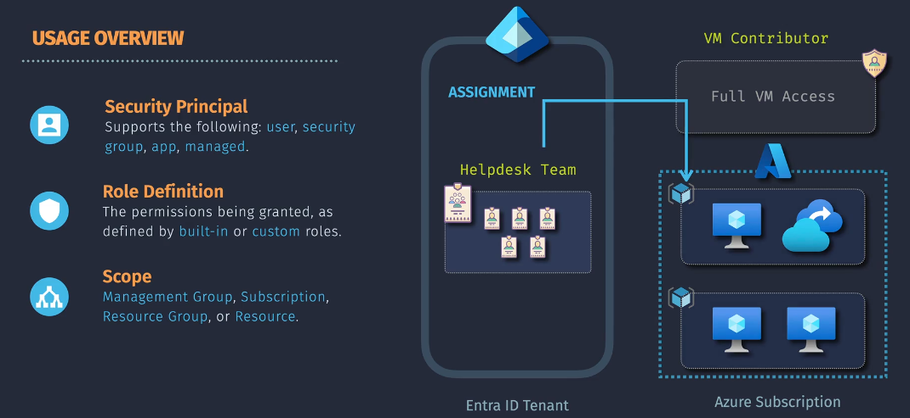
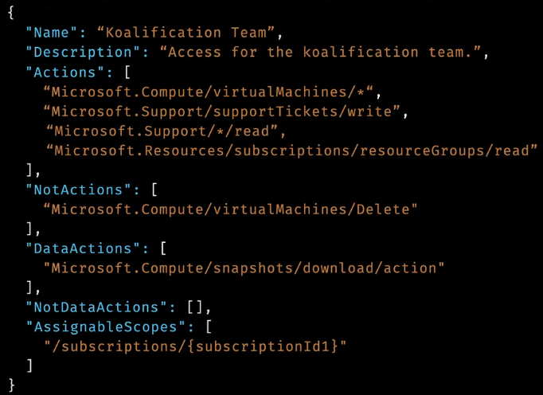
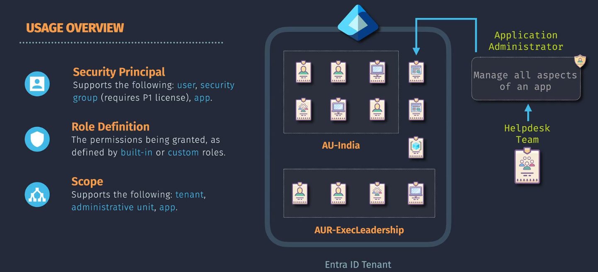
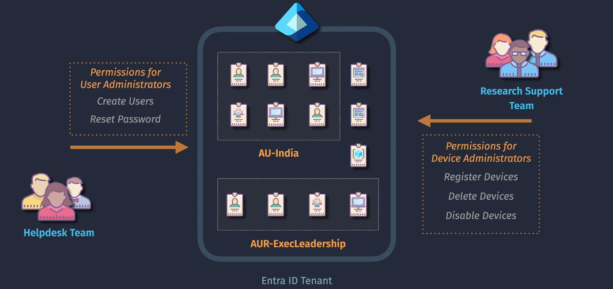

# IAM in Azure

**Identity and Access Management (IAM)** is a cornerstone of Azure's security framework, ensuring that the right individuals have appropriate access to resources. In Azure, IAM is primarily managed through two systems:

1. **Azure Role-Based Access Control (RBAC)**
2. **Azure Entra ID Roles** (formerly Azure Active Directory Roles)

## **Table of Contents**

1. [Azure Role-Based Access Control (RBAC)](#azure-role-based-access-control-rbac)
   - [What is Azure RBAC?](#what-is-azure-rbac)
   - [Types of Azure RBAC Roles](#types-of-azure-rbac-roles)
   - [How Azure RBAC Works](#how-azure-rbac-works)
   - [Custom Azure RBAC Roles](#custom-azure-rbac-roles)
   - [Use Cases for Azure RBAC](#use-cases-for-azure-rbac)
2. [Azure Entra ID Roles](#azure-entra-id-roles)
   - [Types of Azure Entra ID Roles](#types-of-azure-entra-id-roles)
   - [How Azure Entra ID Roles Work](#how-azure-entra-id-roles-work)
   - [Custom Azure Entra ID Roles](#custom-azure-entra-id-roles)
   - [Use Cases for Azure Entra ID Roles](#use-cases-for-azure-entra-id-roles)
3. [Comparing Azure RBAC Roles and Azure Entra ID Roles](#comparing-azure-rbac-roles-and-azure-entra-id-roles)
   - [Interplay Between Azure RBAC and Entra ID Roles](#interplay-between-azure-rbac-and-entra-id-roles)
4. [Best Practices for Managing Azure RBAC and Entra ID Roles](#best-practices-for-managing-azure-rbac-and-entra-id-roles)
5. [💡 Key Takeaways](#-key-takeaways)
6. [📌 Final Summary](#-final-summary)

## Azure Role-Based Access Control (RBAC)



### What is Azure RBAC?

**Azure Role-Based Access Control (RBAC)** is a system that provides fine-grained access management for Azure resources.  
It allows you to assign `Role Definition` to `Security principals` at specific `Scopes`.

- **Purpose:** Control who can perform what actions on Azure resources.
- **Security principals**
  - **user**
  - **security group**
  - **app registration**
  - **managed identity**
- **Role Definition**
  - **Built-in Roles**
  - **Custom Role**
- **Scope Levels:**
  - **Management Group**
  - **Subscription**
  - **Resource Group**
  - **Resource**

### Types of Azure RBAC Roles

Azure RBAC includes three primary types of roles:

1. **Built-in Roles:**

   - **Description:** Predefined roles provided by Azure.
   - **Examples:**
     - **Owner:** Full access to all resources, including the ability to delegate access.
     - **Contributor:** Can create and manage all types of Azure resources but cannot grant access to others.
     - **Reader:** Can view existing Azure resources.

2. **Custom Roles:**

   - **Description:** User-defined roles tailored to specific organizational needs.
   - **Features:**
     - Define precise permissions by selecting actions.
     - Suitable for unique scenarios not covered by built-in roles.

### How Azure RBAC Works

Azure RBAC operates by assigning roles to security principals at a particular scope.
The role definition outlines the permissions, specifying which actions are allowed or denied.

- **Security Principal:** An identity requesting access (`user`, `security group`, `app`, `managed`).
- **Role Definition:** A collection of permissions (`built-in` or `custom` roles).
- **Assignment:** Binding a role definition to a security principal at a specific scope.

**Example Workflow:**

1. **Define Scope:** Choose the subscription or resource group.
2. **Select Role:** Choose a built-in role like Contributor.
3. **Assign Role:** Assign the Contributor role to a user for the chosen scope.

### Custom Azure RBAC Roles

**Custom RBAC Roles** allow you to create roles with specific permissions tailored to your organization's needs.



- **Actions:** Allowed control plane actions
- **NotActions:** Subtracted control plane actions
- **DataActions:** allowed data plane actions.
- **NotDataActions:** Subtracted data plane actions.
- **AssignableScopes:**
  - Root (`"/*"`)
  - ManagementGroups (`"/providers/Microsoft.Management/managementGroups/{ID}"`)
  - Subscriptions (`"/subscriptions/{ID}"`)
  - Resource Groups (`"/subscriptions/ID/resourceGroups/{name}"`)

#### **Example: Creating a Custom RBAC Role**

**Scenario:** A development team needs to manage virtual machines (VMs) but should not have permissions to manage networking resources.

**Steps:**

1. **Define the Role JSON:**

   ```json
   {
     "Name": "VM Manager",
     "Description": "Can manage virtual machines but cannot manage networking resources.",
     "Actions": [
       "Microsoft.Compute/virtualMachines/read",
       "Microsoft.Compute/virtualMachines/write",
       "Microsoft.Compute/virtualMachines/start/action",
       "Microsoft.Compute/virtualMachines/deallocate/action"
     ],
     "NotActions": ["Microsoft.Network/*"],
     "AssignableScopes": ["/subscriptions/{subscription-id}"]
   }
   ```

2. **Create the Custom Role Using Azure CLI:**

   ```bash
   az role definition create --role-definition vm-manager-role.json
   ```

3. **Assign the Custom Role to a User or Group:**

   ```bash
   az role assignment create --assignee user@example.com --role "VM Manager" --scope /subscriptions/{subscription-id}
   ```

### Use Cases for Azure RBAC

- **Resource Management:** Assign specific permissions to developers to manage only the resources they need.
- **Compliance:** Ensure that only authorized personnel can access sensitive resources.
- **Operational Efficiency:** Streamline access management by using groups and roles instead of individual assignments.

### Notes

- Azure RBAC Custom Roles are available without any special licensing requirements.
- Azure RBAC is not Azure Policy. RBAC is for permissions, Policy is for standards.

## Azure Entra ID Roles

**Azure Entra ID Roles** are a set of predefined and custom roles that control access to Azure Entra ID resources and functionalities. These roles determine what administrative actions users and groups can perform within the Entra ID environment.  
**Purpose:** Manage who can perform specific administrative tasks within Azure Entra ID, ensuring secure and organized identity management.




- **Security Principals**

  - **User:** Individual accounts that represent people.
  - **Security Group:** Collections of users grouped for easier management.
  - **Service Principal:** Applications or services that need access to Azure resources.
  - **Managed Identity:** Identities managed by Azure for services to access resources securely.

- **Role Definitions**

  - **Built-in Roles:** Predefined roles provided by Azure Entra ID.
  - **Custom Roles:** User-defined roles tailored to specific organizational needs.

- **Scope**
  - **tenant**
  - **administrative units (AU)**
  - **app**

### Types of Azure Entra ID Roles

Azure Entra ID includes various roles that control access to the Entra ID itself and its features:

1. **Built-in Roles:**

   - **Global Administrator:**
     - **Description:** Has access to all administrative features in Azure Entra ID and services that use Azure Entra ID identities.
     - **Capabilities:** Manage everything, including creating and managing roles.
   - **User Administrator:**
     - **Description:** Can manage users and groups, reset passwords, and monitor service health.
   - **Security Administrator:**
     - **Description:** Can manage security-related features like Conditional Access policies and security reports.
   - **Application Administrator:**
     - **Description:** Can manage application registrations and enterprise applications.

2. **Custom Roles:**
   - **Description:** User-defined roles to meet specific organizational needs.
   - **Features:**
     - Define precise permissions within Azure Entra ID.
     - Suitable for scenarios not covered by built-in roles.

### How Azure Entra ID Roles Work

Azure Entra ID roles are assigned to security principals (users, groups) to grant them administrative permissions within the Entra ID environment.

- **Role Definition:** Specifies the permissions and allowed actions.
- **Role Assignment:** Associates a role with a security principal at a specific scope (usually the entire Entra ID tenant).

**Example Workflow:**

1. **Select Role:** Choose the Global Administrator role.
2. **Assign Role:** Assign it to a user to grant them full administrative access to Entra ID.

### Custom Azure Entra ID Roles

**Custom Entra ID Roles** allow you to create roles that provide specific administrative permissions within Azure Entra ID.

#### **Example: Creating a Custom Entra ID Role**

**Scenario:** Your organization requires a role that allows users to manage only group memberships without granting access to other directory settings.

```json
{
  "displayName": "Group Manager",
  "description": "Can manage group memberships without accessing other directory settings.",
  "isEnabled": true,
  "rolePermissions": [
    {
      "allowedResourceActions": [
        "microsoft.directory/groups/members/update",
        "microsoft.directory/groups/members/read"
      ],
      "excludedResourceActions": []
    }
  ],
  "assignableScopes": ["/"]
}
```

**Benefits:**

- **Tailored Administrative Access:** Grant specific administrative permissions without broader directory controls.
- **Improved Security:** Limit the scope of administrative actions to reduce potential security risks.
- **Operational Efficiency:** Streamline administrative tasks by delegating precise responsibilities.

### Use Cases for Azure Entra ID Roles

- **Directory Management:** Assign Global Administrators to manage all aspects of Entra ID.
- **User Management:** Assign User Administrators to handle user accounts and group memberships.
- **Security Oversight:** Assign Security Administrators to manage security policies and monitor threats.
- **Application Management:** Assign Application Administrators to handle app registrations and integrations.

### Notes

- Entra ID Custom Roles require Entra ID Premium P1 licensing at least
- Using Powershell or the MS Graph API provides more control over the role definition.

## Comparing Azure RBAC Roles and Azure Entra ID Roles

Understanding the distinctions between Azure RBAC Roles and Azure Entra ID Roles is crucial for effective IAM in Azure. Here's a detailed comparison:

| **Aspect**             | **Azure RBAC Roles**                                              | **Azure Entra ID Roles**                                                                                          |
| ---------------------- | ----------------------------------------------------------------- | ----------------------------------------------------------------------------------------------------------------- |
| **Primary Purpose**    | Manage access to Azure resources and services.                    | Manage Azure Entra ID itself and its features.                                                                    |
| **Scope of Control**   | Azure subscriptions, resource groups, individual resources.       | Entire Azure Entra ID tenant (directory).                                                                         |
| **Role Definition**    | Defines permissions to perform actions on Azure resources.        | Defines permissions to perform administrative tasks within Entra ID.                                              |
| **Assignment Scope**   | Assigned at subscription, resource group, or resource level.      | Assigned at the tenant level (entire directory).                                                                  |
| **Security Principal** | Users, groups, service principals accessing resources.            | Users, groups managing Entra ID features.                                                                         |
| **Examples of Roles**  | Owner, Contributor, Reader, Virtual Machine Contributor.          | Global Administrator, User Administrator, Security Administrator, Application Administrator.                      |
| **Usage Focus**        | Access control for Azure resources like VMs, storage, networking. | Administrative control over Entra ID features like user management, security policies, application registrations. |
| **Integration Points** | Works with Azure resources and services.                          | Integrates with Azure AD services, Microsoft 365, and other identity-driven services.                             |

### Interplay Between Azure RBAC and Entra ID Roles

- **Complementary Systems:** Azure RBAC and Entra ID Roles work together to provide comprehensive IAM in Azure.
- **Separate Management Areas:** RBAC controls access to Azure resources, while Entra ID Roles control access to identity and directory features.
- **Dependency:** Managing Entra ID Roles often requires RBAC Roles like Owner or Contributor to perform directory-level configurations.

## Best Practices for Managing Azure RBAC and Entra ID Roles

1. **Adopt the Principle of Least Privilege:**

   - **RBAC:** Assign roles that provide only the necessary permissions required for users to perform their tasks.
   - **Entra ID Roles:** Assign the least privileged role needed for administrators to manage Entra ID effectively.

2. **Use Built-in Roles Whenever Possible:**

   - **RBAC:** Utilize Azure's built-in roles to simplify role assignments and maintenance.
   - **Entra ID:** Leverage built-in Entra ID roles before considering custom roles.

3. **Implement Role Segregation:**

   - **RBAC:** Separate roles for different resource management tasks (e.g., storage management, networking).
   - **Entra ID:** Assign distinct roles for different administrative functions (e.g., user management, security management).

4. **Regularly Review and Audit Role Assignments:**

   - **RBAC:** Conduct periodic audits to ensure role assignments remain appropriate.
   - **Entra ID:** Regularly review Entra ID role assignments to prevent privilege creep.

5. **Leverage Groups for Role Assignments:**

   - **RBAC:** Assign roles to Azure AD groups instead of individual users to simplify management.
   - **Entra ID:** Assign Entra ID roles to groups to manage permissions collectively.

6. **Monitor and Log Access:**

   - **RBAC:** Use Azure Monitor and Activity Logs to track role-based access and changes.
   - **Entra ID:** Utilize Entra ID logs and reports to monitor administrative activities and access patterns.

7. **Educate Administrators:**

   - **RBAC and Entra ID Roles:** Ensure that administrators understand their roles and responsibilities, including the permissions granted by their assigned roles.

8. **Utilize Conditional Access Policies:**
   - **Entra ID Roles:** Implement Conditional Access to enforce additional security measures based on role assignments.

## 💡 Key Takeaways

1. **Distinct Roles for Different Scopes:**

   - **Azure RBAC Roles** manage access to Azure resources, ensuring users have appropriate permissions within specific scopes like subscriptions or resource groups.
   - **Azure Entra ID Roles** manage the identity infrastructure itself, controlling who can administer the Azure Entra ID tenant and its features.

2. **Complementary Systems:**

   - Azure RBAC and Entra ID Roles operate in tandem to provide a comprehensive IAM solution in Azure. RBAC secures resources, while Entra ID Roles secure the identity infrastructure.

3. **Least Privilege Principle:**

   - Both RBAC and Entra ID Roles should adhere to the principle of least privilege, granting users only the permissions they need to perform their roles effectively, minimizing security risks.

4. **Regular Auditing and Monitoring:**

   - Continuously audit role assignments and monitor access logs to ensure compliance, detect anomalies, and prevent unauthorized access.

5. **Leverage Groups for Efficiency:**

   - Using Azure AD groups for role assignments simplifies management, especially in large organizations, by allowing collective permissions rather than individual assignments.

6. **Conditional Access Enhances Security:**

   - Implement Conditional Access policies, especially for Entra ID Roles, to add an additional layer of security based on contextual factors like location, device state, and user risk.

7. **Educate and Train Administrators:**

   - Ensure that those managing roles understand the responsibilities and limitations of their roles, fostering a security-aware culture within the organization.

8. **Utilize Automation Tools:**
   - Employ PowerShell, Azure CLI, and Microsoft Graph APIs to manage roles efficiently, especially when dealing with large-scale deployments or frequent changes.

## 📌 Final Summary

**Identity and Access Management (IAM)** in Azure is a foundational aspect of securing your cloud environment. By leveraging both **Azure Role-Based Access Control (RBAC)** and **Azure Entra ID Roles**, organizations can ensure that users and administrators have the appropriate levels of access to perform their tasks while maintaining robust security and compliance.

- **Azure RBAC** is essential for managing access to Azure resources, providing granular control over who can perform specific actions within subscriptions, resource groups, and individual resources.

- **Azure Entra ID Roles** are critical for managing the identity infrastructure itself, controlling who can administer the Azure Entra ID tenant, manage users and groups, and enforce security policies.

**Best Practices Recap:**

- **Adopt Least Privilege:** Assign only necessary permissions to minimize security risks.
- **Use Built-in Roles:** Leverage Azure's built-in roles for simplicity and reliability.
- **Regular Audits:** Continuously review role assignments to ensure appropriateness and compliance.
- **Leverage Groups:** Use Azure AD groups to streamline role assignments and management.
- **Implement Conditional Access:** Enhance security by enforcing contextual access controls.
- **Educate Administrators:** Ensure that those managing roles understand their responsibilities and the implications of their permissions.
