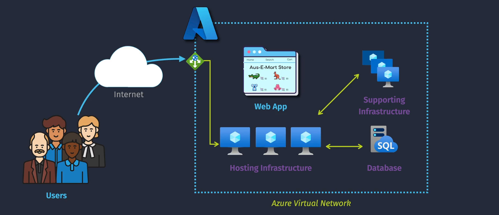
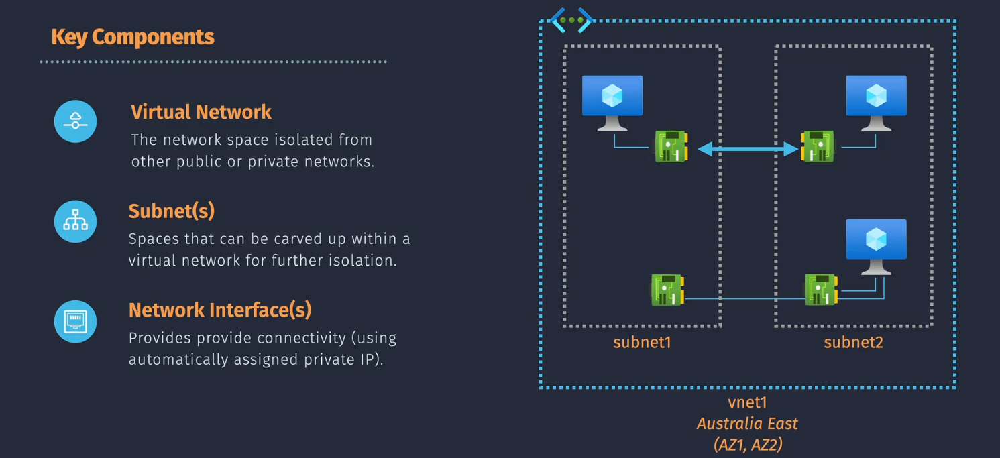
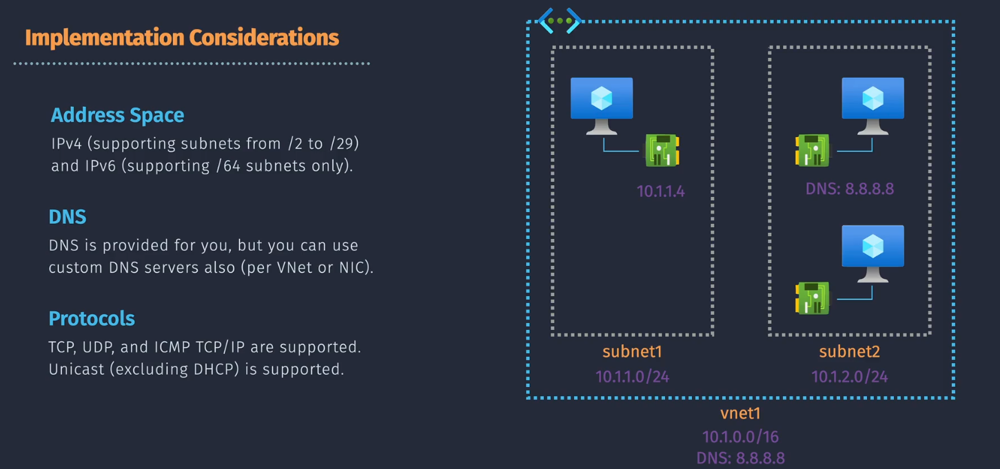
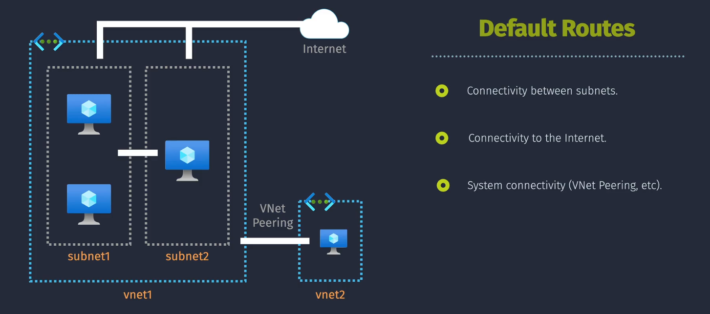

# Azure Virtual Network (VNet)

**Azure Virtual Network (VNet)** is a fundamental building block for your private network in Azure. It enables Azure resources, like virtual machines (VMs), to securely communicate with each other, the internet, and on-premises networks. Here's a simple breakdown:

1. **Private Networking**: VNet provides a logically isolated network in the Azure cloud, where you can define subnets, routing, and access control.
2. **Segmentation**: You can divide a VNet into subnets to organize and secure resources.
3. **Connectivity**: VNet supports connections to on-premises networks through VPN or ExpressRoute, and inter-VNet communication via VNet peering.
4. **Security**: Network Security Groups (NSGs) and Azure Firewall help control inbound and outbound traffic to and from your resources.
5. **Scalability**: VNets can scale with your needs, allowing you to add more subnets and resources as your infrastructure grows.

Imagine it as your own private section of the Azure cloud, where you have complete control over the network layout and security settings.

## Key Components

1. **Virtual Network**: A VNet is the foundation of your private network in Azure. It enables Azure resources to securely communicate with each other, the internet, and on-premises networks.

2. **Subnet(s)**: Subnets segment your VNet into smaller, manageable sections. Each subnet can host multiple Azure resources, such as VMs. This segregation helps improve security and performance.

3. **Network Interface(s)**: Network Interfaces (NICs) connect VMs and other resources to the subnet. Each NIC has a private IP address, and optionally, a public IP address.

## Implementation Considerations

1. **Address Space**: Define the IP address range using CIDR notation. Plan address spaces carefully to avoid overlap and ensure adequate room for growth.

   - IPV4 (supporting subnets from `/2` to `/29`)
   - IPV6 (supporting `/64` subnets only)

2. **DNS**: Configure DNS settings for name resolution within your VNet. You can use Azure-provided DNS or a custom DNS server.

3. **Protocols**: Decide on the protocols (TCP, UDP) and ports needed for communication between resources.

## Default Connectivity

1. **Subnet to Subnet Connectivity**: Subnets within the same VNet can communicate with each other by default. This allows for seamless integration and resource interaction.

2. **Subnet to Internet Connectivity**: Resources in a subnet can connect to the internet if they have a public IP or through a NAT gateway. This is crucial for accessing external services and updates.

3. **VNet to VNet Connectivity (VNet Peering)**: VNet peering enables you to connect two VNets, allowing resources in different VNets to communicate as if they are on the same network.
