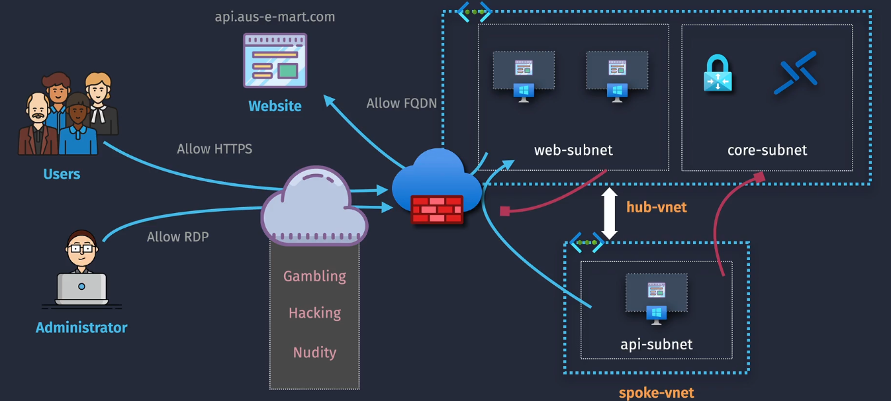
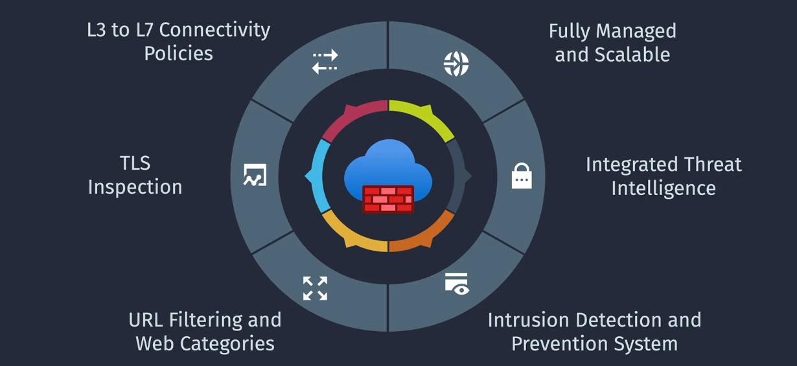
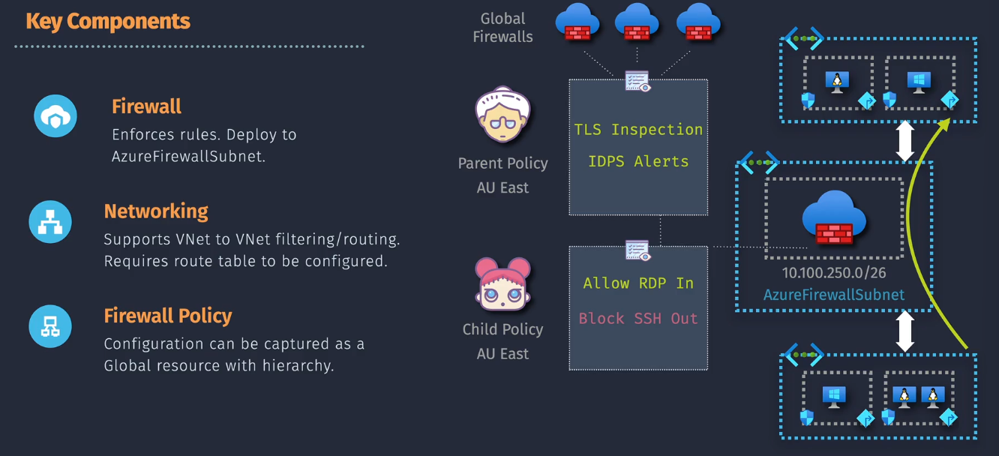

# Azure Firewall 🔞

**Azure Firewall** is a managed, cloud-based network security service that protects your Azure Virtual Network resources. It provides stateful packet inspection, high availability, and unrestricted cloud scalability. Azure Firewall is designed to be similar to traditional on-premises firewalls but leverages the scalability and flexibility of the cloud.

## Key Features

Azure Firewall offers a rich set of features designed to enhance the security and manageability of your Azure environments:

1. **Threat Protection**

   - **What It Does**: Protects your network from threats by using intelligence feeds from Microsoft Cyber Security.
   - **How It Helps**: It can alert you about, and block traffic from, known bad IP addresses and domains.

2. **High Availability**

   - **What It Does**: Ensures that your firewall is always up and running, even if there are failures.
   - **How It Helps**: Provides continuous protection without interruptions.

3. **Scalability**

   - **What It Does**: Automatically scales to handle more traffic as needed.
   - **How It Helps**: You don’t need to worry about your firewall being overwhelmed by a lot of traffic.

4. **L3-L7 Filtering**

   - **What It Does**: Inspects network traffic at multiple layers, from basic network (Layer 3) to application-level (Layer 7).
   - **How It Helps**: Allows you to set detailed rules for controlling traffic, making your security more granular and effective.

5. **Signature-Based IDPS (Premium SKU)**

   - **What It Does**: Uses known attack patterns (signatures) to detect and block threats.
   - **How It Helps**: Provides an additional layer of security by identifying and stopping attacks based on these patterns.

6. **Application and Network Rule Filtering**

   - **What It Does**: Lets you create rules to control both application and network traffic.
   - **How It Helps**: Helps you enforce your security policies more effectively by specifying which applications and network traffic are allowed or blocked.

7. **Centralized Policy Management**

   - **What It Does**: Allows you to create and manage firewall policies centrally, which can be applied to multiple firewalls.
   - **How It Helps**: Simplifies management and ensures consistent security rules across different environments.

8. **Logging and Analytics**
   - **What It Does**: Provides detailed logs and integrates with Azure Monitor for insights and analysis.
   - **How It Helps**: Helps you monitor traffic, identify potential threats, and analyze network activity for better security management.

## Key Components

### 1. Firewall

- **Not VMs, But Virtual Devices**: Azure Firewall itself isn't a VM. It's a managed service provided by Azure that acts as a virtual device.
- **Traffic Control**: When you set up Azure Firewall, it sits in a special subnet (`AzureFirewallSubnet`). It watches the traffic going in and out of your VNet and applies rules you set up to control this traffic.

### 2. Networking

- **VNet to VNet Filtering/Routing**: Imagine you have different sections (VNets) of a large building. Azure Firewall can control which sections can talk to each other.
- **Route Table**: Think of a route table as a map that tells the traffic where to go. You configure this map to direct the traffic through the firewall first, so the firewall can check and control it.

### 3. Firewall Policy

- **Global Management**: You can create firewall policies that act like a set of rules. These policies can be applied across multiple firewalls, not just one VNet. It's like having a central rulebook that can be used everywhere.
- **Hierarchy**: Policies can be organized in a tree-like structure. Think of it like folders and subfolders on your computer. You can have a main policy and then more specific sub-policies that apply additional rules.

### Summary

- **Azure Firewall**: Acts like a virtual security guard, not a VM.
- **Traffic Control**: Controlled by placing the firewall in a special subnet and using route tables to direct traffic through it.
- **Management**: Managed globally using firewall policies.
- **Policy Hierarchy**: Organized like a rulebook with main rules and specific sub-rules for different situations.

Azure Firewall offers three different SKUs to cater to various needs and use cases. Here's a breakdown of each SKU, their features, and typical use cases:

## Azure Firewall SKUs

### 1. **Azure Firewall Basic**

- **Features**:
  - Built-in high availability
  - Availability Zones
  - Application FQDN filtering rules
  - Network traffic filtering rules
  - FQDN tags
  - Service tags
  - Threat intelligence in alert mode
  - Outbound SNAT support
  - Inbound DNAT support
  - Multiple public IP addresses
  - Azure Monitor logging
- **Use Cases**: Ideal for small and medium-sized businesses (SMBs) with throughput needs of up to 250 Mbps.

### 2. **Azure Firewall Standard**

- **Features**:
  - Built-in high availability
  - Availability Zones
  - Unrestricted cloud scalability
  - Application FQDN filtering rules
  - Network traffic filtering rules
  - FQDN tags
  - Service tags
  - Threat intelligence
  - DNS proxy
  - Custom DNS
  - Web categories
  - Forced tunneling
  - Outbound SNAT support
  - Inbound DNAT support
  - Multiple public IP addresses
  - Azure Monitor logging
- **Use Cases**: Suitable for enterprises requiring Layer 3-7 filtering and autoscaling to handle peak traffic periods of up to 30 Gbps.

### 3. **Azure Firewall Premium**

- **Features**:
  - Built-in high availability
  - Availability Zones
  - Unrestricted cloud scalability
  - Application FQDN filtering rules
  - Network traffic filtering rules
  - FQDN tags
  - Service tags
  - Threat intelligence
  - DNS proxy
  - Custom DNS
  - Web categories
  - Forced tunneling
  - Outbound SNAT support
  - Inbound DNAT support
  - Multiple public IP addresses
  - Azure Monitor logging
  - TLS inspection
  - Intrusion Detection and Prevention System (IDPS)
  - URL filtering
  - Web categories
  - Compliance with Payment Card Industry Data Security Standard (PCI DSS)
- **Use Cases**: Designed for highly sensitive and regulated environments, such as payment processing and healthcare, with advanced threat protection capabilities.

### Summary

- **Azure Firewall Basic**: Best for SMBs with lower throughput needs.
- **Azure Firewall Standard**: Ideal for enterprises needing advanced filtering and autoscaling.
- **Azure Firewall Premium**: Perfect for highly sensitive environments requiring advanced threat protection.

## Azure Firewall vs. Traditional On-Premises Firewalls

**Similarities:**

- **Functionality:** Both Azure Firewall and traditional on-premises firewalls perform essential network security functions such as traffic filtering, threat protection, and access control.
- **Rule Management:** They use similar rule-based approaches to allow or deny traffic based on defined policies.
- **Logging and Monitoring:** Both provide logging and monitoring capabilities to track and analyze network traffic and security events.

**Differences:**

- **Deployment and Maintenance:**

  - **Traditional Firewalls:** Require physical hardware, manual updates, and maintenance.
  - **Azure Firewall:** Is a cloud-native service that is automatically maintained, updated, and scaled by Azure, eliminating the need for physical hardware management.

- **Scalability:**

  - **Traditional Firewalls:** Limited by the capacity of physical devices; scaling often requires additional hardware purchases and configurations.
  - **Azure Firewall:** Automatically scales to handle varying traffic loads without manual intervention, leveraging Azure's cloud infrastructure.

- **Integration and Automation:**

  - **Traditional Firewalls:** Integration with cloud services and automation requires additional tools and configurations.
  - **Azure Firewall:** Seamlessly integrates with other Azure services and supports automation through Azure APIs, PowerShell, and Azure CLI.

- **Cost Structure:**
  - **Traditional Firewalls:** Involves upfront capital expenditures for hardware and ongoing costs for maintenance.
  - **Azure Firewall:** Operates on a pay-as-you-go model, allowing for cost flexibility based on usage.

## Azure Firewall vs. Network Security Groups (NSGs)

While both **Azure Firewall** and **Network Security Groups (NSGs)** are used to control network traffic in Azure, they serve different purposes and offer varying levels of functionality.

### **Azure Firewall**

- **Scope:** Global within a Virtual Network or across multiple VNets using firewall policies.
- **Functionality:**

  - **Stateful Inspection:** Maintains context about active connections.
  - **Application Rules:** Filter traffic based on fully qualified domain names (FQDNs).
  - **Network Rules:** Control traffic based on IP addresses, ports, and protocols.
  - **Threat Intelligence:** Blocks traffic from known malicious sources.
  - **Centralized Management:** Manage policies across multiple VNets.

- **Use Case:** Comprehensive security for entire VNets, protecting against a wide range of threats and providing detailed traffic analysis.

### **Network Security Groups (NSGs)**

- **Scope:** Local to individual subnets or network interfaces within a Virtual Network.
- **Functionality:**

  - **Stateless Filtering:** Evaluates each packet independently without maintaining connection state.
  - **Inbound and Outbound Rules:** Allow or deny traffic based on source/destination IPs, ports, and protocols.
  - **No Application Layer Filtering:** Cannot filter traffic based on application-level attributes like FQDNs.

- **Use Case:** Basic traffic filtering for specific subnets or VMs, enforcing granular access controls at the network interface or subnet level.

### **Key Differences**

| Feature                         | Azure Firewall                               | Network Security Groups (NSGs)              |
| ------------------------------- | -------------------------------------------- | ------------------------------------------- |
| **Layer of Operation**          | Layer 4 and Layer 7                          | Layer 3 and Layer 4                         |
| **Stateful Inspection**         | Yes                                          | No                                          |
| **Application-Level Filtering** | Yes (FQDN-based rules)                       | No                                          |
| **Threat Intelligence**         | Integrated                                   | No                                          |
| **Scope**                       | Global across VNets                          | Local to subnets or network interfaces      |
| **Management**                  | Centralized for multiple VNets               | Managed per subnet or network interface     |
| **Use Cases**                   | Comprehensive security and threat protection | Basic traffic control and access management |

## Use Cases

Azure Firewall is a versatile tool that can be used in various scenarios to enhance network security and manage traffic effectively. Here are some common use cases:

### 1. Protecting Internet-Facing Applications

- **Scenario**: You have web applications or services that are accessible over the internet.
- **How Azure Firewall Helps**: It provides robust protection by inspecting incoming traffic, blocking malicious traffic, and preventing attacks such as SQL injection and cross-site scripting.

### 2. Hybrid Cloud Security

- **Scenario**: You have a mix of on-premises infrastructure and Azure cloud resources.
- **How Azure Firewall Helps**: It secures traffic between your on-premises network and your Azure environment, ensuring that only authorized traffic can flow between them.

### 3. Segmentation of Network Traffic

- **Scenario**: You need to segment your network to isolate different workloads or departments.
- **How Azure Firewall Helps**: It enforces policies to control traffic between different segments of your network, improving security and reducing the risk of lateral movement in case of a breach.

### 4. Centralized Policy Management

- **Scenario**: You manage multiple Azure subscriptions or environments.
- **How Azure Firewall Helps**: It allows you to create and manage security policies centrally, applying consistent rules across all your firewalls, reducing administrative overhead and ensuring uniform security posture.

### 5. Secure Access to Remote Workstations

- **Scenario**: Remote workers need secure access to resources hosted in Azure.
- **How Azure Firewall Helps**: It provides secure RDP/SSH access to virtual machines, ensuring that remote connections are protected and only authorized users can access critical resources.

### 6. Compliance and Regulatory Requirements

- **Scenario**: You need to comply with industry regulations and standards.
- **How Azure Firewall Helps**: It helps meet compliance requirements by providing detailed logging, monitoring, and advanced threat protection features, ensuring that your network meets industry security standards.

### 7. Protecting Non-HTTP/S Traffic

- **Scenario**: You have applications that use non-HTTP/S protocols.
- **How Azure Firewall Helps**: It supports a wide range of protocols and provides comprehensive filtering and protection for various types of traffic, ensuring that all your applications are secured.

## Step-by-Step Guide to Configure Azure Firewall in Hub-and-Spoke Network

### Assumptions

- **Hub VNet**: `Hub-VNet`
- **Spoke VNets**: `Spoke1-VNet` and `Spoke2-VNet`
- **Peering**: `Hub-VNet` is already peered with `Spoke1-VNet` and `Spoke2-VNet`

### Step 1: Create Azure Firewall in Hub-VNet

1. **Create a Subnet for Azure Firewall**:

   - In `Hub-VNet`, create a subnet named `AzureFirewallSubnet`.
   - Example address range: `10.0.1.0/26`.

2. **Create Azure Firewall**:
   - Go to the Azure portal, select **Create a resource**, search for **Firewall**, and click **Create**.
   - Enter a name (e.g., `Hub-FW`), select your resource group, and choose the region.
   - **Public IP**: Create a new Standard SKU public IP address for the firewall.
   - **Virtual Network**: Select `Hub-VNet` and the `AzureFirewallSubnet`.
   - **Review + Create**: Review the settings and click **Create**.

### Step 2: Configure Firewall Policy

#### Create Parent Firewall Policy

1. **Create Parent Firewall Policy**:

   - Go to the Azure portal, select **Firewall policies**, and click **Create**.
   - Enter a name (e.g., `Parent-FW-Policy`), select your resource group, and choose the region.
   - Define common rules (e.g., default deny inbound and outbound traffic) that apply to all firewalls.
   - Click **Review + Create**.

2. **Associate Parent Policy with Firewall**:
   - Navigate to your Azure Firewall instance (`Hub-FW`).
   - In the settings, select **Firewall Policy** and associate the `Parent-FW-Policy`.

#### Create Child Firewall Policy

1. **Create Child Firewall Policy**:

   - Go to the Azure portal, select **Firewall policies**, and click **Create**.
   - Enter a name (e.g., `Child-FW-Policy`), select your resource group, and choose the region.
   - Set `Parent-FW-Policy` as the parent policy.
   - Define specific rules (e.g., allow traffic between spokes) that apply to the child policy.
   - Click **Review + Create**.

2. **Associate Child Policy with Firewall**:
   - Navigate to your Azure Firewall instance (`Hub-FW`).
   - In the settings, select **Firewall Policy** and associate the `Child-FW-Policy`.

### Step 3: Configure Route Tables

1. **Create Route Table for Spokes**:

   - Go to the Azure portal, select **Route tables**, and click **Create**.
   - Enter a name (e.g., `Spoke-RT`), select your resource group, and choose the region.

2. **Add Routes**:

   - **Default Route**:
     - Address Prefix: `0.0.0.0/0`
     - Next Hop Type: **Virtual appliance**
     - Next Hop Address: IP address of the Azure Firewall in `Hub-VNet`.

3. **Associate Route Table**:
   - Associate the `Spoke-RT` with the subnets in both `Spoke1-VNet` and `Spoke2-VNet`.

### Step 4: Test the Configuration

1. **Deploy Test VMs**:

   - Create a virtual machine in each of the VNets: `Hub-VNet`, `Spoke1-VNet`, and `Spoke2-VNet`.

2. **Test Connectivity**:
   - Ensure that the VMs can communicate with each other through the Azure Firewall and the rules defined in the firewall policies are enforced correctly.

## Summary

**Azure Firewall** is a robust, cloud-native network security service that offers comprehensive protection for your Azure Virtual Networks. It mirrors many functionalities of traditional on-premises firewalls while providing the scalability, flexibility, and ease of management inherent to cloud services.

- **Similarity to Traditional Firewalls:** Like traditional firewalls, Azure Firewall controls incoming and outgoing network traffic based on security rules, offering stateful packet inspection, threat intelligence, and centralized policy management.

- **Differences from NSGs:**
  - **Azure Firewall** provides advanced features like application-level filtering, threat intelligence integration, and centralized management across multiple VNets.
  - **Network Security Groups (NSGs)** offer basic traffic filtering at the subnet or network interface level, operating at a lower layer without application-specific rules or threat intelligence.
