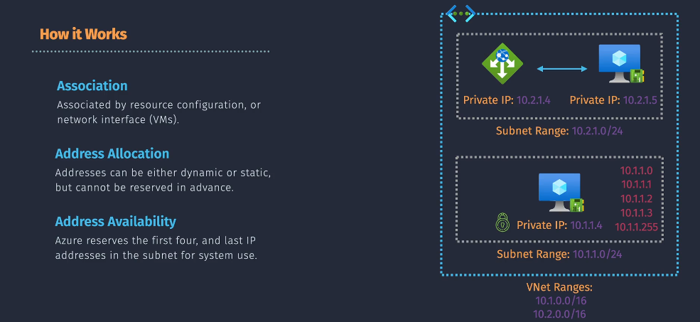
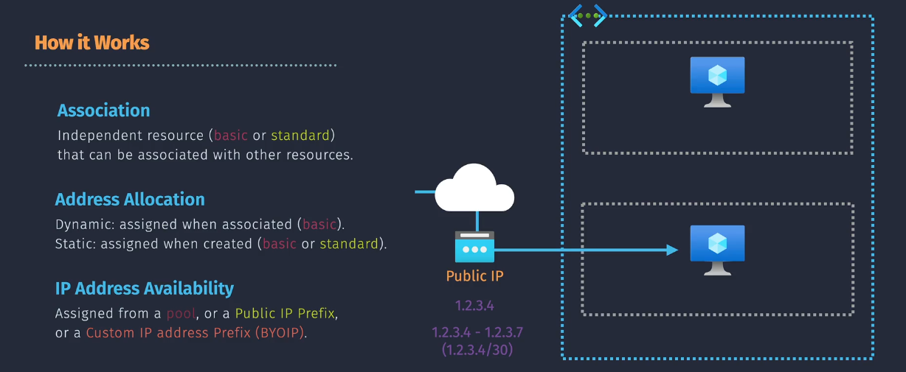
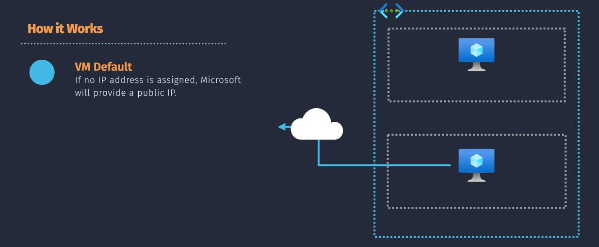
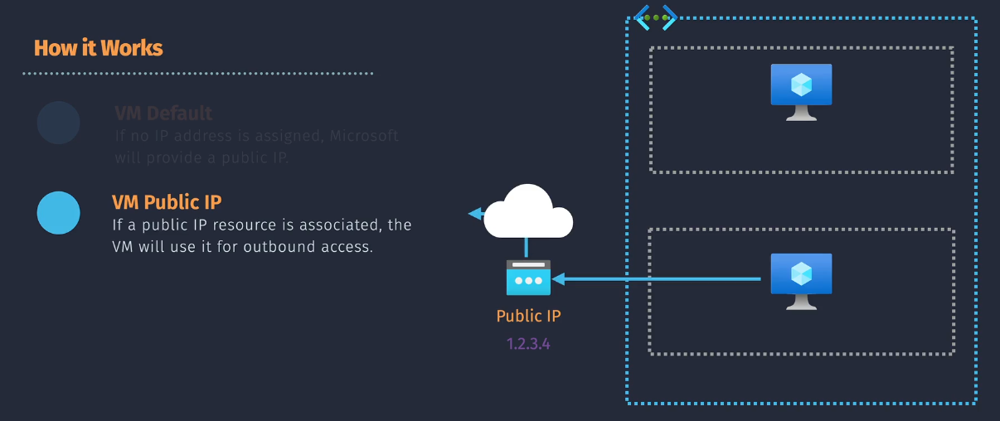
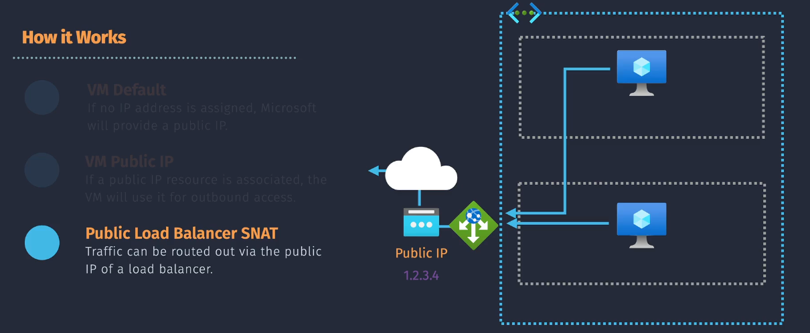
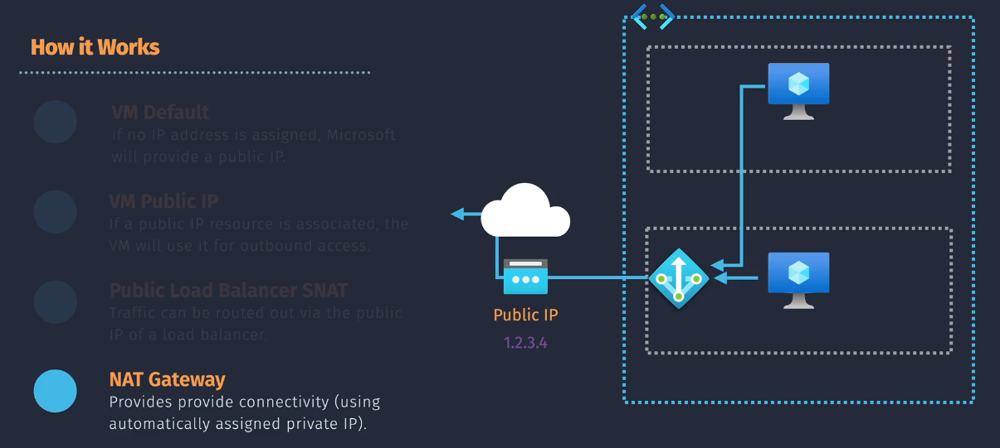

# Azure IP Addressing

## Private IP Addressing

Private IP addressing is used within an Azure Virtual Network (VNet) to enable communication between resources without exposing them to the internet. These addresses are not routable on the internet, ensuring internal communication is secure and isolated.

### 1. Association

- **VM uses NICs**: Virtual Machines (VMs) use Network Interface Cards (NICs) to associate with private IP addresses. Each NIC can have one or more private IP addresses.
- **Other resources use resource configuration**: Resources like Azure Load Balancers, Application Gateways, and internal Azure services use private IP addresses assigned through their configurations.

### 2. Address Allocation

- **Dynamic or static**: Private IP addresses can be dynamically assigned (automatically by Azure) or statically assigned (manually by the user). Dynamic allocation is useful for short-lived resources, while static allocation ensures persistent addresses for critical resources.
- **Cannot be reserved in advance**: Private IP addresses are assigned when the resource is created or configured, ensuring efficient use of the address space.

### 3. Address Availability

- **Azure reserves the first four and last IP addresses in the subnet for system use**: These reserved addresses include network and broadcast addresses, as well as addresses for Azure services like the default gateway.

## Public IP Addressing

Public IP addressing allows Azure resources to be accessed from the internet. Public IP addresses are essential for resources like web servers, VPN gateways, and any service that needs to be publicly reachable.

### 1. Association

- **Independent resource**: Public IP addresses are managed as separate resources in Azure and can be associated with VMs, load balancers, and VPN gateways.
- **(Basic or Standard) type**: There are two types of public IP addresses: Basic and Standard. Basic IPs offer basic redundancy, while Standard IPs offer higher availability and zone redundancy.

### 2. Address Allocation

- **Dynamic**: Dynamic public IP addresses are assigned when the associated resource is created and can change if the resource is restarted or deallocated. This is typically used for less critical applications.
- **Static**: Static public IP addresses are reserved when created and remain the same throughout the resource's lifecycle, ideal for critical applications that need consistent IP addresses.

### 3. Address Availability

- **Assigned from pool, or a public IP Prefix, or a custom IP Address Prefix (BYOIP)**: Public IP addresses can be assigned from Azure's global IP pool, a predefined IP prefix, or a custom IP prefix brought by the user, ensuring flexibility and scalability.

## Outbound Connectivity

Outbound connectivity refers to the ability of Azure resources to communicate with external resources on the internet. Azure provides several mechanisms to enable and manage outbound connectivity.

### **Types of Outbound Connectivity**

#### **1. VM Default**

- **If no IP address is assigned, MS will provide a public IP**: If a VM doesn’t have a specific public IP address assigned, Azure provides a default outbound IP to facilitate internet access. This IP can change and is not intended for consistent or critical communications.
  

#### **2. VM Public IP**

- **If a public IP resource is associated, the VM will use it for outbound access**: When a VM is linked to a public IP resource, it uses that IP for all outbound traffic, ensuring consistent and predictable communication with external services.
  

#### **3. Public Load Balancer (LB) SNAT**

**Source Network Address Translation (SNAT)** is a feature of Azure Load Balancers that allows backend resources (like VMs) to use the public IP address of the load balancer for outbound internet connectivity for outbound connections . Here's how it works:

- **Outbound Rules**: You configure outbound rules on the load balancer to enable SNAT for outbound connections
- **IP Masquerading**: SNAT translates the private IP address of the backend VM to the public IP address of the load balancer for outbound connections
- **Port Allocation**: SNAT uses ports to manage outbound connections for outbound connections. You can manually allocate ports to avoid SNAT exhaustion for outbound connections
- **Scalability**: SNAT is suitable for scenarios where multiple VMs share the same public IP address for outbound traffic with Azure NAT Gateway

- **Traffic can be routed out via the public IP of a Load Balancer**: When using a public load balancer, outbound traffic from backend pool resources can use the public IP of the load balancer through Source Network Address Translation (SNAT), enabling efficient traffic management.

#### **4. NAT Gateway**

A **NAT Gateway** is a dedicated Azure service that provides outbound internet connectivity for resources without public IP addresses. Here's how it works:

- **Dedicated Resource**: NAT Gateway is a separate resource that you associate with a subnet.
- **Automatic Private IP**: NAT Gateway uses an automatically assigned private IP address for outbound traffic.
- **Many-to-One SNAT**: NAT Gateway supports a many-to-one SNAT capability, allowing multiple private instances to share a single public IP address or prefix for outbound connectivity with Azure NAT Gateway
- **Simplified Management**: NAT Gateway simplifies outbound connectivity management by eliminating the need for outbound rules on load balancers.

- **Provides outbound connectivity using automatically assigned private IPs**: A NAT Gateway allows resources without a public IP to access the internet using a private IP address for outbound connectivity. This ensures efficient and secure outbound traffic management.

#### Public LB SNAT 🆚 NAT Gateway

- **Resource Type**: SNAT is a feature of Azure Load Balancers, while NAT Gateway is a separate resource.
- **IP Address Usage**: SNAT uses the public IP address of the load balancer, whereas NAT Gateway uses an automatically assigned private IP for outbound traffic.
- **Management**: SNAT requires configuration of outbound rules on the load balancer, while NAT Gateway provides a more straightforward setup.
- **Scalability**: SNAT is suitable for scenarios with multiple VMs sharing the same public IP, while NAT Gateway is ideal for simpler, many-to-one SNAT scenarios with Azure NAT Gateway

### **Default Outbound Internet Access**

When you create a VM in Azure without assigning a public IP address, Azure provides default outbound internet access for the VM. This feature is designed for basic scenarios, primarily for:

- **Temporary Access**: Short-term internet access needs, like downloading updates or initial setup.
- **Basic Connectivity**: Simple, non-critical access to the internet for lightweight tasks.

However, this default access has limitations:

- **Dynamic IP**: The public IP assigned by Azure can change, which isn't suitable for scenarios where a consistent IP is required.
- **Limited Features**: It lacks advanced features like security controls, scaling, and monitoring.

### **Paid Resources for Outbound Connectivity**

To overcome these limitations and add more functionality, you might opt for paid resources like Public IP addresses, NAT Gateways, or Load Balancers:

#### 1. Public IP Address

- **Consistency**: Provides a static public IP for consistent outbound connectivity, useful for services that need whitelisting.
- **Direct Access**: Enables direct internet access to the VM, suitable for hosting web services or applications that need to be reachable from the internet.

#### 2. Public Load Balancer (LB) SNAT

- **Load Balancing**: Balances incoming traffic across multiple VMs, while also providing outbound connectivity.
- **Shared IP**: Allows multiple VMs to share the same public IP for outbound traffic, simplifying IP management for clustered applications.

#### 3. NAT Gateway

- **Scalability**: Supports high-volume outbound traffic efficiently, making it ideal for larger applications.
- **Security**: Offers better security management by centralizing outbound connections and applying consistent policies.
- **Consistent IP**: Ensures a consistent outbound IP, which is crucial for many enterprise applications.

### **Use Case**

- **Default Access**: Use for temporary or non-critical outbound internet needs, where IP consistency and advanced features are not required.
- **Public IP**: Use for applications needing a consistent public IP, direct internet access, and simple setups.
- **NAT Gateway**: Use for high throughput, secure, and scalable outbound internet access needs.
- **Public LB SNAT**: Use when you need load balancing combined with shared outbound connectivity.

So, while default outbound access is convenient and cost-effective for basic scenarios, paid resources offer the reliability, consistency, and advanced features needed for production and more complex applications. Each option has its place based on your specific requirements.

### Conclusion

IP addressing in Azure is essential for managing communication between resources and with external networks. By understanding and effectively using private and public IP addresses, you can design a secure, scalable, and efficient network infrastructure in Azure.
