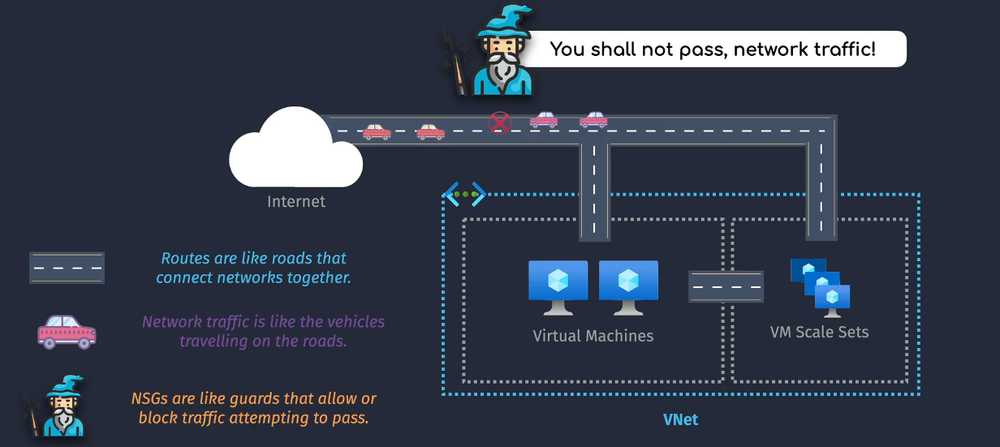
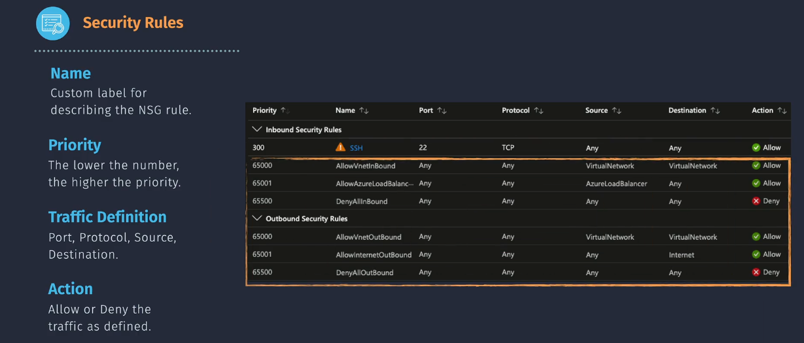

# Azure Network Security Group (NSG)

An Azure Network Security Group (NSG) is a resource that you can use to filter network traffic to and from Azure resources within a virtual network. NSGs contain security rules that allow or deny inbound and outbound traffic based on configured rules.

## Key Features of NSGs

- **Security Rules**: NSGs contain security rules that define how traffic is allowed or denied. Each rule specifies the source and destination, port, and protocol.
- **Resource Association**: NSGs can be associated with either a virtual network (VNet) `subnet` or a network interface (`NIC`) attached to a VM.
- **Priority-Based Processing**: Rules are processed in priority order, with lower numbers having higher priority. Once traffic matches a rule, processing stops, ensuring efficient rule evaluation.
- **Augmented Security Rules**: You can create augmented security rules that allow specifying multiple IP addresses and ranges, service tags, or application security groups.

## How NSGs Work

### Inbound Traffic

For inbound traffic, Azure processes the rules in the NSG associated with the subnet first, and then the rules in the NSG associated with the NIC, if there is one. This ensures that traffic is filtered at both the subnet and individual VM levels.

### Outbound Traffic

For outbound traffic, Azure processes the rules in the NSG associated with the NIC first, and then the rules in the NSG associated with the subnet, if there is one. This allows for granular control over outbound traffic.

## Default Security Rules

Azure provides default security rules that are applied to all NSGs. These default rules include:

### Inbound

- **AllowVnetInbound**: Allows inbound traffic from another subnet within the same VNet.
- **AllowAzureLoadBalancerInbound**: Allows inbound traffic from the Azure Load Balancer.
- **DenyAllInbound**: Denies all inbound traffic by default.

### Outbound

- **AllowVnetOutbound**: Allows outbound traffic to another subnet within the same VNet.
- **AllowInternetOutbound**: Allows outbound traffic to the internet.
- **DenyAllOutbound**: Denies all outbound traffic by default.

### Standard Public IP Address SKU

- **Default Behavior**: By default, a Standard public IP address has a more secure posture. It **denies all inbound traffic** unless explicitly allowed by a Network Security Group (NSG) rule.
- **Use Case**: This is beneficial for scenarios where you need to ensure a higher level of security by default, only allowing specific, intended traffic.

### Basic Public IP Address SKU

- **Default Behavior**: A Basic public IP address does not block inbound traffic by default. It allows all inbound traffic unless you apply an NSG or firewall rules to restrict it.
- **Use Case**: This is useful for simpler configurations or development environments where you want easier access without setting up explicit security rules initially.

### Practical Implications

- **Standard Public IP**: You'll need to configure NSG rules to explicitly allow any desired inbound traffic. This ensures that only traffic meeting your security criteria is permitted.
- **Basic Public IP**: While it allows all inbound traffic by default, it's crucial to add NSG rules if you need to restrict access to improve security.

## Creating and Managing NSGs

### Creating an NSG

1. **Azure Portal**: Navigate to the Network Security Groups section and click on "Create."
2. **Resource Manager**: Use Azure Resource Manager templates to create NSGs programmatically.
3. **Azure CLI or PowerShell**: Use Azure CLI or PowerShell commands to create, modify, or delete NSGs.

### Managing Security Rules

- **Add Rules**: Define rules to allow or deny traffic based on your security requirements.
- **Modify Rules**: Update existing rules to change their properties, such as priority, source, destination, port, and protocol.
- **Delete Rules**: Remove rules that are no longer needed.

## Best Practices

- **Use NSGs for Both Subnets and NICs**: For maximum security, associate NSGs with both subnets and NICs.
- **Prioritize Rules**: Ensure that custom rules have higher priority than default rules to avoid unintended traffic filtering.
- **Monitor and Audit**: Regularly monitor and audit NSG rules to ensure they meet your security requirements.

## Conclusion

Azure Network Security Groups are powerful tools for managing network traffic and enhancing the security of your Azure resources. By understanding and effectively using NSGs, you can create a secure and efficient network environment for your applications.
