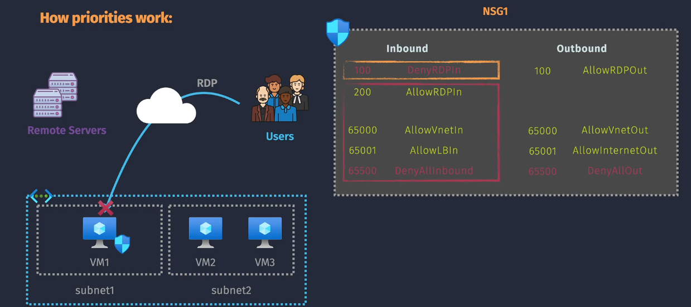
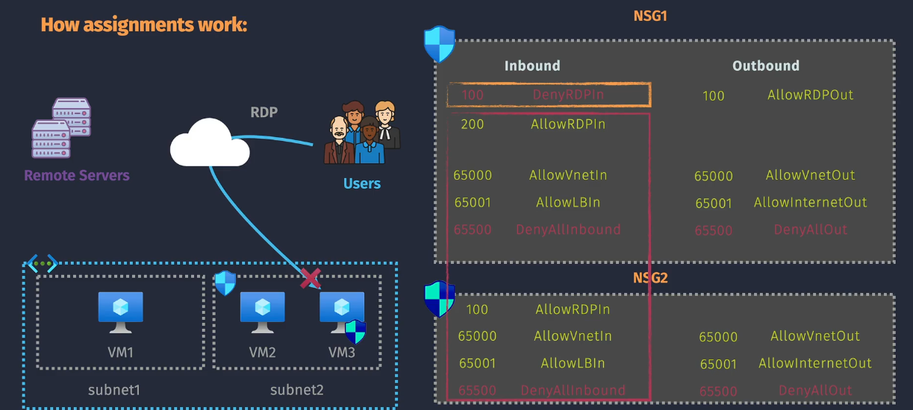
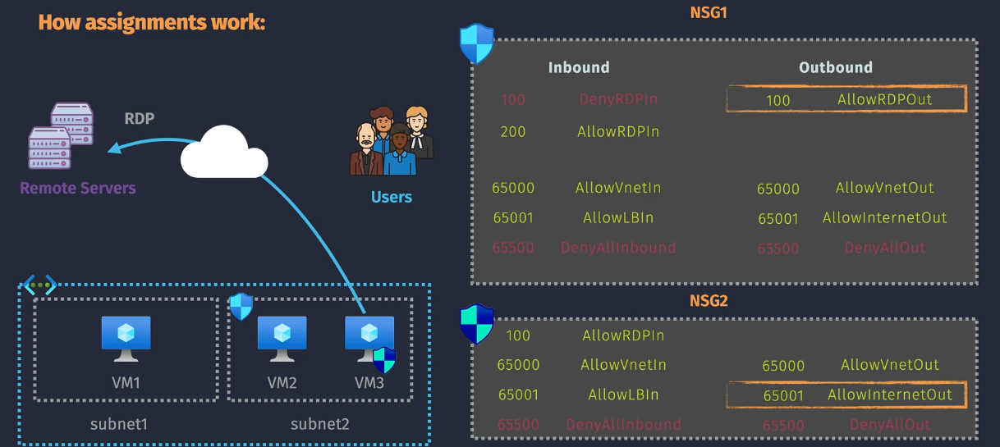
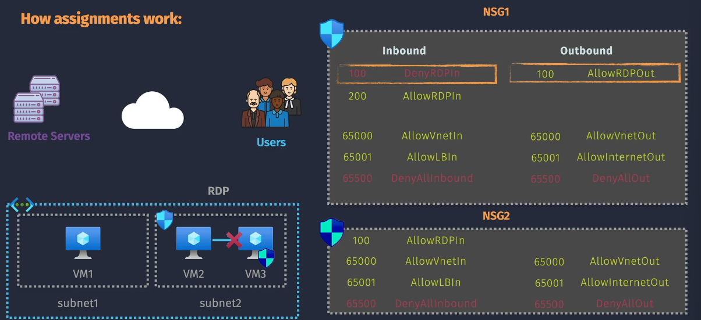

# NSG Security Rules Examples

## **Inbound Examples**

### **EX1**

| Priority | Name        | Action | Source        | Destination | Protocol | Port |
| -------- | ----------- | ------ | ------------- | ----------- | -------- | ---- |
| 100      | DenyRDPIn   | Deny   | Any           | Any         | TCP      | 3389 |
| 200      | AllowRDPIn  | Allow  | Any           | Any         | TCP      | 3389 |
| 65000    | AllowVnetIn | Allow  | VNet          | VNet        | Any      | Any  |
| 65001    | AllowLBIn   | Allow  | Load Balancer | Any         | Any      | Any  |
| 65500    | DenyAllIn   | Deny   | Any           | Any         | Any      | Any  |

**Scenario:**  
A user attempts to connect to VM1 using RDP (Remote Desktop Protocol) over TCP port 3389.

**Result:**  
**Traffic is denied.**

- The `DenyRDPIn` rule in NSG1 (priority `100`) explicitly denies inbound RDP traffic.
- Since NSG rules are evaluated by priority, this deny rule is applied before the `AllowRDPIn` rule (priority `200`).

### **EX2**

**NSG1 (Associated with Subnet) Inbound Rules:**

| Priority | Name        | Action | Source        | Destination | Protocol | Port |
| -------- | ----------- | ------ | ------------- | ----------- | -------- | ---- |
| 100      | DenyRDPIn   | Deny   | Any           | Any         | TCP      | 3389 |
| 200      | AllowRDPIn  | Allow  | Any           | Any         | TCP      | 3389 |
| 65000    | AllowVnetIn | Allow  | VNet          | VNet        | Any      | Any  |
| 65001    | AllowLBIn   | Allow  | Load Balancer | Any         | Any      | Any  |
| 65500    | DenyAllIn   | Deny   | Any           | Any         | Any      | Any  |

**NSG2 (Associated with VM3) Inbound Rules:**

| Priority | Name        | Action | Source        | Destination | Protocol | Port |
| -------- | ----------- | ------ | ------------- | ----------- | -------- | ---- |
| 100      | AllowRDPIn  | Allow  | Any           | Any         | TCP      | 3389 |
| 65000    | AllowVnetIn | Allow  | VNet          | VNet        | Any      | Any  |
| 65001    | AllowLBIn   | Allow  | Load Balancer | Any         | Any      | Any  |
| 65500    | DenyAllIn   | Deny   | Any           | Any         | Any      | Any  |

**Scenario 1 (NSG1):**  
A user attempts to connect to VM1 using RDP over TCP port 3389.

**Result:**  
**Traffic is denied.**

- The `DenyRDPIn` rule in NSG1 (priority `100`) blocks the traffic before the `AllowRDPIn` rule (priority `200`) can take effect.

**Scenario 2 (NSG2):**  
A user attempts to connect to VM3 using RDP over TCP port 3389.

**Result:**  
**Traffic is denied.**

- NSG1 (associated with the subnet) has a `DenyRDPIn` rule (priority `100`) that blocks RDP traffic before NSG2 (associated with VM3) can evaluate its `AllowRDPIn` rule.
- Subnet-level rules take precedence over NIC-level rules when traffic is denied.

## **Outbound Examples**

### **EX1**

| Priority | Name             | Action | Source | Destination | Protocol | Port |
| -------- | ---------------- | ------ | ------ | ----------- | -------- | ---- |
| 100      | AllowRDPOut      | Allow  | Any    | Any         | TCP      | 3389 |
| 65000    | AllowVnetOut     | Allow  | VNet   | VNet        | Any      | Any  |
| 65001    | AllowInternetOut | Allow  | Any    | Internet    | Any      | Any  |
| 65500    | DenyAllOut       | Deny   | Any    | Any         | Any      | Any  |

**Scenario:**  
VM1 tries to establish an RDP session with a remote server using TCP port 3389.

**Result:**  
**Traffic is allowed.**

- The `AllowRDPOut` rule in NSG1 (priority `100`) explicitly allows outbound RDP traffic.
- Since this rule is evaluated before the default `DenyAllOut` rule (priority `65500`), the traffic is permitted.

## **VM-to-VM Examples**

### **EX1**

### **NSG1 (Associated with Subnet)**

#### Inbound Rules

| Priority | Name        | Action | Source        | Destination | Protocol | Port |
| -------- | ----------- | ------ | ------------- | ----------- | -------- | ---- |
| 100      | DenyRDPIn   | Deny   | Any           | Any         | TCP      | 3389 |
| 200      | AllowRDPIn  | Allow  | Any           | Any         | TCP      | 3389 |
| 65000    | AllowVnetIn | Allow  | VNet          | VNet        | Any      | Any  |
| 65001    | AllowLBIn   | Allow  | Load Balancer | Any         | Any      | Any  |
| 65500    | DenyAllIn   | Deny   | Any           | Any         | Any      | Any  |

#### Outbound Rules

| Priority | Name             | Action | Source | Destination | Protocol | Port |
| -------- | ---------------- | ------ | ------ | ----------- | -------- | ---- |
| 100      | AllowRDPOut      | Allow  | Any    | Any         | TCP      | 3389 |
| 65000    | AllowVnetOut     | Allow  | VNet   | VNet        | Any      | Any  |
| 65001    | AllowInternetOut | Allow  | Any    | Internet    | Any      | Any  |
| 65500    | DenyAllOut       | Deny   | Any    | Any         | Any      | Any  |

### **NSG2 (Associated with VM3)**

#### Inbound Rules

| Priority | Name        | Action | Source        | Destination | Protocol | Port |
| -------- | ----------- | ------ | ------------- | ----------- | -------- | ---- |
| 100      | AllowRDPIn  | Allow  | Any           | Any         | TCP      | 3389 |
| 65000    | AllowVnetIn | Allow  | VNet          | VNet        | Any      | Any  |
| 65001    | AllowLBIn   | Allow  | Load Balancer | Any         | Any      | Any  |
| 65500    | DenyAllIn   | Deny   | Any           | Any         | Any      | Any  |

#### Outbound Rules

| Priority | Name             | Action | Source | Destination | Protocol | Port |
| -------- | ---------------- | ------ | ------ | ----------- | -------- | ---- |
| 100      | AllowRDPOut      | Allow  | Any    | Any         | TCP      | 3389 |
| 65000    | AllowVnetOut     | Allow  | VNet   | VNet        | Any      | Any  |
| 65001    | AllowInternetOut | Allow  | Any    | Internet    | Any      | Any  |
| 65500    | DenyAllOut       | Deny   | Any    | Any         | Any      | Any  |

### **Scenario:**

- **VM3** (with NSG2) attempts to send data to **VM2** (in the same VNet, protected by NSG1) using port 1433 (SQL).

### **Result: Traffic is denied.**

**Why?**

1. **Outbound (NSG2):**

   - NSG2's `AllowVnetOut` rule (priority `65000`) allows outbound traffic within the VNet.
   - Outbound traffic is permitted from VM3 to VM2.

2. **Inbound (NSG1):**
   - NSG1 (associated with the subnet containing VM2) evaluates the traffic.
   - NSG1's `AllowVnetIn` rule (priority `65000`) permits VNet traffic.
   - **However, if there is no matching allow rule for the SQL port (1433), traffic defaults to `DenyAllIn` (priority `65500`) and is blocked.**

### **Key Takeaway:**

- Even though NSG2 allows outbound traffic, **NSG1's rules ultimately block the traffic because the inbound deny rule (`DenyAllIn`) takes precedence.**
- Subnet-level NSGs (NSG1) control all VMs within the subnet, regardless of NIC-level NSGs (NSG2).
