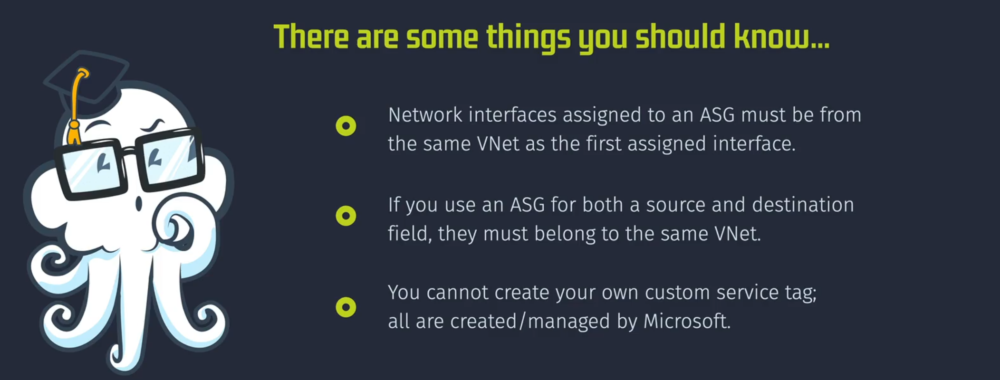

# Augmented Security Rules in Azure NSGs

**Augmented Security Rules** in Azure Network Security Groups (NSGs) extend the traditional security rules by allowing you to define more complex and flexible network security policies. They enable you to specify multiple IP addresses, IP address ranges, ports, and service tags in a single rule, simplifying the management of network security.

## Key Features of Augmented Security Rules

### 1. Multiple IP Addresses and Ranges

- **Flexibility**: Allows you to specify multiple IP addresses and ranges within a single rule, reducing the number of rules needed.
- **Use Case**: Ideal for scenarios where you need to define security rules for a range of IP addresses without creating multiple individual rules.

### 2. Multiple Ports

- **Simplified Management**: Lets you specify multiple ports within a single rule, making it easier to manage security policies that apply to different services or applications.
- **Use Case**: Useful for applications that require access to multiple ports, like web servers needing HTTP (port 80) and HTTPS (port 443).

### 3. Service Tags

- **Predefined IP Ranges**: Use service tags to represent a group of IP address ranges for specific Azure services. Microsoft maintains and updates these tags.
- **Use Case**: Simplifies security rule management by abstracting the IP addresses associated with Azure services, such as Azure SQL, Azure Traffic Manager, and Azure Load Balancer.

### 4. Application Security Groups (ASGs)

- **Logical Grouping**: Allows you to group VMs and apply security rules collectively to these groups, rather than managing individual IP addresses.
- **Use Case**: Ideal for dynamic environments where VMs are frequently created, deleted, or moved.

## Example Use Cases

### Use Case 1: Restricting Internet Access for VMs in a Subnet

**Scenario**: Restrict internet access for VMs in a subnet but allow them to communicate with Azure datacenter IP ranges.

**NSG Rule Example**:

| Rule Name            | Priority | Source   | Source Port | Destination   | Destination Port | Protocol | Action |
| -------------------- | -------- | -------- | ----------- | ------------- | ---------------- | -------- | ------ |
| AllowAzureDatacenter | 100      | Internet | \*          | AzureRegionIP | \*               | TCP      | Allow  |
| DenyInternetAccess   | 65000    | Internet | \*          | \*            | \*               | \*       | Deny   |

**Result**: VMs can access Azure datacenter IP ranges but are restricted from accessing the internet.

### Use Case 2: Allowing Access to Multiple Ports and IP Ranges

**Scenario**: Allow traffic to multiple ports and IP ranges for a specific application.

**NSG Rule Example**:

| Rule Name          | Priority | Source         | Source Port | Destination | Destination Port | Protocol | Action |
| ------------------ | -------- | -------------- | ----------- | ----------- | ---------------- | -------- | ------ |
| AllowMultiplePorts | 100      | 203.0.113.0/24 | \*          | 10.0.0.0/24 | 80, 443, 8080    | TCP      | Allow  |
| DenyAllInbound     | 65000    | \*             | \*          | \*          | \*               | \*       | Deny   |

**Result**: Traffic from the specified IP range to multiple ports on the destination subnet is allowed.

### Use Case 3: Creating and Using an Application Security Group (ASG)

**Scenario**: Group VMs based on their role in a web application (e.g., web servers and database servers) and apply security rules to manage traffic between these groups.

**Steps to Create and Use ASGs**:

1. **Create ASGs**:

   - **WebASG**: Group for web servers.
   - **DbASG**: Group for database servers.

2. **Assign VMs to ASGs**:

   - Assign web server VMs to `WebASG`.
   - Assign database server VMs to `DbASG`.

3. **Define NSG Rules**:
   - Allow traffic from `WebASG` to `DbASG` on port 1433 (SQL).

**NSG Rule Example**:

| Rule Name       | Priority | Source | Source Port | Destination | Destination Port | Protocol | Action |
| --------------- | -------- | ------ | ----------- | ----------- | ---------------- | -------- | ------ |
| AllowSQLTraffic | 100      | WebASG | \*          | DbASG       | 1433             | TCP      | Allow  |
| DenyAllInbound  | 65000    | \*     | \*          | \*          | \*               | \*       | Deny   |

**Result**:

- Web server VMs in `WebASG` can communicate with database server VMs in `DbASG` over port 1433.
- Other inbound traffic is denied by default.

## Benefits of Augmented Security Rules

- **Simplified Management**: Fewer rules to manage, reducing complexity and the potential for errors.
- **Enhanced Flexibility**: More granular control over network traffic by combining multiple conditions into a single rule.
- **Improved Security**: Better control and visibility over network traffic, reducing the risk of unauthorized access.

## Important Considerations

## Conclusion

Augmented Security Rules in Azure NSGs provide a powerful way to manage network security with greater flexibility and simplicity. By allowing multiple IP addresses, ranges, ports, and service tags in a single rule, you can create more effective and manageable security policies that better align with complex and dynamic network environments.
