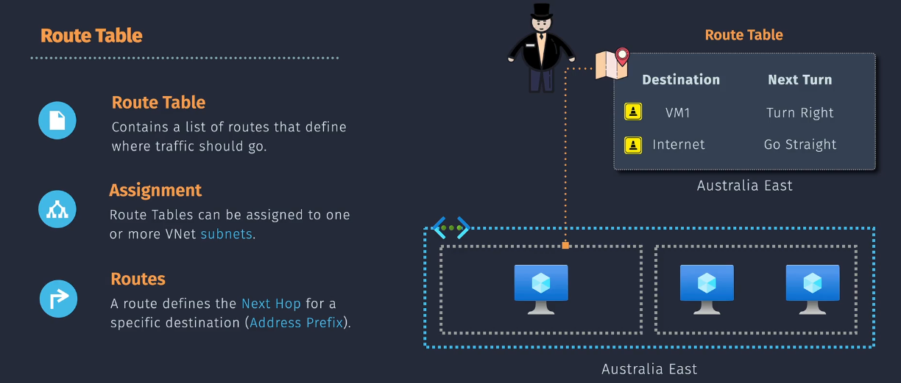

# User Defined Routing (UDR)

**User Defined Routing (UDR)** is a powerful feature in Azure that allows you to control the routing of network traffic within your virtual network. By using UDRs, you can override the default system routes and define custom paths for network traffic based on your specific requirements.

## Key Components of UDR

1. **Route Table**: A collection of routes that define how traffic should be routed within your virtual network.
2. **Routes**: Individual entries in a route table that specify the destination address prefix, the next hop type, and the next hop address.
3. **Subnet Association**: Route tables are associated with subnets, and the routes within the table apply to the traffic within that subnet.

## Table Structure

| Route Name          | Address Prefix | Next Hop Type           | Next Hop Address | Explanation                                                                             |
| ------------------- | -------------- | ----------------------- | ---------------- | --------------------------------------------------------------------------------------- |
| IntraVNet           | 10.0.1.0/24    | Virtual Network         |                  | Routes traffic within the virtual network to the specified subnet (10.0.1.0/24).        |
| ToOnPremises        | 10.1.0.0/16    | Virtual Network Gateway |                  | Routes traffic to an on-premises network via the virtual network gateway.               |
| ThroughFirewall     | 0.0.0.0/0      | Virtual Appliance       | 10.0.0.4         | Routes all outbound traffic through a network virtual appliance (firewall) at 10.0.0.4. |
| DefaultToInternet   | 0.0.0.0/0      | Internet                |                  | Routes all other traffic to the internet.                                               |
| BlockSpecificSubnet | 10.2.0.0/24    | None                    |                  | Drops traffic destined for the specific subnet (10.2.0.0/24).                           |

- **Route Name**: The name you give to each route. It's just a label to identify the route.

- **Address Prefix**: This is the destination address range for the traffic. It defines where the traffic is going. It can be:

  - A specific IP address range (e.g., `10.0.1.0/24`).
  - The internet (represented as `0.0.0.0/0`).

- **Next Hop Type**: This specifies where to send the traffic next. It tells Azure where to direct the traffic. Common next hop types include:

  1. **Virtual Network (VNet)**:

     - **Description**: Sends traffic within the virtual network.
     - **Use Case**: Useful for routing traffic between subnets within the same virtual network.

  2. **Virtual Network Gateway**:

     - **Description**: Directs traffic to a virtual network gateway, which provides connectivity to on-premises networks or other virtual networks.
     - **Use Case**: Ideal for hybrid network setups where you need to route traffic to on-premises data centers via VPN or ExpressRoute.

  3. **Virtual Appliance**:

     - **Description**: Sends traffic to a specific IP address, typically a firewall or Network Virtual Appliance (NVA).
     - **Use Case**: Useful for directing traffic through a security device for inspection, logging, or other network services.

  4. **Internet**:

     - **Description**: Sends traffic to the internet.
     - **Use Case**: Suitable for routing traffic destined for public internet addresses.

  5. **None**:
     - **Description**: Drops the traffic, effectively blocking it from being routed anywhere.
     - **Use Case**: Used to block specific types of traffic by ensuring it is not routed beyond the source subnet.

- **Next Hop Address**: The IP address of the next hop (only needed for Virtual Appliance). It is the destination IP where the traffic should be forwarded. For example, if using a Virtual Appliance, this is the IP address of that appliance.

## How to Create and Use UDR

1. **Create a Route Table**: In the Azure portal, navigate to the "Networking" section and create a new route table.
2. **Add Routes**: Define the routes you need by specifying the destination address prefix, the next hop type (e.g., virtual network, internet, or a specific IP address), and the next hop address.
3. **Associate with Subnet**: Associate the route table with the desired subnet(s) within your virtual network.
4. **Verify Routing**: Use tools like traceroute or Azure Network Watcher to verify that the traffic is being routed according to your custom routes.

## Use Cases

1. **Routing Traffic through a Network Virtual Appliance (NVA)**:

   - **Scenario**: Force traffic between public and private subnets to go through an NVA for security inspection.
   - **Steps**: Create a route table with a route that directs traffic from the public subnet to the NVA .

2. **Routing Traffic to a Specific Subnet**:
   - **Scenario**: Direct traffic from one subnet to another within the same virtual network.
   - **Steps**: Create a route table with a route that directs traffic to the destination subnet. Associate the route table with the source subnet.

## Benefits of UDR

- **Customization**: Provides the flexibility to define custom routing paths based on your specific network requirements.
- **Security**: Enhances security by directing traffic through security appliances for inspection.
- **Simplified Management**: Reduces the complexity of managing network traffic by centralizing routing rules in a route table with Azure Virtual.

## Summary

User Defined Routing (UDR) in Azure allows you to control the routing of network traffic within your virtual network by defining custom routes. By using UDRs, you can direct traffic to specific destinations, enhance security, and simplify network management.
