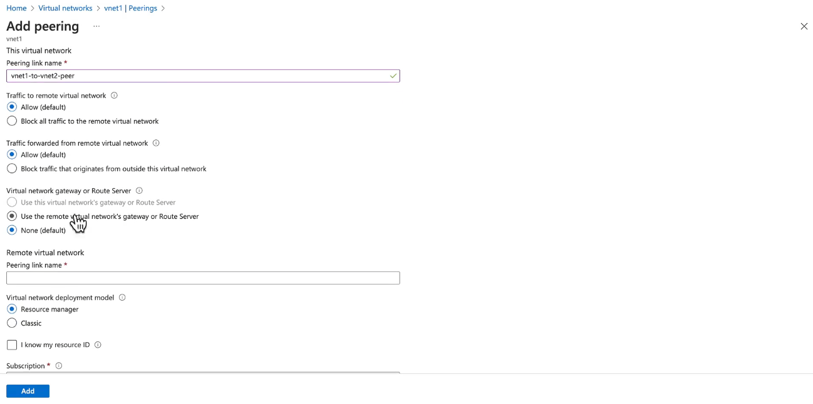

# VNet Peering

**Virtual Network (VNet) Peering** is a feature in Azure that allows you to connect two or more virtual networks seamlessly. Once peered, the virtual networks appear as one for connectivity purposes, enabling resources in one virtual network to communicate with resources in another virtual network as if they were in the same network.

## Key Features of VNet Peering

1. **Seamless Connectivity**: Virtual networks appear as one for connectivity purposes.
2. **Low Latency**: Traffic between peered virtual networks is routed through the Microsoft backbone network, ensuring low latency.
3. **High Bandwidth**: Provides a high-bandwidth connection between resources in different virtual networks.
4. **Private Communication**: Traffic between peered virtual networks remains private and does not traverse the public internet.
5. **Cross-Region Peering**: Supports both local peering (within the same region) and global peering (across regions).
6. **No Downtime**: No downtime to resources in either virtual network when creating or after creating the peering.

## Types of VNet Peering

1. **Local VNet Peering**: Connects virtual networks within the same Azure region.
2. **Global VNet Peering**: Connects virtual networks across different Azure regions.

## Creating VNet Peering in Azure

### Steps to Create VNet Peering

1. **Navigate to Virtual Networks:**

   - Go to the [Azure Portal](https://portal.azure.com/).
   - Select **"Virtual networks"** from the left-hand menu.
   - Choose the first VNet you want to peer.

2. **Initiate Peering:**

   - In the selected VNet's overview, click on **"Peerings"** under the **"Settings"** section.
   - Click **"+ Add"** to create a new peering.

3. **Configure Peering Settings:**

   - **Peering Link Name:** Enter a name for the peering (e.g., `VNet1-to-VNet2`).
   - **Remote Virtual Network:** Select the second VNet you want to peer with.
   - **Peering Link Name (Remote):** Enter a name from the second VNet's perspective (e.g., `VNet2-to-VNet1`).

4. **Set Peering Options:**
   - Configure the following options based on your network requirements.

### Understanding Peering Options

#### 1. **Traffic to Remote VNet**

- **What It Is:** Controls whether the first VNet can send traffic to the second VNet.
- **Options:**

  - **Enabled:** Allows resources in VNet1 to communicate with resources in VNet2.
  - **Disabled:** Prevents traffic from VNet1 to VNet2.

- **Use Case:** Enable this when you want full connectivity between VNets for services to interact.

#### 2. **Traffic Forwarded from Remote VNet**

- **What It Is:** Determines if traffic from the second VNet can be forwarded through the first VNet to other networks.
- **Options:**

  - **Enabled:** Allows VNet2 to route traffic through VNet1 to reach other networks.
  - **Disabled:** Restricts VNet2 from using VNet1 as a transit point.

- **Use Case:** Enable this in hub-and-spoke architectures where VNet1 acts as a central hub for routing.

#### 3. **`Virtual Network Gateway or Route Server`**

- **What It Is:** Specifies whether the peered VNets can share a virtual network gateway or use a route server for advanced routing.
- **Options:**

  - **Allow Gateway Transit:** Lets the remote VNet use the first VNet's gateway.
  - **Use Remote Gateway:** Allows the first VNet to use the remote VNet's gateway.
  - **Enable Forwarded Traffic:** Permits traffic to be forwarded through the VNet for routing purposes.

- **Use Case:**
  - **Allow Gateway Transit:** When multiple VNets need to use a single VPN gateway in VNet1.
  - **Use Remote Gateway:** If VNet1 should utilize VNet2's gateway for connectivity.

## Use Cases

1. **Hub-and-Spoke Network Topology**: Create a central hub virtual network that connects to multiple spoke virtual networks.
2. **Cross-Region Data Replication**: Enable seamless data replication between virtual networks in different regions.
3. **Hybrid Networking**: Connect on-premises networks to Azure virtual networks using VNet peering and VPN gateways.

## Important Consideration

## Summary

VNet Peering in Azure provides a powerful way to connect multiple virtual networks, simplifying network management, enhancing security, and enabling seamless communication between resources in different virtual networks. Whether you need local or global peering, VNet Peering offers a flexible and efficient solution for your networking needs.
