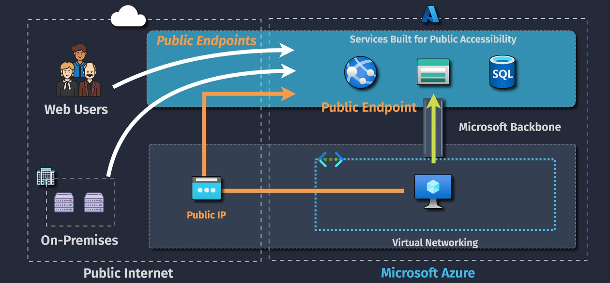
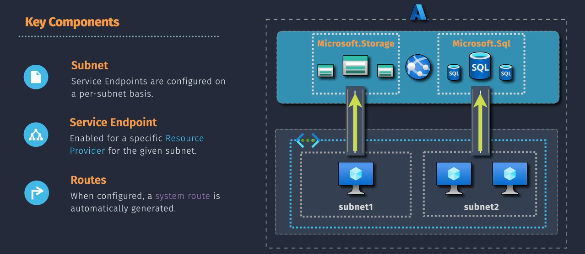

# Service Endpoints in Azure

Service Endpoints in Azure provide a secure and direct connection from a virtual network (VNet) to Azure services, such as Azure Storage, Azure SQL Database, and Azure Key Vault, over the Azure backbone network. This means that traffic between your VNet and these services remains private and does not traverse the public internet, enhancing security and performance.

## Key Points

Traffic goes over the Azure backbone to the public endpoint of the Azure service. The connection is secure but uses a public IP of the azure services

## Key Features

1. **Secure Connectivity**: Connect your VNet directly to Azure services over the Azure backbone, eliminating the need for a public IP.
2. **Improved Security**: Restrict access to Azure services to only your VNet, ensuring that only authorized resources within your VNet can access these services.
3. **Optimized Routing**: Traffic between your VNet and Azure services is routed through the high-speed, low-latency Microsoft backbone network.
4. **Simplified Configuration**: Easily enable service endpoints on a subnet level, allowing for precise control over which subnets can access Azure services.
5. **Supports Multiple Services**: Service Endpoints support a range of Azure services, including Azure Storage, Azure SQL Database, Azure Key Vault, and more.

## Key Components

1. **Virtual Network (VNet)**: A logically isolated network in Azure where your resources, such as VMs, are deployed.
2. **Subnet**: A segment within a VNet where you can enable service endpoints to control access to Azure services.
3. **Service Endpoint**: A configuration that enables secure, direct access to Azure services from a specified subnet within your VNet.
4. **Azure Service**: The specific Azure service (e.g., Azure Storage, Azure SQL Database) that you are connecting to via the service endpoint.

## How to Use Service Endpoints

1. **Navigate to the VNet**: Go to the Azure portal and select the virtual network where you want to enable service endpoints.
2. **Select Subnets**: In the VNet settings, navigate to the "Subnets" section and select the subnet where you want to enable the service endpoint.
3. **Enable Service Endpoints**:
   - In the subnet settings, find the "Service Endpoints" section.
   - Select the Azure services you want to enable service endpoints for (e.g., Azure Storage, Azure SQL Database).
4. **Configure Azure Services**:
   - Go to the settings of the Azure service you want to connect to.
   - Configure the service to accept traffic from the specified subnet with the service endpoint enabled.
5. **Verify Connectivity**: Test the connectivity from your VMs within the subnet to the Azure service to ensure that the service endpoint is working as expected.

## How Service Endpoints Update Effective Routes

1. **Service Endpoint Configuration**: When you enable a service endpoint for a specific Azure service (e.g., Azure Storage) on a subnet, Azure recognizes the intent to securely connect that subnet to the service.

2. **Effective Route Table Update**:

   - Azure automatically adds a new route to the effective route table of the subnet.
   - This route directs traffic destined for the Azure service's IP range through the Azure backbone network, instead of routing it through the public internet.
   - The destination address prefix for the route is specific to the Azure service you enabled (e.g., the IP ranges used by Azure Storage).

3. **Route Priority**: These new routes take precedence over the default routes in your virtual network. The effective route table is a combination of:

   - **System Routes**: Default routes created by Azure.
   - **User Defined Routes (UDRs)**: Custom routes you configure.
   - **Service Endpoint Routes**: Automatically added routes for service endpoints.

4. **Private Access**: Traffic to the Azure service from the subnet is now private, staying within the Azure backbone network. This minimizes latency and enhances security, as the traffic doesn’t traverse the public internet.

Let's say you enabled the Azure Storage service endpoint on a subnet. The effective routes might look like this:

| Route Name      | Address Prefix | Next Hop Type                    | Next Hop Address | Explanation                                               |
| --------------- | -------------- | -------------------------------- | ---------------- | --------------------------------------------------------- |
| DefaultRoute    | 0.0.0.0/0      | Internet                         |                  | Default route to the internet for all traffic.            |
| ServiceEndpoint | 13.64.0.0/16   | Virtual Network Service Endpoint |                  | Route to Azure Storage within the Azure backbone network. |
