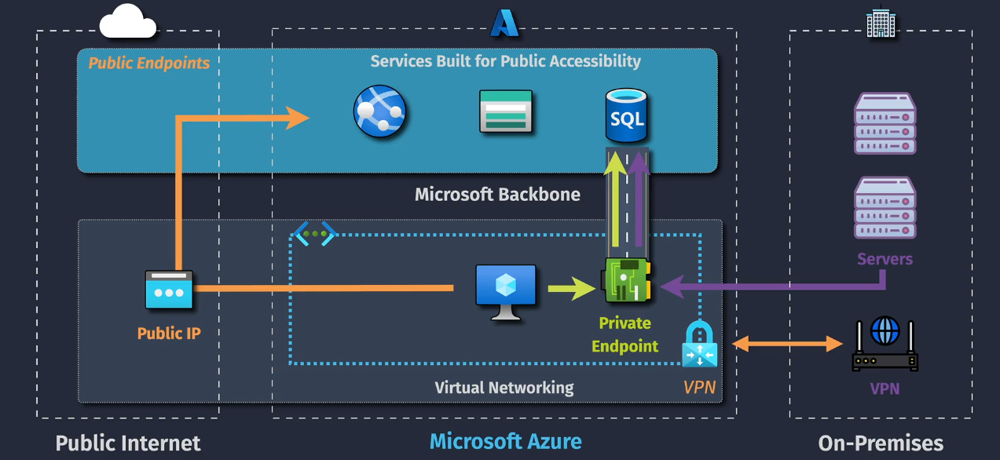
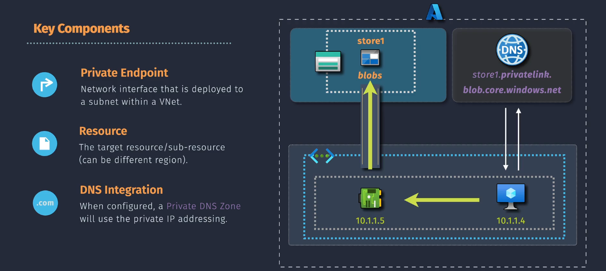
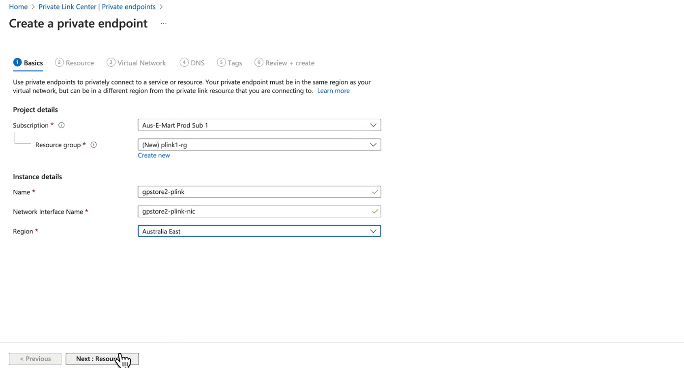
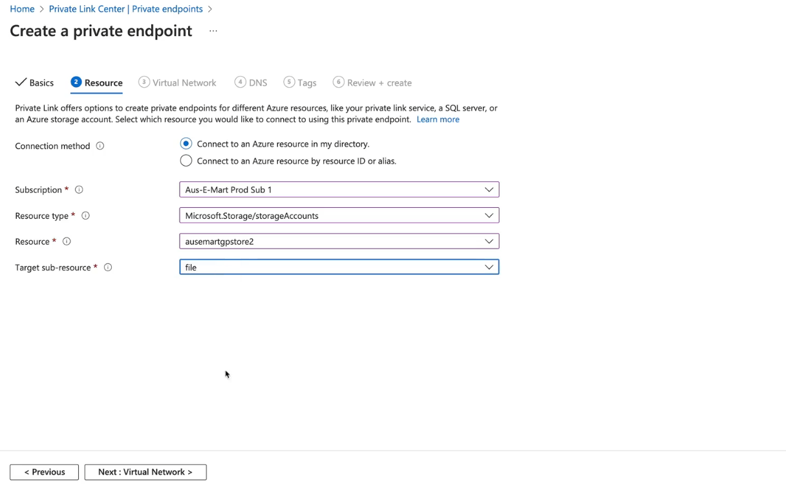
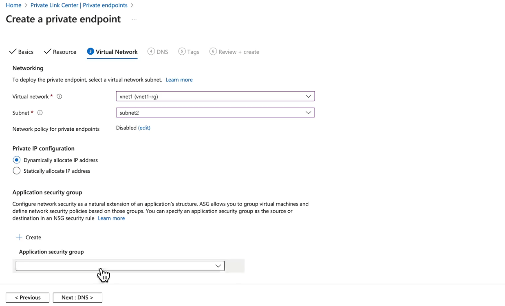
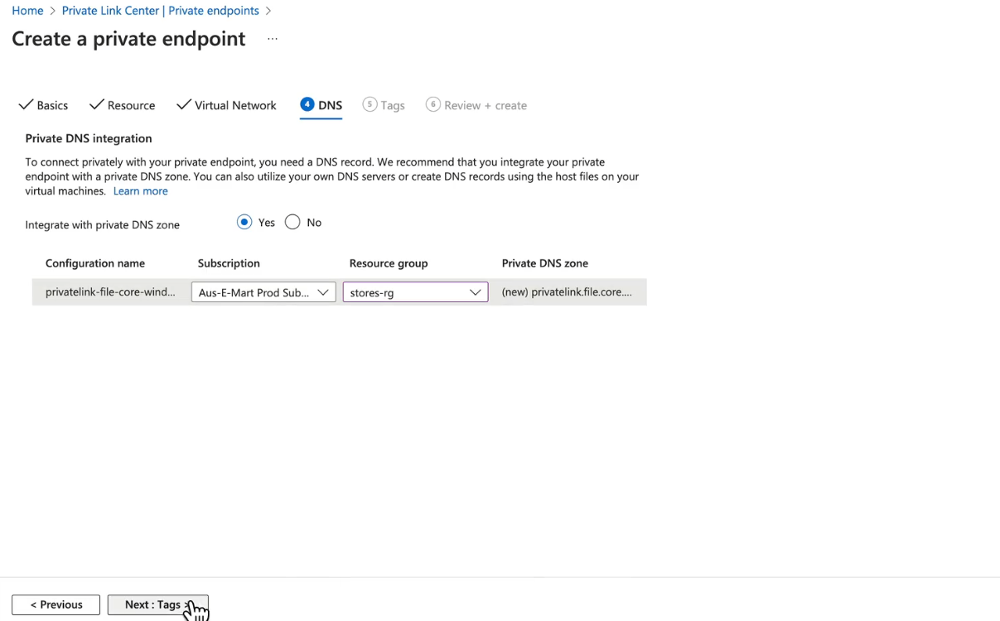

# Azure Private Links

**Azure Private Links** provide a secure and private way to connect your virtual network (VNet) to Azure services, such as Azure Storage, Azure SQL Database, and Azure Key Vault, without exposing your traffic to the public internet. By using private endpoints, you can ensure that traffic between your VNet and Azure services remains within the Microsoft backbone network, enhancing security and performance.

## Key Features

1. **Private Connectivity**: Connect your VNet to Azure services using private endpoints, keeping traffic private and secure.
2. **Enhanced Security**: Traffic does not traverse the public internet, reducing exposure to potential threats.
3. **Optimized Routing**: Traffic is routed through the Microsoft backbone network, ensuring low latency and high bandwidth.
4. **Simplified Network Management**: Easily enable private links at the subnet level, providing precise control over access to Azure services.
5. **Support for Multiple Services**: Private links support a wide range of Azure services, including Azure PaaS, customer-owned services, and partner services.

## Key Components

1. **Virtual Network (VNet)**: The isolated network within Azure where your resources are deployed.
2. **Subnet**: The segment within the VNet where you enable private endpoints.
3. **Private Endpoint**: A network interface with a private IP address from your VNet that connects to an Azure service.
4. **Azure Service**: The specific Azure service (e.g., Azure Storage, Azure SQL Database) that you are connecting to via the private endpoint.
5. **Private DNS Zone**: Manages and resolves domain names in your private VNet, translating them to private IP addresses for seamless access to Azure services.

## DNS Integration with Private Endpoints

To seamlessly access Azure services via private endpoints, Azure Private DNS zones play a critical role. Here’s how it works:

1. **Private DNS Zone**: A private DNS zone allows you to manage and resolve domain names in your private VNet, translating them to private IP addresses.
2. **DNS Configuration**:
   - When you create a private endpoint, Azure can automatically configure a private DNS zone to resolve the Azure service's domain name to the private IP address of the endpoint.
   - This ensures that applications and services within your VNet can use familiar domain names to access Azure services privately.
3. **Linking DNS Zones**: You can link the private DNS zone to multiple VNets, enabling DNS resolution across different VNets.

**Example**: Configuring a Private DNS Zone for an Azure Storage Account

- **Create a Private DNS Zone**: In the Azure portal, create a private DNS zone (e.g., `privatelink.blob.core.windows.net` for Azure Blob Storage).
- **Create Private Endpoint**: Create a private endpoint for your Azure Storage account and link it to the private DNS zone.
- **DNS Record**: Azure automatically adds an A record in the private DNS zone, mapping the storage account's domain name to the private IP address of the private endpoint.
- **VNet Link**: Link the private DNS zone to your VNet(s) to ensure DNS resolution within those VNets.

## Example of Creating Private Links

We will Create Azure Private Links to Connect a Subnet with an Azure Storage Account

### 1. **Start Creating a Private Endpoint**

- Navigate to the **Azure Portal**.
- Go to **Private Link Center** > **Private Endpoints**.
- Click **+ Create** to start creating a new private endpoint.

### 2. **Basics Configuration**

- **Overview:**
  
- **Subscription**: Select the subscription (e.g., `Aus-E-Mart Prod Sub 1`).
- **Resource Group**: Choose an existing resource group or create a new one (e.g., `plink1-rg`).
- **Instance Details**:
  - **Name**: Provide a name for the private endpoint (e.g., `gpstore2-plink`).
  - **Network Interface Name**: Specify a name for the network interface (e.g., `gpstore2-plink-nic`).
  - **Region**: Select the appropriate Azure region (e.g., `Australia East`).
- Click **Next: Resource**.

### 3. **Resource Configuration**

- **Overview:**
  
- **Connection Method**: Choose `Connect to an Azure resource in my directory`.
- **Subscription**: Ensure the subscription matches the one used earlier.
- **Resource Type**: Select the type of resource (e.g., `Microsoft.Storage/storageAccounts`).
- **Resource**: Pick the specific storage account you want to connect (e.g., `ausemartgpstore2`).
- **Target Sub-Resource**: Select the type of sub-resource (e.g., `file`).
- Click **Next: Virtual Network**.

### 4. **Virtual Network Configuration**

- **Overview:**
  
- **Virtual Network**: Choose the virtual network (e.g., `vnet1`).
- **Subnet**: Select a subnet (e.g., `subnet2`).
- **Private IP Configuration**:
  - Choose `Dynamically allocate IP address` or `Statically allocate IP address` as per your requirements.
- **Application Security Group** (optional): You can assign an Application Security Group or leave it empty.
- Click **Next: DNS**.

### 5. **DNS Configuration**

- **Overview:**
  
- Enable integration with a private DNS zone by selecting **Yes**.
- **Configuration Name**: Verify or adjust the configuration name (e.g., `privatelink-file-core-windows`).
- **Private DNS Zone**: Select or create a new private DNS zone.
- Click **Next: Tags**.

### 6. **Tags (Optional)**

- Add tags to organize your resources (e.g., `Environment: Production`, `Owner: Networking Team`).
- Click **Next: Review + Create**.

### 7. **Review and Create**

- Review all configurations.
- If everything is correct, click **Create** to finalize the private endpoint.

Your private endpoint will now securely connect your subnet to the specified Azure storage account.
