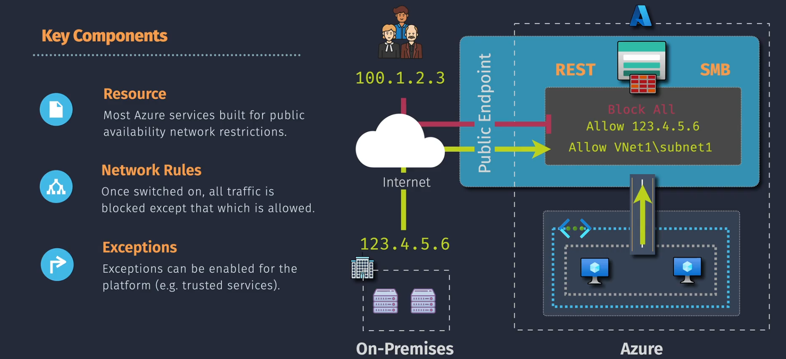
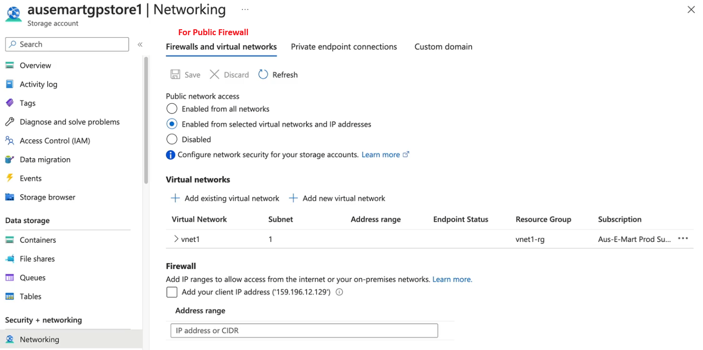

# Azure Resource Firewall

**Azure Firewall** is a cloud-native, managed network security service that protects your Azure Virtual Network (VNet) resources. It provides high availability and unrestricted cloud scalability, helping you create, enforce, and log application and network connectivity policies across subscriptions and VNets.

## Key Features

1. **Stateful Firewall**: Azure Firewall is a fully stateful firewall as a service, meaning it keeps track of the state of active connections and can make decisions based on the context of the traffic.
2. **High Availability**: Built-in high availability ensures that your firewall remains operational even in the event of failures.
3. **Scalability**: Azure Firewall offers unrestricted cloud scalability, allowing it to handle large volumes of traffic without performance degradation.
4. **Threat Intelligence**: Azure Firewall Standard includes threat intelligence-based filtering, which alerts and denies traffic from/to known malicious IP addresses and domains.
5. **Advanced Threat Detection**: Azure Firewall Premium provides signature-based intrusion detection and prevention (IDPS) to rapidly detect attacks by looking for specific patterns in network traffic.
6. **Centralized Management**: Azure Firewall Manager allows you to centrally manage firewalls across multiple subscriptions, applying a common set of network and application rules.

## Key Components

1. **Resource**: This refers to the Azure service you want to protect, such as a Storage Account, SQL Database, or any other Azure resource.
2. **Network Rules**: These define the traffic that is allowed or denied based on IP addresses, ports, and protocols. Network rules control both inbound and outbound traffic at the network layer (Layer 4).
3. **Exceptions**: Specific allowances for Azure services that need to bypass the firewall. Common services that may require exceptions include:
   - Azure Backup
   - Azure Monitor
   - Azure Site Recovery
   - Azure DevTest Labs
   - Azure Event Grid
   - Azure Event Hubs
   - Azure Networking
   - Azure SQL Data Warehouse

## How to Deploy and Configure Azure Firewall

### 1. **Firewalls and Virtual Networks** (For Public Access)

- **Public Network Access**: Choose one of the following:
  - `Enabled from all networks`: Allows access from any public network.
  - `Enabled from selected virtual networks and IP addresses`: Specify allowed IP ranges or Azure subnets. Note: Subnets must have private links configured.
  - `Disabled`: Disables all public access.
- Add IP ranges or Azure subnets as needed to allow specific access.

### 2. **Private Endpoint Connections** (For Private Access)

- Access is controlled via:
  - **Network Security Groups (NSGs)**: Define inbound and outbound traffic rules.
  - **Route Tables**: Configure routes for directing traffic to the private endpoint.
- Ensure proper configuration of NSGs and route tables to secure private endpoint access.
