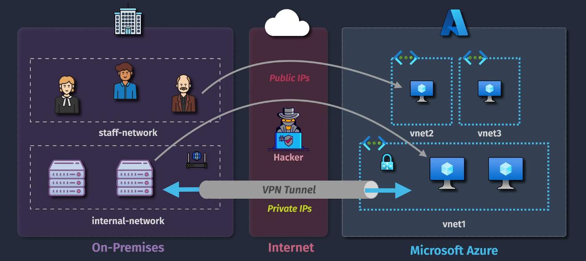
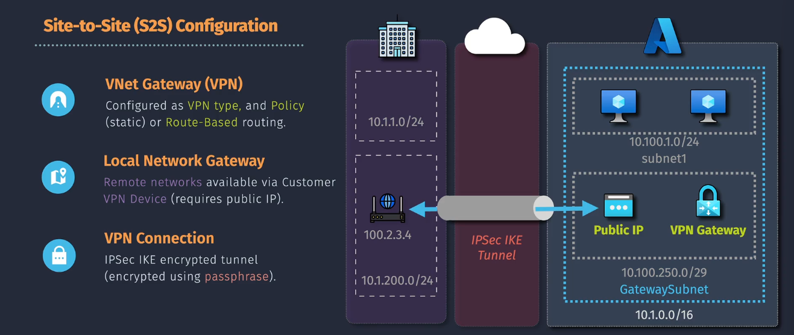
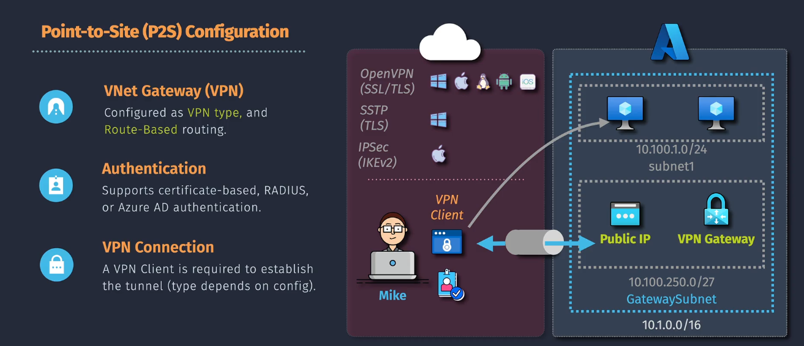

# VPN Gateway

**VPN Gateway** in Azure is a service that provides secure cross-premises connectivity between your Azure virtual network (VNet) and your on-premises network or between multiple Azure VNets. It's a way to create a secure tunnel for your data as it travels across the internet.

## Types of VPN Gateway Connections

### 1. **Site-to-Site (S2S) VPN:**

- **Definition**: Connects an entire on-premises network to an Azure VNet. This type of connection extends your on-premises network to Azure over an IPsec/IKE VPN tunnel.
- **Use Case**: Suitable for scenarios where you need to connect two or more networks. For example, connecting your company's main office network to your Azure infrastructure.
- **Requirements**: Requires a VPN device (router or firewall) that supports IPsec/IKE.

### 2. **Point-to-Site (P2S) VPN:**

- **Definition**: Connects individual devices (clients) to an Azure VNet. This type of connection allows users to connect to Azure from anywhere using a secure connection.
- **Use Case**: Ideal for remote workers who need to securely connect to the Azure VNet from their laptops or mobile devices.
- **Requirements**: Only requires a client device with VPN client software. No need for a dedicated VPN device on the on-premises side.

## Summary

- **Site-to-Site (S2S) VPN**: Network-to-network connection. Use for connecting whole networks.
- **Point-to-Site (P2S) VPN**: Individual device-to-network connection. Use for connecting individual devices remotely.
