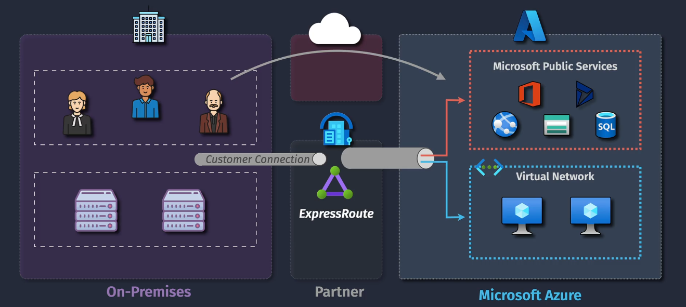
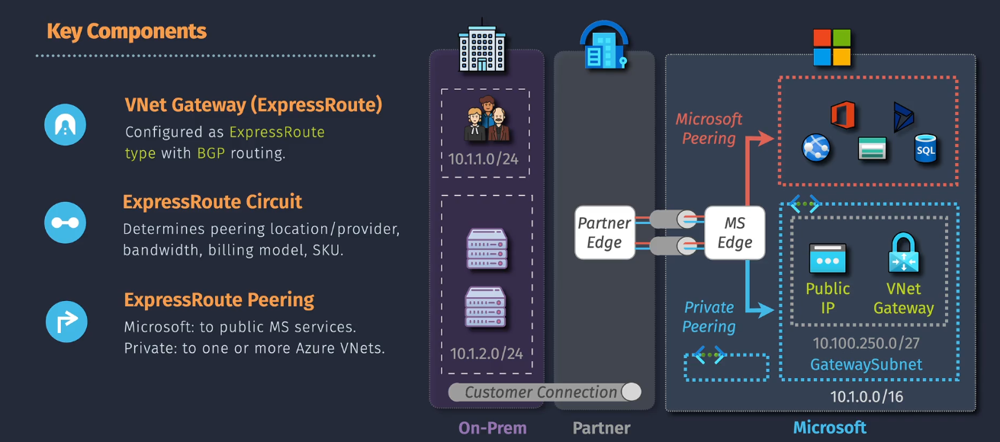

# Express Route

**Azure ExpressRoute** is a service that lets you connect your on-premises network to Microsoft Azure over a private, dedicated connection. This means your data doesn't travel over the public internet, making it more secure and reliable.

## Key Components of ExpressRoute

1. **ExpressRoute Circuit**: This is the logical connection between your on-premises network and Microsoft Azure. Think of it as a dedicated "pipe" for your data.it is has a services key which is A unique identifier for your ExpressRoute circuit. It's used to manage and configure your connection.

2. **Connectivity Provider**: A service provider that partners with Microsoft to offer ExpressRoute connections. They handle the physical connection to Microsoft's network.
3. **Edge Routers**: These are the routers at the entry point `(partner edge)` and exit point `(ms edge)` of the ExpressRoute circuit. They ensure your data is routed correctly between your network and Azure.

4. **Peering Locations**: Physical locations where your network connects to Microsoft's network. These can be at data centers or colocation facilities.
   - **Microsoft:** to public ms services.
   - **Private:** to one or more az VNets.

## Benefits of ExpressRoute

- **Security**: Data travels over a private connection, not the public internet.
- **Reliability**: Offers higher availability and lower latency compared to internet-based connections.
- **Performance**: Provides consistent and predictable performance.

## Important Considerations

