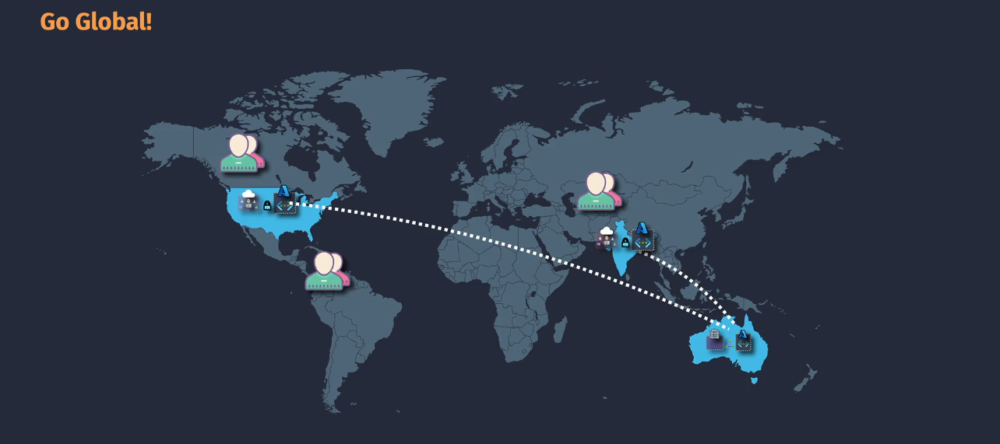
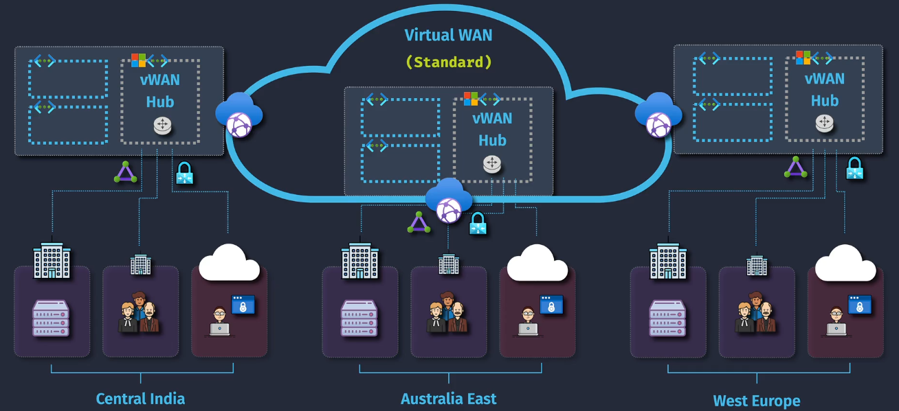
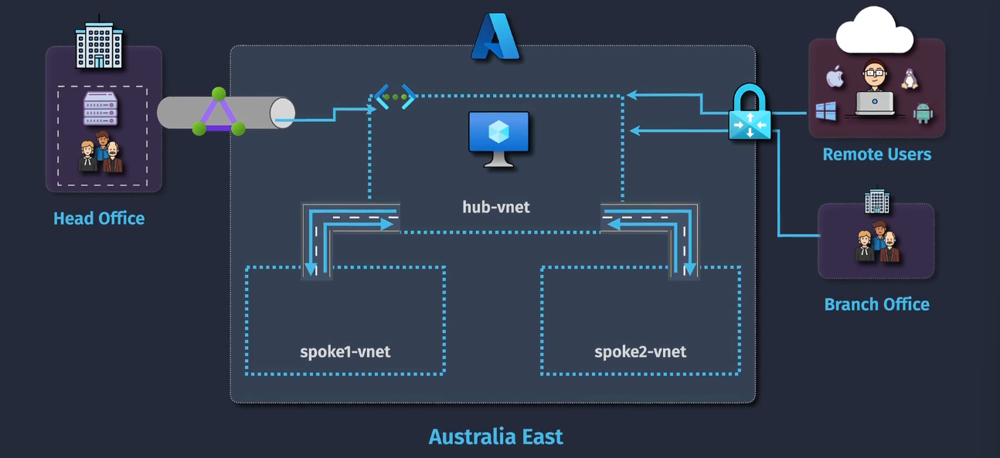
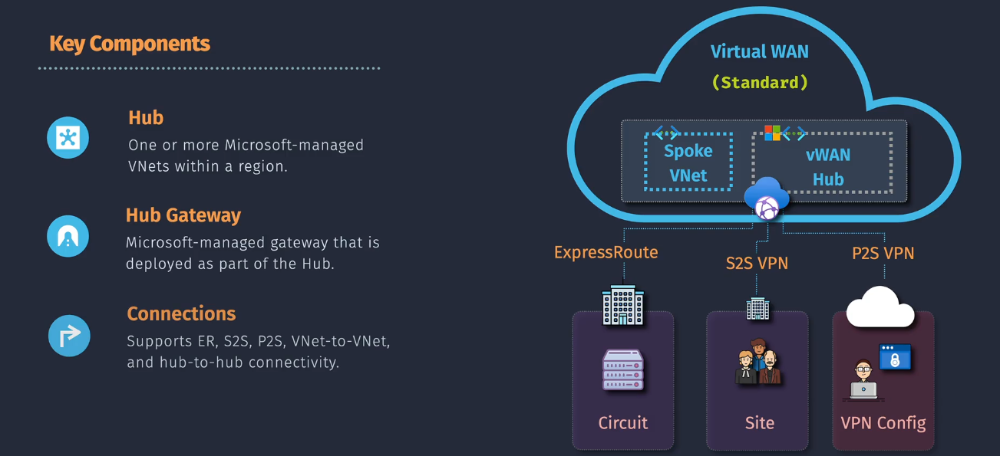

# Azure Virtual WAN

**Azure Virtual WAN** is a networking service that provides optimized and automated branch connectivity to, and through, Azure. It enables you to connect your branches, remote users, and data centers to Azure using a unified `hub-and-spoke architecture`.

## Hub-and-Spoke Architecture

The **Hub-and-Spoke Architecture** is a network topology designed to simplify management, optimize performance, and enhance security within Azure Virtual WAN. Here's how it works:

1. **Central Hub**:

   - The **Virtual WAN Hub** acts as the central point of connectivity for all the spokes. It manages and routes traffic efficiently.
   - This hub is fully managed by Azure, ensuring high availability and scalability.

2. **Spokes**:

   - **Spokes** are VNets or branch locations connected to the hub. Each spoke is isolated from other spokes, ensuring secure and controlled communication.
   - Spokes can be VNets in Azure, on-premises locations connected via Site-to-Site VPN or ExpressRoute, or remote users connected via Point-to-Site VPN.

3. **Traffic Routing**:

   - Traffic between spokes always flows through the hub, enabling centralized management and security.
   - The hub-and-spoke design reduces the complexity of managing direct connections between each VNet or location.

4. **Security**:
   - Centralized security policies can be applied at the hub, ensuring consistent security measures across all connected spokes.
   - The isolation of spokes enhances security by limiting the scope of potential breaches.

## Key Components of Virtual WAN

1. **Virtual WAN Hub**: A managed resource that acts as a central connection point for your network. It handles all the routing and connectivity for the branches, remote users, and data centers.
2. **Virtual Network Connections**: These are the connections between your virtual networks (VNets) and the Virtual WAN hub. They allow your VNets to communicate through the hub.
3. **Site-to-Site VPN Connections**: These are VPN connections from your on-premises locations (branches) to the Virtual WAN hub. They provide secure connectivity over the internet.
4. **Point-to-Site VPN Connections**: These are VPN connections for individual users to connect securely to the Virtual WAN hub from anywhere.
5. **ExpressRoute Connections**: These are private connections from your on-premises locations to the Virtual WAN hub. They offer higher security and reliability compared to internet-based connections.
6. **Security and Routing Policies**: Define how traffic is routed and secured across the Virtual WAN, allowing you to implement policies for optimal performance and security.
