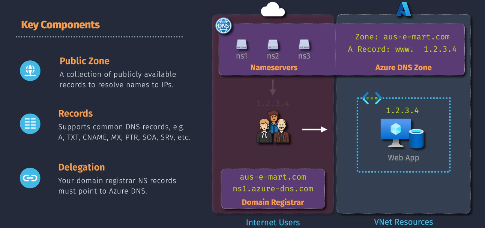
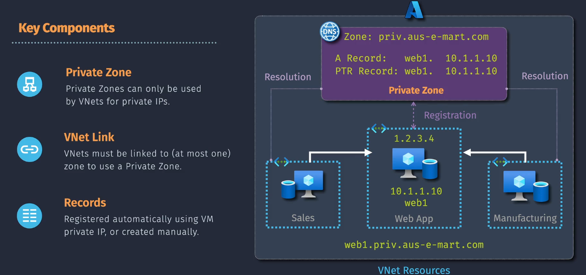

# Azure DNS

**Azure DNS** is a hosting service for DNS domains that provides name resolution using Microsoft Azure infrastructure. It supports both public and private DNS zones, allowing you to manage DNS records with the same credentials, APIs, tools, billing, and support as your other Azure services.


## Public DNS Zones

**Public DNS zones** are used to host DNS records for domains that are accessible from the internet. These zones are hosted on Azure's global network of DNS name servers, ensuring high availability and performance.


### **Step-by-Step Guide:**

#### Step 1: Sign in to the Azure Portal

1. **Go to the Azure Portal**: Open your web browser and navigate to the [Azure portal](https://portal.azure.com/).
2. **Sign In**: Use your Azure account credentials to sign in.

#### Step 2: Create a DNS Zone

1. **Create a Resource**: Once signed in, click on **"Create a resource"** in the left-hand menu.
2. **Search for DNS Zone**: In the search bar, type **"DNS zone"** and select it from the search results.
3. **Create the DNS Zone**:

   - Click **"Create"** to start creating a new DNS zone.
   - **Basics Tab**:
     - **Subscription**: Select the Azure subscription you want to use.
     - **Resource Group**: Choose an existing resource group or create a new one.
     - **Name**: Enter the name for your DNS zone (e.g., `contoso.com`).
     - **Region**: Azure DNS zones are globally distributed, so you can choose any region.

4. **Review + Create**: Click **"Review + create"**, verify the settings, and then click **"Create"** to create the DNS zone.

#### Step 3: Create DNS Records

1. **Navigate to Your DNS Zone**: Once the DNS zone is created, go to its overview page.
2. **Record Sets**: Click on **"Record sets"** in the left-hand menu.
3. **Add Record Set**: Click on **"+ Record set"** to create a new DNS record.
4. **Configure the Record**:

   - **Name**: Enter the name of the record (e.g., `www` for `www.contoso.com`).
   - **Type**: Select the type of DNS record (e.g., A, MX, CNAME).
   - **TTL**: Set the Time-to-Live (TTL) value for the record. This determines how long the record is cached by DNS resolvers.
   - **IP Address or Value**: Enter the IP address or value for the record (e.g., `203.0.113.1` for an A record).

5. **Create**: Click **"OK"** to create the DNS record.

### **Example:**

Let's say you want to create a public DNS zone for `contoso.com` and add a few DNS records:

1. **Sign in to the Azure Portal**: Go to the Azure portal and sign in with your account.
2. **Create a DNS Zone**:

   - Navigate to "Create a resource" and search for "DNS zone".
   - Click on "DNS zone" and fill in the required details:
     - **Name**: `contoso.com`
     - **Resource Group**: Select an existing resource group or create a new one.
     - **Region**: Choose any region (DNS zones are globally distributed).
   - Click "Review + create", verify the settings, and then click "Create".

3. **Create DNS Records**:
   - **A Record**:
     - **Name**: `www`
     - **Type**: `A`
     - **TTL**: `3600` (1 hour)
     - **IP Address**: `203.0.113.1`
   - **MX Record**:
     - **Name**: (leave blank for root domain)
     - **Type**: `MX`
     - **TTL**: `3600` (1 hour)
     - **Mail Server**: `mail.contoso.com`

## Private DNS Zones

**Private DNS zones** are used to host DNS records for domains that are only accessible within your virtual network. These zones are not resolvable from the internet, providing a secure DNS service for your virtual network.


Absolutely, let's dive deeper into each step and explain the **Auto Registration** feature for private DNS zones.

### **Step-by-Step Guide:**

#### Step 1: Sign in to the Azure Portal

1. **Go to the Azure Portal**: Open your web browser and navigate to the [Azure portal](https://portal.azure.com/).
2. **Sign In**: Use your Azure account credentials to sign in.

#### Step 2: Create a Private DNS Zone

1. **Create a Resource**: Once signed in, click on **"Create a resource"** in the left-hand menu.
2. **Search for Private DNS Zone**: In the search bar, type **"Private DNS zone"** and select it from the search results.
3. **Create the DNS Zone**:

   - Click **"Create"** to start creating a new private DNS zone.
   - **Basics Tab**:
     - **Subscription**: Select the Azure subscription you want to use.
     - **Resource Group**: Choose an existing resource group or create a new one.
     - **Name**: Enter the name for your private DNS zone (e.g., `internal.contoso.com`).
     - **Region**: Select the region for your DNS zone.

4. **Review + Create**: Click **"Review + create"**, verify the settings, and then click **"Create"** to create the DNS zone.

#### Step 3: Link to Virtual Network

1. **Navigate to Your Private DNS Zone**: Once the DNS zone is created, go to its overview page.
2. **Virtual Network Links**: Click on **"Virtual network links"** in the left-hand menu and then click **"+ Add"**.
3. **Add Link**:
   - **Link Name**: Enter a name for the virtual network link.
   - **Subscription**: Select the subscription containing the VNet.
   - **Virtual Network**: Choose the virtual network you want to link to the DNS zone.
   - **Auto Registration**: **Enable Auto Registration** to automatically register the DNS records for VMs in the linked VNet.

**Auto Registration** Feature:

- **Auto Registration** automatically creates and deletes DNS records in the private DNS zone based on the lifecycle of virtual machines (VMs) in the linked virtual network. When a VM is deployed, Azure automatically adds an A record for the VM in the DNS zone. When the VM is deleted, Azure automatically removes the corresponding A record. This simplifies DNS management and ensures that DNS records are always up to date.

4. **Add**: Click **"Add"** to link the VNet to the private DNS zone.

#### Step 4: Create DNS Records

1. **Navigate to Record Sets**: In the overview page of the private DNS zone, click on **"Record sets"**.
2. **Add Record Set**: Click on **"+ Record set"** to create a new DNS record.
3. **Configure the Record**:

   - **Name**: Enter the name of the record (e.g., `web` for `web.internal.contoso.com`).
   - **Type**: Select the type of DNS record (e.g., A, MX, CNAME).
   - **TTL**: Set the Time-to-Live (TTL) value for the record.
   - **IP Address or Value**: Enter the IP address or value for the record (e.g., `10.0.0.4` for an A record).

4. **Create**: Click **"OK"** to create the DNS record.

### **Example:**

1. **Create a Private DNS Zone**:
   - Name: `internal.contoso.com`
   - Resource Group: `RG-PrivateDNS`
2. **Link to Virtual Network**:
   - VNet: `VNet-Production`
3. **Add DNS Records**:
   - A Record: `web.internal.contoso.com` -> `10.0.0.1`
   - MX Record: `mail.internal.contoso.com` -> Mail server IP

```bash
ping web.internal.contoso.com
```

## Important Considerations for Azure DNS

1. **Security**:

   - **DNS Security**: Implement DNS security features like DNSSEC (Domain Name System Security Extensions) for public DNS zones to protect against spoofing and ensure integrity.
   - **Access Control**: For private DNS zones, manage access through Azure Active Directory and role-based access control (RBAC) to restrict who can make changes to DNS records.

2. **Network Configuration**:

   - **Virtual Network Links**: Ensure private DNS zones are correctly linked to the appropriate virtual networks to enable DNS resolution within those networks.
   - **Network Security Groups (NSGs)**: Use NSGs to control traffic flow and protect your DNS infrastructure.

3. **High Availability and Performance**:

   - **Global Distribution**: For public DNS zones, Azure DNS uses a global network of name servers to ensure high availability and low latency.
   - **Redundancy**: Consider using multiple DNS zones or integrating with other DNS services for additional redundancy.

4. **Name Resolution**:

   - **Private DNS Integration**: Ensure that private DNS zones are configured to resolve domain names to the correct private IP addresses within your VNet.
   - **Conditional Forwarding**: Use conditional forwarding rules to resolve DNS queries for specific domains to designated DNS servers.

5. **Monitoring and Logging**:

   - **DNS Analytics**: Use Azure Monitor and DNS Analytics to monitor DNS queries, identify patterns, and detect anomalies.
   - **Logging**: Enable logging to track changes and access to DNS records for audit purposes.

6. **Cost Management**:
   - **Billing**: Understand the pricing model for Azure DNS, including the cost of DNS queries and hosted zones. Regularly review usage to manage costs effectively.
