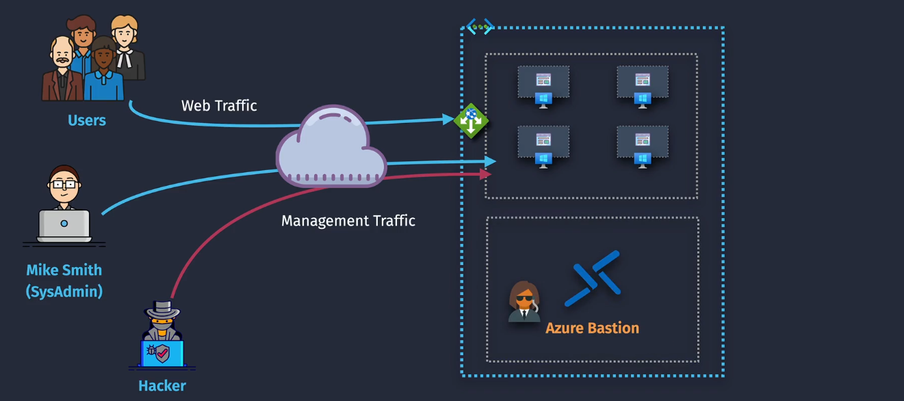

# Azure Bastion

**Azure Bastion** is a Platform as a Service (PaaS) offering that you can provision within your virtual network. It provides secure and seamless RDP/SSH connectivity to your VMs directly over TLS from the Azure portal or via the native SSH or RDP client on your local computer. This means you don't need a public IP address on your VMs, and you can avoid managing Network Security Groups (NSGs) for RDP/SSH access.

## Key Benefits

1. **Secure Access**: Connects to your VMs using private IP addresses, eliminating the need for public IP addresses and reducing exposure to potential attacks.
2. **Seamless Connectivity**: Provides a single-click, seamless RDP/SSH experience directly from the Azure portal.
3. **No Public IP Required**: Your VMs don't need public IP addresses, which enhances security.
4. **No Agent Software**: No need for agent software on your VMs.
5. **Protection Against Port Scanning**: Reduces the risk of port scanning by malicious users.
6. **High Availability**: Offers multiple SKU tiers (Developer, Basic, Standard, Premium) to meet different needs.

## Use Cases

- **Remote Administration**: Easily manage and administer your VMs without exposing them to the internet.
- **Dev/Test Environments**: Securely connect to VMs in development and testing environments.
- **Hybrid Cloud**: Connect to VMs in a hybrid cloud setup without needing public IP addresses.
- **Compliance**: Meet compliance requirements by avoiding public IP exposure.

## How Does Azure Bastion Work?

1. **Deployment**: You deploy Azure Bastion within your virtual network. It sits at the perimeter of your virtual network, acting as a secure gateway.
2. **Connection**: Users connect to the Azure portal using an HTML5 browser and select the VM they want to access. The RDP/SSH session opens directly in the browser.
3. **Security**: All traffic is encrypted over TLS, ensuring secure communication.
4. **Management**: Azure Bastion is fully managed by Microsoft, meaning you don't need to worry about patching or maintaining it.

## Key Component

### 1. Azure Bastion Service

- **Public IP**: When you set up Azure Bastion, you create a Standard SKU public IP address for it. This allows secure access to your VMs without exposing them to the internet.
- **Subnet Deployment**: Azure Bastion is deployed within your Virtual Network (VNet) as a special subnet named `AzureBastionSubnet`. This subnet ensures that Bastion has the necessary address space to operate effectively.

### 2. Connectivity

- **Secure Access**: Azure Bastion provides secure RDP/SSH access to your VMs using private IP addresses. This means your VMs do not need public IP addresses, enhancing security.
- **No NSG Required for Bastion**: You do not need to create Network Security Groups (NSGs) specifically for Azure Bastion. Instead, configure NSGs to allow RDP/SSH access from the Azure Bastion subnet to your VM subnet.

### 3. Client

- **Entra ID Credentials**: Use your Azure Entra ID credentials to log into the Azure portal and access your VMs securely.
- **Native Client**: For the Standard SKU, you can also use native SSH or RDP clients (like PuTTY or Remote Desktop Connection) to connect directly to your VMs through Azure Bastion.
