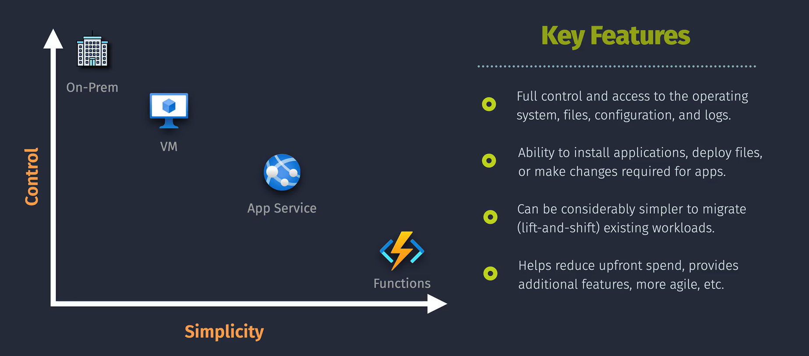
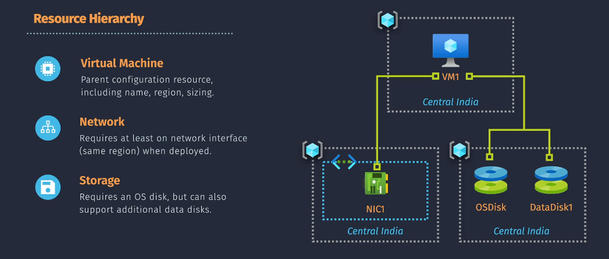

# VMs

## Associated Resources

- **VNet**: A Virtual Network (VNet) must be in the same region as the VM to enable network connectivity.
- **NIC**: A VM requires at least one Network Interface Card (NIC), which also needs to be in the same region as the VM.
- **Storage**: VMs require an OS disk and can support additional data disks. All disks must be in the same region as the VM.

## VM Family

The VM Family refers to a group of virtual machine sizes with different configurations to cater to various needs. Each family offers different sizes, providing flexibility in choosing the most suitable VM size based on specific requirements such as CPU, memory, and storage capacity.

## Key Features

1. **VM Scale Sets**

   - **Description**: VM Scale Sets allow you to create and manage a group of identical, load-balanced VMs. They automatically increase or decrease the number of VMs based on current demand, ensuring scalability and high availability.
   - **Benefits**: Efficiently manage large-scale applications, handle load balancing, and maintain performance during demand spikes.

2. **VM High Availability**

   - **Description**: High availability ensures that your VMs remain operational by distributing them across multiple isolated hardware nodes within either Availability Sets or Availability Zones.
   - **Benefits**: Protects against hardware failures and improves the reliability of applications by reducing downtime.

3. **VM Encryption**
   - **Description**: Provides enhanced security by encrypting the OS and data disks of your VMs using Azure Disk Encryption with BitLocker for Windows VMs or DM-Crypt for Linux VMs.
   - **Benefits**: Protects sensitive data at rest, ensuring compliance with security and regulatory requirements.

## Fees and Quotas

- **Fees**: VMs are charged by the second (Pay-As-You-Go) as long as they are running and not de-allocated.
- **Quota**: There are limits on the number of VMs you can create, which can vary by region and subscription type. It's essential to monitor and manage usage to stay within these quotas.

## Important Considerations

### Immutable/Non-Immutable Properties

- **Name Changes**: Once a VM is created, its name is immutable. If you need to change the name, you must create a new VM with the desired name and migrate your data and configurations to the new VM.

- **VNet Association**: Similarly, the Virtual Network (VNet) a VM is associated with cannot be changed after the VM is created. If you need to move a VM to a different VNet, you must create a new VM in the desired VNet and migrate your workloads.
- **Disk Attachments**: Disks attached to a VM can be moved between VMs, but you need to detach them from the original VM before attaching them to a new VM.
- **Size and SKU**: While you can resize a VM to a different size or SKU within the same VM family, ensure compatibility and plan for brief downtime.(Resize os disk need vm to be stopped)
- **Tags and Labels**: Tags and labels can be modified at any time to help with resource organization and cost management.

### Deleting a VM

- **Data Loss**: When you delete a VM, any data on the VM's OS and temporary disks is lost. Ensure that all important data is backed up.
- **Managed Disks**: Deleting a VM does not automatically delete associated managed disks, which may continue to incur costs. Make sure to review and delete unnecessary disks.
- **Network Resources**: Networking components like NICs and public IP addresses are not deleted automatically. Manually review and clean up resources if they are no longer needed.

### Redeploying a VM

- **Retain IPs**: Redeploying a VM can resolve underlying hardware issues by moving it to a new host. Your public and private IP addresses will remain the same.
- **Data Persistence**: Redeploying does not affect the VM's data disks or configurations. However, it’s a good practice to ensure recent backups are available.
- **Downtime**: Redeploying a VM incurs a brief downtime as the VM is moved to a new host. Plan accordingly to minimize impact.

### Reapplying a VM

- **Configuration**: Reapplying a VM re-runs the VM's configurations in the Azure fabric to address any configuration drift or discrepancies.
- **No Downtime**: This action does not cause downtime or affect the running state of the VM, making it a safe operation to perform.

### Resizing a VM

- **Compatibility**: Ensure the new size is compatible with the VM's current region and hardware cluster. Not all sizes are available in all regions.
- **Downtime**: Resizing typically involves deallocating the VM, which causes downtime. Plan for maintenance windows to minimize service disruptions.
- **Storage Performance**: Consider how changes in VM size may affect your disk performance, as different VM sizes have varying disk throughput and IOPS limits.
- **Network Configuration**: Verify that resizing doesn't disrupt network configurations, especially if you rely on specific NIC settings or IP addresses.
