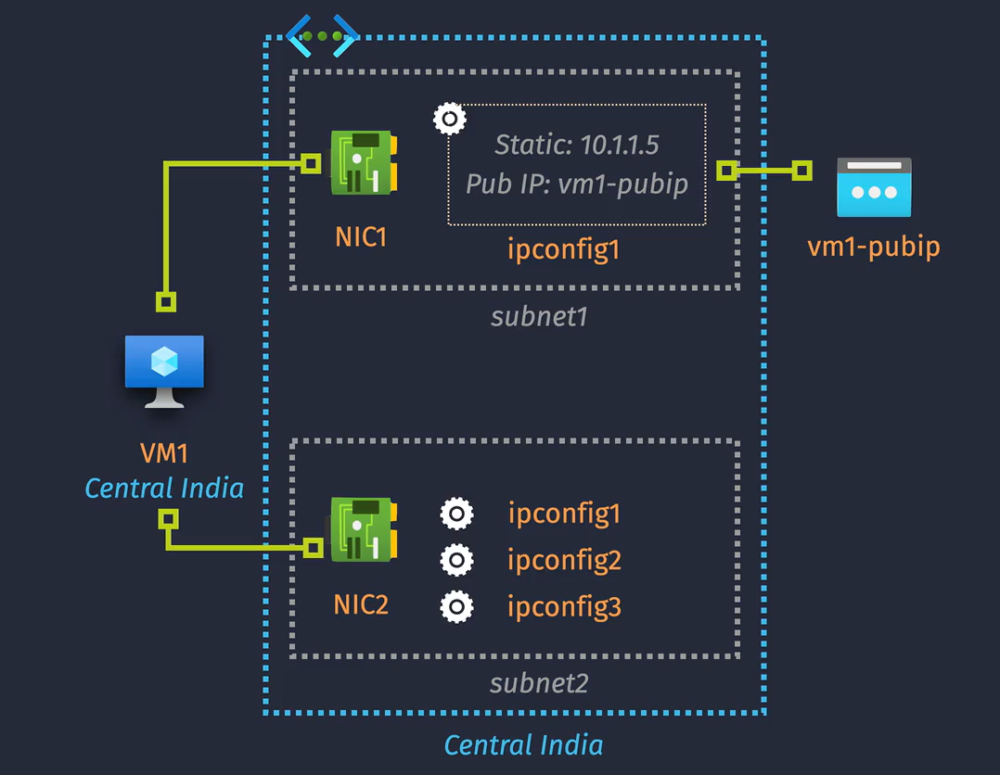

# VMs

## VM Overview

- **VMs Associated Resources** there are other several resource that we need to be associated in the Vms

  - **VNet** VM must be in same region of VNet
  - **NIC** VM Require at least one NIC and it must me in same region.
  - **Storage** VM Require Os disk and can support additional data disk (all in same region)

- **VM Family** refers to a group of virtual machine (VM) sizes that has different sizes and configurations to cater to various needs. You can choose the most suitable VM size based on your specific requirements.

- **Fees and Quota** VMs are charged by the second (for PYAG) so long as the VM is not de-allocated

- **Limitations** you can't change VM name or VNet

## VM Storage

### Disk Types

#### OS Disk

- OS preinstalled to disk (you cannot perform the install manually).
- OS Disks Can use marketplace image, uploaded VHDs, or custom images.
- OS Disks can be resized, but this requires downtime (stop/deallocate VM).
- OS disks cannot be added/detached, but they can be swapped.

#### Data Disk

- Data Used for persistent data storage (application data, files, etc).
- Data Disks can be resized without downtime (for some VM SKUs).
- You can add/detach data disks without downtime (but you should stop activity).

#### Temp Disk

- Temporary fast storage, that is provided from the underlying Azure hypervisor.
- Mounted by default for both Windows (D drive) and Linux (/dev/sdbl).
- Considered ephemeral (data does not persist) and can be lost on restart.
- Not all VM's come with a temp disk; size/availability based on VM SKU.

### Storage Performance

## VM Networking

### **Key Networking Components of an Azure VM**

#### **1. VM SKU**

- **Definition**: Specifies the type and size of a VM, determining its hardware specifications, including CPU, memory, storage, and network capabilities.
- **Impact on Networking**: Influences network bandwidth, the number of supported network interfaces (NICs), and overall network performance.

#### **2. Network Interface (NIC)**

- **Definition**: A virtual network interface card attached to a VM.
- **Purpose**: Connects the VM to a Virtual Network (VNet), enabling it to communicate with other resources within the VNet and beyond.
- **Key Features**: Each NIC can have one or more IP configurations, allowing for multiple IP addresses per NIC.

#### **3. IP Configurations**

- **Definition**: Specifies the IP address settings for a NIC, including private and public IP addresses.
- **Components**:
  - **Private IP Address**: Assigned within the VNet, enabling internal communication.
  - **Public IP Address**: Allows external access to the VM from the internet.
  - **DNS Settings**: Configures the DNS name label and settings for the IP address.

### **VM Networking Notes**

- You can change IP addresses, and subnets associated with a network interface.
- Changing virtual network is not possible. For this, a virtual machine must be recreated.
- IPv6 addresses are supported, but must firstly be enabled for the corresponding vnet/subnet.

## VM Images

## VM Configuration Management

## VM Scale Set

## VM High Availability

## VM Encryption
