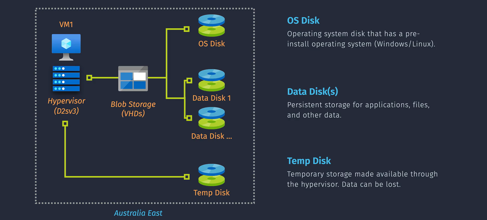
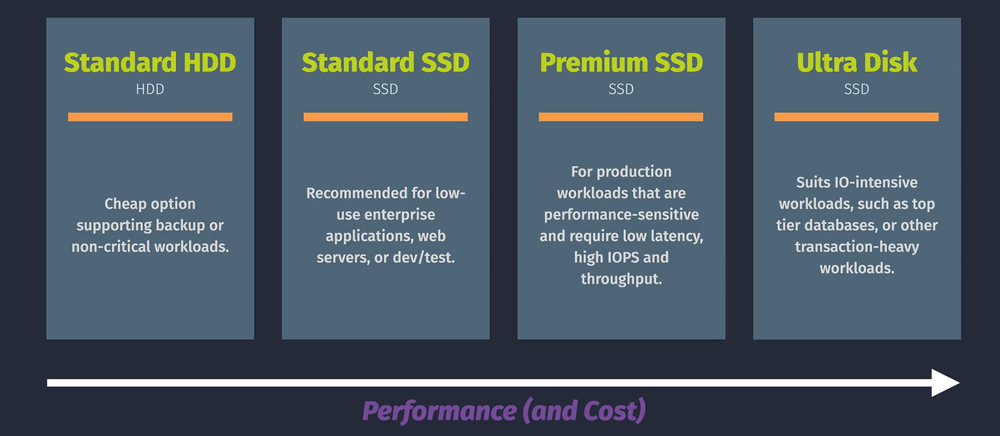

# VMs

## VM Overview

- **VMs Associated Resources** there are other several resource that we need to be associated in the Vms

  - **VNet** VM must be in same region of VNet
  - **NIC** VM Require at least one NIC and it must me in same region.
  - **Storage** VM Require Os disk and can support additional data disk (all in same region)

- **VM Family** refers to a group of virtual machine (VM) sizes that has different sizes and configurations to cater to various needs. You can choose the most suitable VM size based on your specific requirements.

- **Fees and Quota** VMs are charged by the second (for PYAG) so long as the VM is not de-allocated

- **Limitations** you can't change VM name or VNet

## VM Storage

### Disk Types

#### OS Disk

- OS preinstalled to disk (you cannot perform the install manually).
- OS Disks Can use marketplace image, uploaded VHDs, or custom images.
- OS Disks can be resized, but this requires downtime (stop/deallocate VM).
- OS disks cannot be added/detached, but they can be swapped.

#### Data Disk

- Data Used for persistent data storage (application data, files, etc).
- Data Disks can be resized without downtime (for some VM SKUs).
- You can add/detach data disks without downtime (but you should stop activity).

#### Temp Disk

- Temporary fast storage, that is provided from the underlying Azure hypervisor.
- Mounted by default for both Windows (D drive) and Linux (/dev/sdbl).
- Considered ephemeral (data does not persist) and can be lost on restart.
- Not all VM's come with a temp disk; size/availability based on VM SKU.

### Storage Performance

## VM Networking

## VM Images

## VM Configuration Management

## VM Scale Set

## VM High Availability

## VM Encryption
