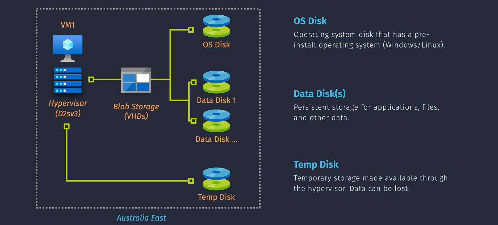
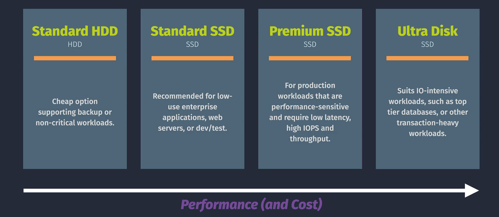

# What is Azure VM Storage?

Azure VM Storage is a critical component of Azure Virtual Machines (VMs). It provides the storage needed to run your workloads on Azure. VM Storage can be broken down into two main components: the OS disk and the data disks. The OS disk is used to store the operating system and is used to boot the VM, while the data disks are used to store application data, logs, and other data beyond what is stored on the OS disk. Azure VM Storage is durable, secure, and scalable. It is managed by Azure and is integrated with other Azure services, such as `Azure Backup` and `Azure Site Recovery`, to provide a comprehensive solution for your storage needs.

## Disk Types

### OS Disk

- **Description**: The OS disk contains the operating system and is used to boot the VM. It is typically a managed disk.
- **Performance Tiers**: Comes in different tiers, such as Standard HDD, Standard SSD, and Premium SSD, to match workload needs.
- **Snapshot and Backup**: You can take snapshots of the OS disk for backups or to create new VMs with the same configuration.
- **Installation**: OS is preinstalled; manual installation is not possible.
- **Resize**: Can be resized, but this requires downtime (stop/deallocate VM).
- **Swapping**: OS disks can be swapped but cannot be added or detached.

### Data Disk

- **Description**: Additional disks attached to store application data, logs, and other data beyond what the OS disk can accommodate.
- **Performance Options**: Available as Standard HDD, Standard SSD, and Premium SSD.
- **Scaling**: Multiple data disks can be attached to a single VM to increase storage capacity and throughput.
- **Management**: Can be resized without downtime (depending on VM SKU). Can be added or detached without downtime (though stopping activity is recommended).
- **Persistence**: Used for persistent data storage (application data, files, etc.).

### Temp Disk

- **Description**: Provides temporary storage local to the VM, used for scratch data, temporary files, or page files.
- **Ephemeral**: Data does not persist and can be lost if the VM is deallocated or restarted.
- **Performance**: Offers high IOPS and throughput, suitable for temporary fast storage needs.
- **Availability**: Mounted by default as D drive (Windows) or /dev/sdb1 (Linux). Not all VMs come with a temp disk; size and availability depend on VM SKU.

Absolutely! Here’s a comparison of the different Performance Tiers for Azure disks to help you choose the right one for your needs:

## Storage Tiers

Choosing the right performance tier depends on your specific workload requirements. Standard HDD is great for cost-saving and less critical tasks, Standard SSD balances cost and performance, and Premium SSD is best for high-performance needs.

### Standard HDD

- **Description**: Cost-effective storage for workloads that are less sensitive to performance variations and can handle higher latency.
- **Use Cases**: Ideal for development and testing environments, non-critical workloads, backup storage, and infrequently accessed data.
- **Performance**: Offers baseline performance with lower IOPS (Input/Output Operations Per Second) and throughput compared to SSDs.

### Standard SSD

- **Description**: Provides a balance between performance and cost. It is designed for workloads that require consistent performance but are not extremely demanding.
- **Use Cases**: Suitable for web servers, low-traffic applications, lightly used databases, and virtual desktops.
- **Performance**: Delivers better performance than Standard HDD, with moderate IOPS and throughput.

### Premium SSD

- **Description**: High-performance storage solution designed for mission-critical and latency-sensitive workloads.
- **Use Cases**: Ideal for enterprise applications, high-traffic web servers, large databases, and applications requiring low latency and high IOPS.
- **Performance**: Offers superior performance with high IOPS and throughput, providing consistent low latency.

### Comparison Table

| Feature        | Standard HDD     | Standard SSD     | Premium SSD                       |
| -------------- | ---------------- | ---------------- | --------------------------------- |
| **Cost**       | Low              | Moderate         | High                              |
| **IOPS**       | Low              | Moderate         | High                              |
| **Throughput** | Low              | Moderate         | High                              |
| **Latency**    | High             | Moderate         | Low                               |
| **Use Cases**  | Dev/Test, Backup | Web Servers, VDI | Databases, High-Perf Applications |
