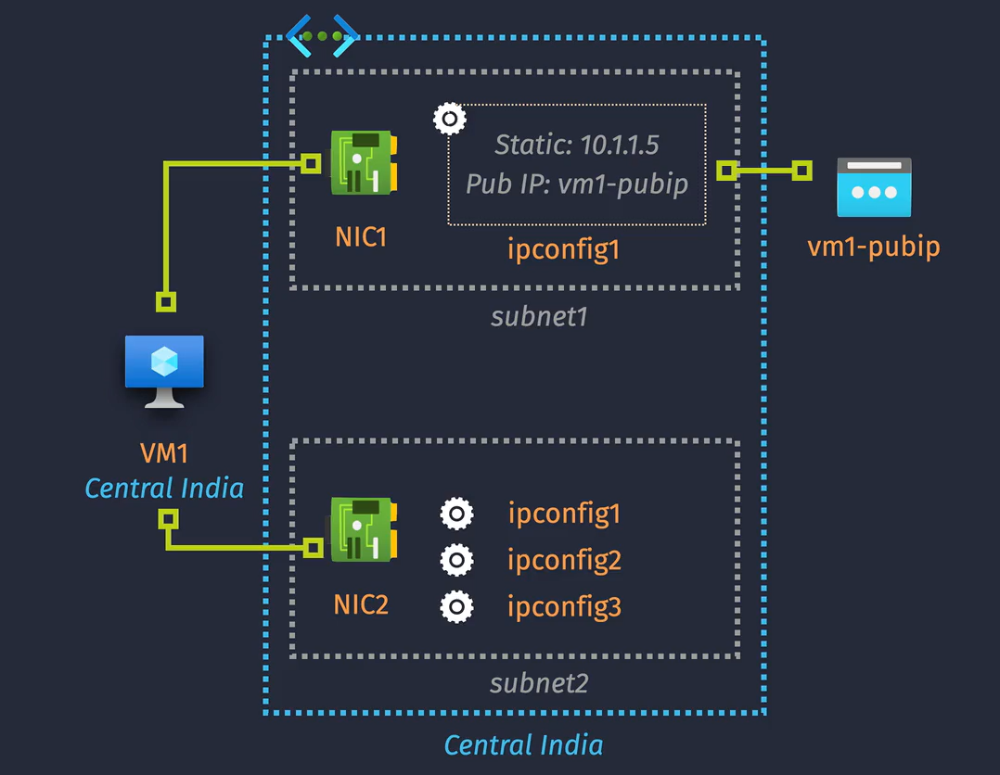

# VM Networking



## **Key Networking Components of an Azure VM**

### **1. VM SKU**

- **Definition**: Specifies the type and size of a VM, determining its hardware specifications, including CPU, memory, storage, and network capabilities.
- **Impact on Networking**: Influences network bandwidth, the number of supported network interfaces (NICs), and overall network performance.

### **2. Network Interface (NIC)**

- **Definition**: A virtual network interface card attached to a VM.
- **Purpose**: Connects the VM to a Virtual Network (VNet), enabling it to communicate with other resources within the VNet and beyond.
- **Key Features**: Each NIC can have one or more IP configurations, allowing for multiple IP addresses per NIC.

### **3. IP Configurations**

- **Definition**: Specifies the IP address settings for a NIC, including private and public IP addresses.
- **Components**:
  - **Private IP Address**: Assigned within the VNet, enabling internal communication.
  - **Public IP Address**: Allows external access to the VM from the internet.
  - **DNS Settings**: Configures the DNS name label and settings for the IP address.

Yes, a virtual machine (VM) in Azure can have multiple network interface cards (NICs) attached. Here's a more readable version:

## Multiple NICs in Azure VMs

Azure allows you to attach multiple NICs to a single VM. This capability provides enhanced network management and flexibility.

**Key Points:**

1. **Network Segmentation**: Multiple NICs enable network traffic segmentation, allowing you to direct traffic to different subnets or virtual networks (VNets).
2. **Enhanced Security**: By using multiple NICs, you can isolate different types of traffic, such as separating management traffic from application traffic.
3. **Load Balancing**: Multiple NICs can help distribute network traffic more efficiently across different network interfaces.

**How to Add Multiple NICs:**

1. **VM Size Compatibility**: Ensure your VM size supports multiple NICs, as not all VM sizes offer this capability.
2. **Adding NICs in Azure Portal**:

   - Go to your VM in the Azure portal.
   - Select "Networking" from the VM settings.
   - Click "Add network interface" and configure the new NIC.

3. **PowerShell**:

   ```powershell
   $vm = Get-AzVM -ResourceGroupName "myResourceGroup" -VMName "myVM"
   $nic = Get-AzNetworkInterface -Name "myNewNic" -ResourceGroupName "myResourceGroup"
   Add-AzVMNetworkInterface -VM $vm -Id $nic.Id -Primary
   Update-AzVM -ResourceGroupName "myResourceGroup" -VM $vm
   ```

## **VM Networking Notes**

- **Changing virtual network is not possible. For this, a virtual machine must be recreated.**
- **IP Configuration**: Each NIC can have its own private IP address configuration.
- **Subnet Association**: NICs can be associated with different subnets within the same VNet or different VNets.
- **VM Restart**: Adding or removing NICs typically requires the VM to be stopped and restarted.
- IPv6 addresses are supported, but must firstly be enabled for the corresponding VNet/subnet.
- **Public IP:**are managed by Microsoft. This means that the operating system (OS) of the virtual machine (VM) is not directly aware of the public IP address. Instead, Microsoft handles the network address translation (NAT) for you. When traffic is directed to the VM's public IP address:

  - **Public IP**: Managed by Azure and associated with your VM.
  - **NAT**: Azure uses NAT to translate the public IP address to the VM's private IP address.
  - **Traffic Flow**: Incoming traffic goes to the public IP, and Azure NATs it to the appropriate private IP of your VM.
