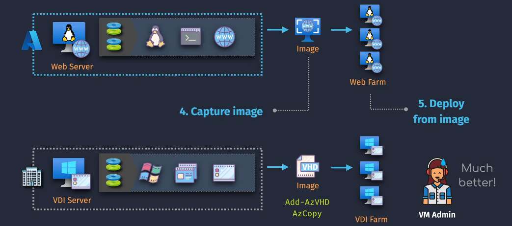
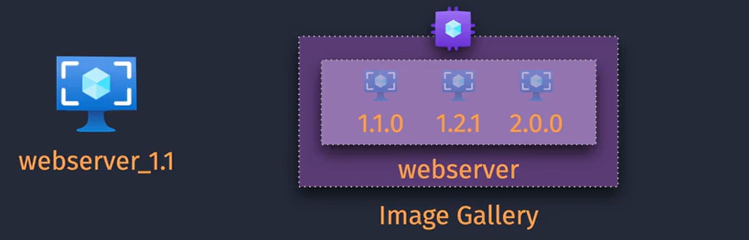

# Azure VM Images

**Azure VM Images** are essential for deploying consistent and standardized virtual machines in Microsoft Azure. They serve as templates that encapsulate the operating system, applications, and configurations required to instantiate new VMs quickly and reliably.


- **Purpose:**
  - Streamline VM deployment with standardized configurations.
  - Ensure consistency across multiple VM instances.
  - Accelerate provisioning processes for new VMs.

## **Table of Contents**

1. [Types of Azure VM Images](#types-of-azure-vm-images)
2. [Azure Image Gallery](#azure-image-gallery)
3. [Creating a Custom VM Image in Azure](#creating-custom-images)
   - [1. Prepare the Source VM](#1-prepare-the-source-vm)
   - [2. Generalize the VM](#2-generalize-the-vm)
   - [3. Capture the VM Image](#3-capture-the-vm-image)
4. [Deploying VMs Using Custom Images](#deploying-vms-using-custom-images)
5. [Summary](#summary)

## Types of Azure VM Images

Azure offers various types of VM images to cater to different deployment needs. Understanding these types helps in selecting the right image for your scenarios.

### Marketplace Images

- **Description:** Pre-built images provided by Microsoft and third-party vendors available in the Azure Marketplace.
- **Examples:** Windows Server, Ubuntu, SQL Server images.
- **Use Case:** Quick deployment of standard operating systems and applications without customization.

### Managed Images

- **Description:** Stored in Azure as a managed resource, making it easy to replicate across multiple regions.
- **Features:**
  - Simplifies image management by handling storage and replication.
  - Supports versioning for better lifecycle management.
- **Use Case:** Deploy consistent VM configurations across different regions and subscriptions with ease.

### Custom Images

- **Description:** Created by users based on a configured VM and captured for reuse.
- **Features:**
  - Tailored to meet specific organizational requirements.
  - Can include custom software, configurations, and settings.
- **Use Case:** Deploy VMs with proprietary software or specialized settings not available in Marketplace images.

### Specialized Images

- **Description:** Capture the entire VM state, including all OS configurations, applications, and data.
- **Features:**
  - Includes system disks, data disks, and all configurations.
  - Ideal for creating exact replicas of a VM.
- **Use Case:** Disaster recovery, cloning environments, or migrating VMs.

## Azure Image Gallery



- **Description:** A centralized repository for managing and sharing VM images across multiple subscriptions and regions.
- **Features:**
  - **Versioning:** Maintain multiple versions of an image for better lifecycle management.
  - **Replication:** Geo-replicate images to multiple regions to enhance availability and performance.
  - **Image Sharing:** Share images with different teams or departments within your organization.
  - **Regional Availability:** Distribute images to various regions to reduce deployment times and latency.
- **Use Case:** Large organizations requiring consistent image deployment across diverse environments, ensuring high availability and scalability.

## Creating Custom Images

Creating a custom VM image (Capturing the VM as an image) involves preparing a VM with the desired configurations, generalizing it, and capturing the image for future deployments. Below are the step-by-step instructions to create a custom image using the Azure Portal, Azure PowerShell, and Azure CLI.

### 1. Prepare the Source VM

Before capturing the VM as an image, you need to prepare it by removing machine-specific information.

**For Windows VMs:**

- **Run Sysprep:**

  1. Connect to the VM via Remote Desktop Protocol (RDP).
  2. Open Command Prompt as an administrator.
  3. Execute the following command:

     ```cmd
     sysprep /oobe /generalize /shutdown
     ```

  - **Flags:**
    - `/oobe`: Presents the Windows Welcome screen on next boot.
    - `/generalize`: Removes unique system information.
    - `/shutdown`: Powers off the VM after preparation.

**For Linux VMs:**

- **Deprovision the VM:**

  1. Connect to the VM via SSH.
  2. Run the following command:

     ```bash
     sudo waagent -deprovision+user -force
     ```

  - **Note:** This command removes SSH host keys and user accounts, preparing the VM for image capture.

### 2. Generalize the VM

After running Sysprep or waagent, the VM is ready to be generalized and captured.

### 3. Capture the VM Image

You can capture the VM image using the Azure Portal, Azure PowerShell, or Azure CLI.

**Using Azure Portal:**

1. **Navigate to the VM:**

   - Go to the [Azure Portal](https://portal.azure.com/).
   - Select **"Virtual Machines"** from the left-hand menu.
   - Click on the VM you want to capture.

2. **Capture the Image:**
   - In the VM's overview pane, click **"Capture"** under the **"Operations"** section.
   - **Image Name:** Provide a name for your custom image.
   - **Resource Group:** Choose an existing resource group or create a new one to store the image.
   - **Shared Image Gallery (Optional):** Select an image gallery to store the image for better management and sharing.
   - **Generalize:** Ensure this option is checked to indicate that the VM has been generalized (using Sysprep or waagent).
   - **Automatically delete the VM after creating the image:** Check this option if you want to delete the source VM post-capture.
   - Click **"Review + create"** and then **"Create"** to initiate the image capture process.

## Deploying VMs Using Custom Images

Once the custom image is created, you can deploy new VMs using this image to ensure consistency and efficiency.

**Using Azure Portal:**

1. **Navigate to Custom Images:**

   - In the Azure Portal, select **"Images"** under **"All Services"**.
   - Click on your custom image or navigate to the **Shared Image Gallery** if you used it.

2. **Create a VM from the Image:**
   - Click **"Create VM"**.
   - Follow the VM creation wizard, selecting your custom image as the source.
   - Configure additional settings as needed and complete the deployment.

## Important Notes for VM Images

Here are the final important notes to keep in mind when creating and managing VM images in Azure:

1. **Preparation Steps**:

   - **Windows VMs**: Run Sysprep to generalize the OS.
   - **Linux VMs**: Use `waagent` to deprovision the VM.
   - **Shutdown**: Always shut down the VM after preparation and before capturing the image.

2. **Post-Capture VM Usability**:

   - **Generalized State**: The original VM becomes unusable after capturing the image because it is left in a generalized or deprovisioned state.
   - **Backups**: Ensure you back up any important data before creating the image.

3. **Unique Identifiers**:

   - **SID Reset**: Capturing the image resets unique identifiers like SID (for Windows). New VMs deployed from the image will have unique identifiers.

4. **Storage and Costs**:

   - **Storage Account**: Managed images are stored in Azure Storage. Be mindful of storage costs.
   - **Retention**: Regularly review and delete outdated images to manage costs and storage usage.

5. **Testing**:

   - **Validation**: Test the image by deploying a VM from it to ensure it works as expected.

6. **Automation**:
   - **Scripting**: Use scripts or automation tools to streamline the image creation process, ensuring consistency and efficiency.

## Summary

1. **Types of VM Images:**

   - **Marketplace Images:** Ideal for quick deployments using standard configurations.
   - **Custom Images:** Provide tailored configurations for specific business requirements.
   - **Managed Images:** Offer centralized management and easy replication across regions and subscriptions.
   - **Specialized Images:** Capture complete VM states for exact replication and recovery.

2. **Creating Custom Images:**

   - **Preparation:** Generalize the source VM using Sysprep (Windows) or waagent (Linux).
   - **Capture Process:** Use Azure Portal, PowerShell, or Azure CLI to capture and store the custom image.
   - **Publishing (Optional):** Utilize Azure Shared Image Gallery for enhanced management and distribution.

3. **Azure Shared Image Gallery Advantages:**
   - **Scalability:** Easily manage and distribute images across multiple regions and subscriptions.
   - **Version Control:** Maintain multiple versions of images for better lifecycle management.
   - **Geo-Replication:** Enhance availability and reduce deployment latency by replicating images to different regions.
