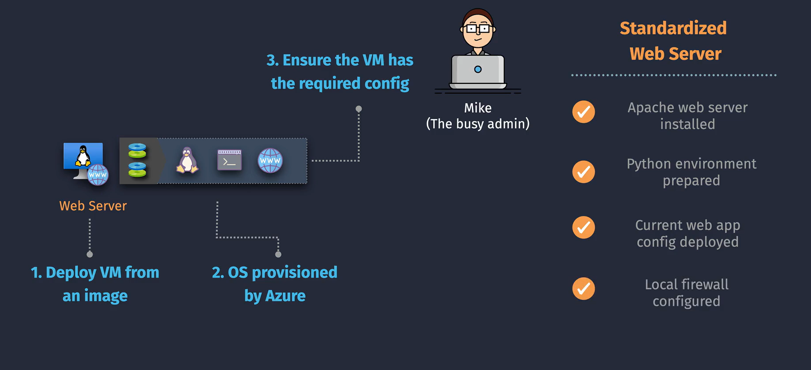

# Azure VM Configuration and Management

Managing and configuring Azure Virtual Machines (VMs) efficiently is crucial for maintaining a stable and secure cloud environment. Azure offers various tools and extensions to help automate these tasks. This guide introduces three key configuration tools:

1. **Custom Script Extension**
2. **Automation State Configuration**
3. **Cloud-Init**

## **1. What are VM Custom Images?**

**VM Custom Images** are personalized templates that capture a VM’s operating system, applications, and settings. They allow you to create new VMs with the same configuration, ensuring consistency and saving time.

- **Use Case:** Quickly deploy multiple VMs with identical setups without manual configuration each time.
- **Benefits:** Consistency, speed, and reduced manual effort in VM provisioning.

## **2. Custom Script Extension**

### **What is Custom Script Extension?**

The **Custom Script Extension** allows you to run scripts on your VM after it has been deployed. These scripts can install software, configure settings, or perform any custom tasks you need.

### **Key Points**

- **Flexibility:** Execute PowerShell (Windows) or Bash (Linux) scripts.
- **Timing:** Run scripts during or after VM deployment.
- **Use Cases:** Installing applications, setting up configurations, automating tasks.

### **Example Scenario**

After deploying a VM, use a Custom Script Extension to install and configure a web server automatically.

## **3. Automation State Configuration**

### **What is Automation State Configuration?**

**Automation State Configuration** uses **Desired State Configuration (DSC)** to define and maintain the desired state of your VMs. It ensures that your VMs remain consistent by automatically correcting any drift from the defined configuration.

### **Key Points**

- **Consistency:** Keeps VM configurations aligned with predefined settings.
- **Automation:** Automatically applies and enforces configurations.
- **Use Cases:** Ensuring security settings, maintaining software versions, enforcing policies.

### **Example Scenario**

Ensure that all VMs have the latest security patches and specific services running at all times.

## **4. Cloud-Init**

### **What is Cloud-Init?**

**Cloud-Init** is a tool used mainly with Linux VMs to automate the initial setup during the first boot. It allows you to define configurations such as user accounts, SSH keys, package installations, and more.

### **Key Points**

- **Initialization:** Runs during the VM’s first boot to set up configurations.
- **Customization:** Define settings using YAML or shell scripts.
- **Use Cases:** Automating VM setup, configuring network settings, installing software.

### **Example Scenario**

Automatically create a user account and install necessary software packages when a Linux VM is first launched.

## **5. Comparing Extensions and VM Custom Images**

| **Feature**                 | **Custom Script Extension**                              | **Automation State Configuration**                       | **Cloud-Init**                                                | **VM Custom Images**                                                      |
| --------------------------- | -------------------------------------------------------- | -------------------------------------------------------- | ------------------------------------------------------------- | ------------------------------------------------------------------------- |
| **Purpose**                 | Run custom scripts on VMs post-deployment                | Maintain and enforce desired VM configurations           | Automate initial setup during first boot of Linux VMs         | Create standardized VM templates for consistent deployments               |
| **When It Runs**            | During or after VM deployment                            | Continuously or on-demand                                | During the first boot of the VM                               | Before deploying new VMs                                                  |
| **Primary Use Cases**       | Installing applications, configuring settings            | Ensuring compliance, maintaining configurations          | Initial VM setup, creating user accounts, installing packages | Rapidly deploying multiple VMs with the same configuration                |
| **Supported OS**            | Windows and Linux                                        | Primarily Windows and Linux                              | Mainly Linux                                                  | Windows and Linux                                                         |
| **Automation Level**        | Executes specific tasks                                  | Continuously ensures VMs remain in the desired state     | Automates setup tasks during VM initialization                | Automates the creation of new VMs with predefined settings                |
| **Integration with Images** | Can be used alongside custom images for additional setup | Works best with custom images to maintain configurations | Complements custom images by handling initial setups          | Serves as the foundation for deploying VMs with consistent configurations |

## **6. When to Use Each Tool**

- **Use VM Custom Images When:**

  - You need to deploy multiple VMs with the exact same configuration.
  - You want to save time by avoiding repetitive setup tasks.
  - Ensuring consistency across your VM deployments is critical.

- **Use Custom Script Extension When:**

  - You need to perform additional configurations or installations after VM deployment.
  - You want to automate specific tasks that are not covered by your custom image.

- **Use Automation State Configuration When:**

  - You require ongoing maintenance to ensure VMs stay in the desired state.
  - Enforcing compliance and security policies across your VMs is necessary.

- **Use Cloud-Init When:**
  - You are deploying Linux VMs and want to automate the initial setup process.
  - You need to configure VM settings during the first boot.

## **7. Best Practices**

1. **Combine Tools for Maximum Efficiency:**

   - Use **VM Custom Images** for standardizing deployments.
   - Apply **Custom Script Extensions** for additional, post-deployment configurations.
   - Implement **Automation State Configuration** to maintain consistency and compliance.
   - Utilize **Cloud-Init** for automating Linux VM initial setups.

2. **Maintain Security:**

   - Store scripts securely and manage access using Azure Role-Based Access Control (RBAC).
   - Regularly update and patch your custom images and configurations.

3. **Automate Where Possible:**

   - Integrate these tools with Azure DevOps or other CI/CD pipelines to automate deployments and configurations.

4. **Monitor and Audit:**

   - Use Azure Monitor and Activity Logs to track the execution of scripts and configuration changes.

5. **Keep Configurations Idempotent:**
   - Ensure scripts and configurations can run multiple times without causing issues, maintaining VM stability.

## **8. Summary Table**

| **Feature**                 | **Custom Script Extension**                              | **Automation State Configuration**                       | **Cloud-Init**                                                | **VM Custom Images**                                                      |
| --------------------------- | -------------------------------------------------------- | -------------------------------------------------------- | ------------------------------------------------------------- | ------------------------------------------------------------------------- |
| **Purpose**                 | Run custom scripts on VMs post-deployment                | Maintain and enforce desired VM configurations           | Automate initial setup during first boot of Linux VMs         | Create standardized VM templates for consistent deployments               |
| **When It Runs**            | During or after VM deployment                            | Continuously or on-demand                                | During the first boot of the VM                               | Before deploying new VMs                                                  |
| **Primary Use Cases**       | Installing applications, configuring settings            | Ensuring compliance, maintaining configurations          | Initial VM setup, creating user accounts, installing packages | Rapidly deploying multiple VMs with the same configuration                |
| **Supported OS**            | Windows and Linux                                        | Primarily Windows and Linux                              | Mainly Linux                                                  | Windows and Linux                                                         |
| **Automation Level**        | Executes specific tasks                                  | Continuously ensures VMs remain in the desired state     | Automates setup tasks during VM initialization                | Automates the creation of new VMs with predefined settings                |
| **Integration with Images** | Can be used alongside custom images for additional setup | Works best with custom images to maintain configurations | Complements custom images by handling initial setups          | Serves as the foundation for deploying VMs with consistent configurations |

## **💡 Key Takeaways**

1. **VM Custom Images** are perfect for standardizing VM deployments, ensuring consistency and saving time.
2. **Custom Script Extension** adds flexibility by allowing you to run additional scripts after VM deployment.
3. **Automation State Configuration** helps maintain the desired state of your VMs, ensuring ongoing compliance and consistency.
4. **Cloud-Init** automates the initial setup of Linux VMs, making the provisioning process seamless.
5. **Combining these tools** provides a comprehensive approach to VM management, enhancing efficiency, security, and scalability.

## **📌 Final Summary**

Efficiently configuring and managing Azure VMs is essential for a reliable and secure cloud infrastructure. By leveraging **VM Custom Images**, you can standardize your VM deployments, ensuring consistency and reducing setup time. Enhancing this with **Custom Script Extensions** allows for additional customization post-deployment, while **Automation State Configuration** ensures your VMs remain compliant and in the desired state over time. For Linux VMs, **Cloud-Init** automates the initial setup, streamlining the provisioning process.
