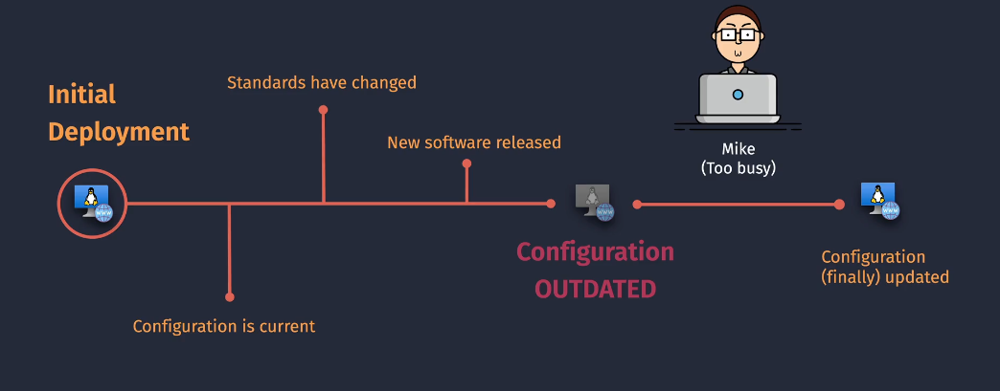
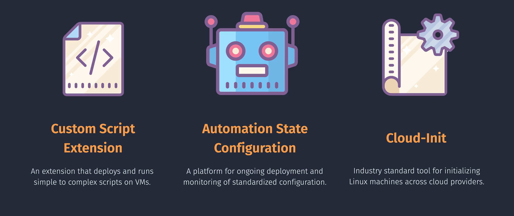
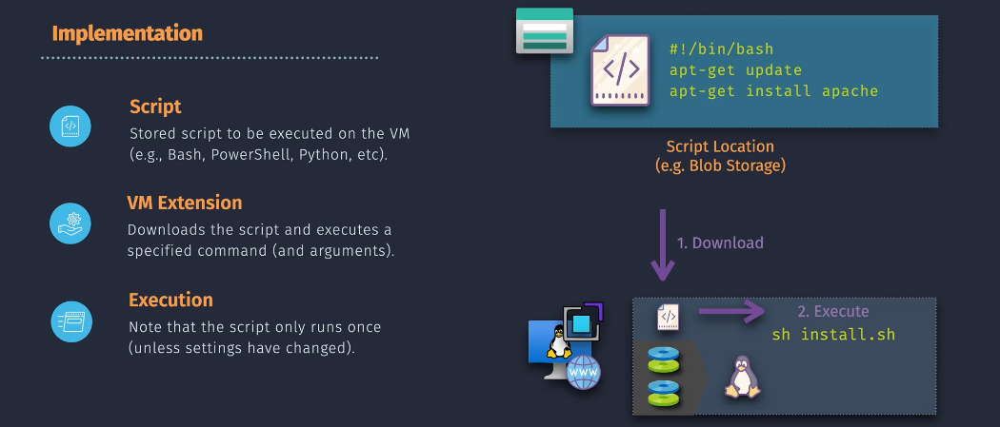
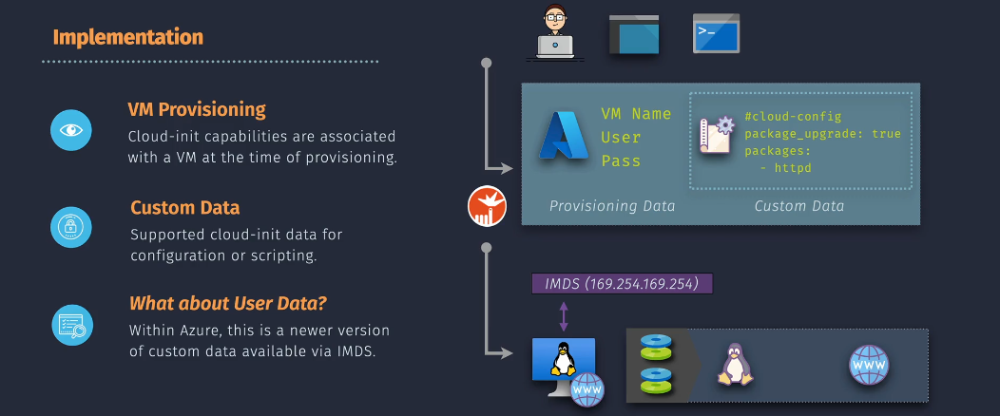
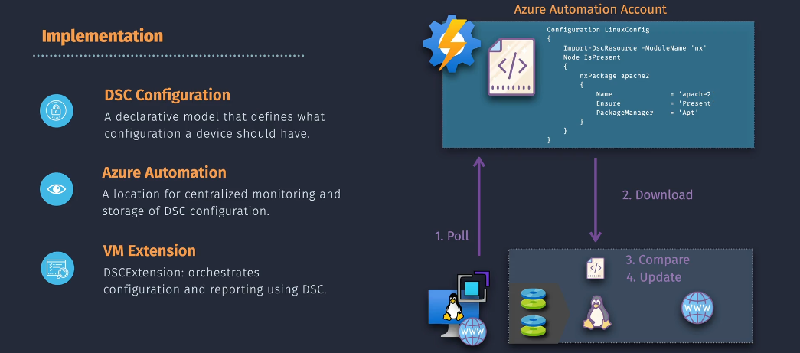

# Azure VM Configuration and Management



Managing and configuring Azure Virtual Machines (VMs) efficiently is crucial for maintaining a stable and secure cloud environment. Azure offers various tools and extensions to help automate these tasks. This guide introduces three key configuration tools:



1. **Custom Script Extension**
2. **Automation State Configuration**
3. **Cloud-Init**

## 1. **Custom Script Extension**

The **Custom Script Extension** is a tool in Azure that lets you run scripts on your virtual machines (VMs) after they are deployed. This is useful for tasks like installing software, configuring settings, or performing maintenance. You can upload your scripts from a location like Azure Storage or GitHub, and the extension will execute them on your VM.

**Why not use SSH to VM:**
Using SSH to manually write and run scripts on a VM provides real-time control and immediate feedback, making it ideal for debugging, ad-hoc tasks, and development. However, it requires manual effort and is not efficient for managing multiple VMs. On the other hand, the Azure Custom Script Extension automates script execution post-deployment, ensuring consistency across multiple VMs and reducing manual intervention. This method is more scalable and suitable for standardizing configurations, but offers less real-time control and interaction compared to SSH.



**Implementation Steps**:

1. **Prepare the Script**:

   - Write your custom script (e.g., a Bash script for Linux or a PowerShell script for Windows) and save it to a location accessible by Azure, such as Azure Storage or GitHub.

2. **Upload the Script**:

   - If using Azure Storage, upload the script to a storage account container.

3. **Deploy the Custom Script Extension**:

   - Use the Azure Portal, Azure CLI, or PowerShell to deploy the Custom Script Extension to your VM.
   - **Azure CLI Example**:

     ```sh
     az vm extension set \
       --resource-group $rg \
       --vm-name $vm \
       --name $name \
       --publisher Microsoft.Azure.Extensions \
       --settings '{"fileUris": ["https://mystorageaccount.blob.core.windows.net/mycontainer/myscript.sh"], "commandToExecute": "./myscript.sh"}'
     ```

   - **PowerShell Example**:

     ```powershell
     Set-AzVMExtension
       -ResourceGroupName $rg
       -VMName $vm
       -Name $name
       -Publisher "Microsoft.Azure.Extensions"
       -ExtensionType "CustomScript"
       -TypeHandlerVersion "2.0"
       -Settings '{"fileUris": ["https://mystorageaccount.blob.core.windows.net/mycontainer/myscript.ps1"], "commandToExecute": "powershell -ExecutionPolicy Unrestricted -File myscript.ps1"}'
     ```

## 2. **Automation State Configuration**

**Automation State Configuration (DSC)** is a service in Azure that helps you manage and configure your VMs to ensure they stay in a desired state. You write configuration scripts that define how your VMs should be set up, and DSC makes sure they follow those configurations. It's like setting rules for your VMs and making sure they always follow them.



**Implementation Steps**:

1. **Create an Automation Account**:

   - In the Azure Portal, navigate to "Automation Accounts" and create a new automation account.

2. **Import DSC Configuration**:

   - Write your DSC configuration script and import it into the automation account.
   - **Example DSC Configuration (PowerShell)**:

     ```powershell
     Configuration MyDscConfiguration {
         Node "localhost" {
             WindowsFeature "IIS" {
                 Ensure = "Present"
                 Name = "Web-Server"
             }
         }
     }
     MyDscConfiguration -OutputPath "C:\DSC\"
     ```

3. **Compile Configuration**:

   - Compile the DSC configuration into a node configuration (MOF file) in the Azure Portal.

4. **Assign Configuration to VM**:
   - Navigate to "State Configuration (DSC)" in the Automation Account and add the VM as a node. Assign the compiled configuration to the VM.

## 3. **Cloud-Init**

**Cloud-Init** is a tool used to customize Linux VMs during their initial boot process. It allows you to run commands or scripts when the VM first starts, which can be useful for installing packages, setting up users, or configuring services. Cloud-Init works across different Linux distributions, making it a flexible option for VM customization.



**Implementation Steps**:

1. **Prepare the Cloud-Init Configuration File**:

   - Write your Cloud-Init configuration in a YAML file.
   - **Example Cloud-Init YAML**:

     ```yaml
     #cloud-config
     package_update: true
     packages:
       - nginx
     runcmd:
       - echo "Hello, world!" > /var/www/html/index.html
     ```

2. **Deploy the VM with Cloud-Init**:

   - Use the Azure CLI or an ARM template to create a new VM and provide the Cloud-Init file.
   - **Azure CLI Example**:

     ```bash
     az vm create \
       --resource-group $rg \
       --name $vm \
       --image $img \
       --custom-data ./cloud-init.yml \
       --admin-username $username \
       --generate-ssh-keys
     ```

## Comparison

| Feature                      | Azure VM Custom Script Extension                                  | Azure Automation State Configuration                            | Cloud-Init                               |
| ---------------------------- | ----------------------------------------------------------------- | --------------------------------------------------------------- | ---------------------------------------- |
| **Platform**                 | Azure Virtual Machines                                            | Azure Virtual Machines, On-premises, AWS                        | Various Cloud Providers                  |
| **Script Execution**         | Runs scripts post-deployment                                      | Manages desired state configurations                            | Initializes VMs during provisioning      |
| **Configuration Management** | Manual script execution                                           | Declarative configurations                                      | YAML-based configuration                 |
| **Use Cases**                | Post-deployment configuration, software installation              | Configuration management, compliance reporting                  | VM initialization, software installation |
| **Supported OS**             | Windows, Linux                                                    | Windows, Linux (Linux support retired for Azure Automation DSC) | Linux, Windows (limited support)         |
| **Integration**              | Azure Resource Manager templates, Azure CLI, PowerShell, REST API | Azure Automation, Azure Monitor                                 | Cloud provider APIs                      |
| **Script Location**          | Azure Storage, GitHub, local server                               | Azure Automation account                                        | Local file or cloud storage              |
| **Execution Time Limit**     | Not specified                                                     | 90 minutes                                                      | Not specified                            |
| **Idempotency**              | Manual                                                            | Built-in                                                        | Built-in                                 |

## Important Considerations

- Custom Script Extension can't apply on stopped VMs.
