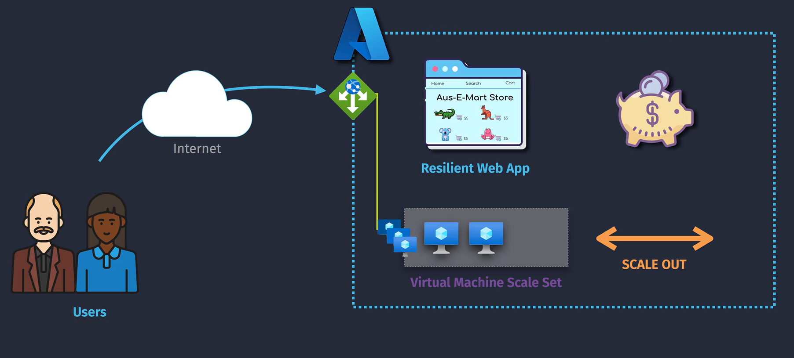
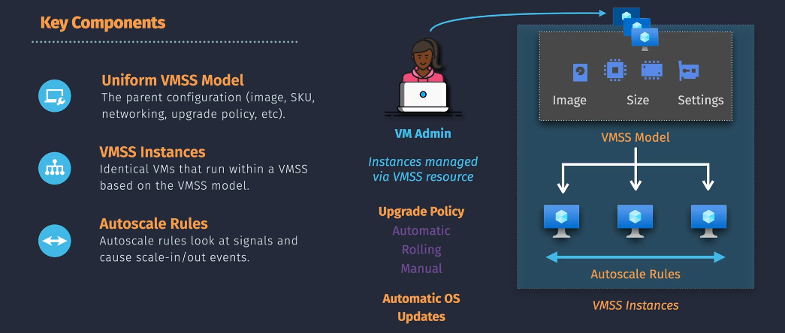
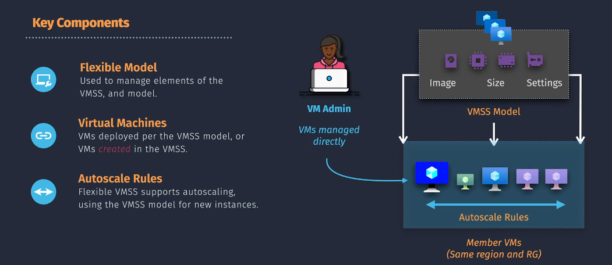
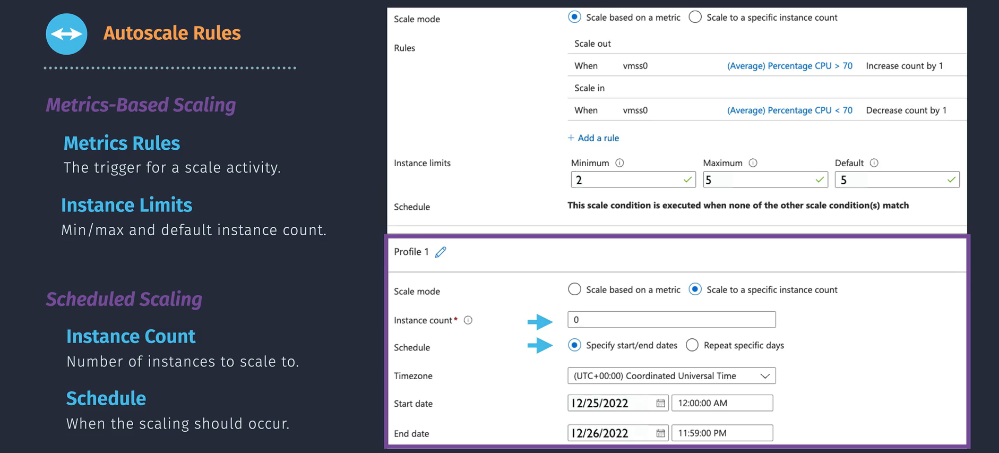

# VM Scale Set (vmss)

Azure Virtual Machine (VM) Scale Sets **(vmss)** allow you to deploy and manage a group of identical, auto-scaling VMs. They help ensure high availability and performance by automatically adjusting the number of VM instances based on demand.

## Scale Set Types

Azure offers two primary types of VM Scale Sets to cater to different application needs:

### Uniform Orchestration

- **Description:** Deploys a set of identical VMs with the same configuration.
- **Features:**
  - All VMs have the same size, OS image, and settings.
  - Integrates with Azure Load Balancer for traffic distribution.
- **Use Case:** Ideal for stateless applications like web servers or microservices that require consistent configurations.
- **_Notes:_**
  - **VMs Instance Must be in same region**
  - Instances Deployed as `Scale Set Instance` (all attached component is hidden)
  - Upgrade Policy are **Supported**
  - Automatic Update for Os Image are **Supported**

### Flexible Orchestration

- **Description:** Provides more control over individual VM instances, allowing for diverse configurations within the same scale set.
- **Features:**
  - Different VM sizes and configurations within the same set.
  - Supports both Linux and Windows VMs.
- **Use Case:** Suitable for stateful applications or scenarios where VMs require varying configurations.

- **_Notes:_**
  - **VMs Instances of Scale Set Must be in same region and same resource group**
  - Instances Deployed as `Virtual machine` (all attached component is visible)
  - Upgrade Policy are **No supported**
  - Automatic Update for Os Image **Not Supported**

## Autoscale Rules

Scaling rules determine how and when your scale set adjusts the number of VM instances. Azure offers two primary types of scaling rules:

### Metrics-Based Scaling

- **Description:** Automatically scales the number of VM instances based on specific performance metrics such as CPU usage, memory usage, or network traffic.
- **How It Works:**
  - **Define Metrics:** Choose relevant metrics to monitor (e.g., CPU > 70%).
  - **Set Thresholds:** Establish thresholds that trigger scaling actions.
  - **Auto-Scale Actions:** Specify how many instances to add or remove when thresholds are met.
- **Example:** Scale out by adding 2 VMs when average CPU usage exceeds 70% for 5 minutes.

### Scheduled Scaling (based on count)

- **Description:** this method sets the number of VM instances based on a predefined schedule rather than real-time metrics.
- **How It Works:**
  - **Define Schedule:** Set specific times to scale up or scale down the number of VMs.
  - **Set Desired Count:** Specify the exact number of VM instances for each scheduled time.
- **Use Case:** Ideal for predictable workloads with known usage patterns, such as business hours or periodic events.
- **Example:** Scale out to 10 VMs every weekday at 8 AM and scale down to 5 VMs at 6 PM.

### Priority of Scale Set Rules

1. Custom Profiles
   1. Based on Count [specific start/end date schedule ]
   2. Based on Count [repeated specific days ]
   3. Based on Metrics
2. Default Profile
   1. Based on Count [specific start/end date schedule ]
   2. Based on Count [repeated specific days ]
   3. Based on Metrics

## Upgrade Policy

Azure VM Scale Sets provide upgrade policies to manage how updates are applied to the VMs in a scale set, ensuring minimal disruption and maximum flexibility.

### **1. Manual Upgrade**

- **Description:** Updates are performed manually by the administrator.
- **Use Case:** Suitable for scenarios where you want full control over the upgrade process.
- **Steps:**
  - Update one or more VMs manually.
  - Verify the changes before applying them to all VMs.

### **2. Automatic Rolling Upgrade**

- **Description:** Automatically updates VMs in batches to ensure high availability.
- **Features:**
  - Update domains are used to roll out changes.
  - Configurable batch sizes and waiting times between batches.
- **Use Case:** Ideal for ensuring continuous service availability during updates.

### **3. Automatic OS Upgrade**

- **Description:** Automatically upgrades the OS image for all VMs in the scale set.
- **Features:**
  - No manual intervention required.
  - Ensures VMs run the latest OS version.
- **Use Case:** Best for stateless applications where quick updates are essential.

## Extensions and Applications

### VM Extensions

- **Description:** Extensions allow you to automate tasks like installing software, configuring settings, or running scripts on VMs.
- **Examples:**
  - **Custom Script Extension:** Run custom scripts for software installation.
  - **Azure Monitor Agent:** Enable detailed monitoring of VMs.
  - **Desired State Configuration (DSC):** Ensure VMs have a specific configuration.

### Application Deployment

- **Description:** VM Scale Sets support seamless application deployment for uniform and flexible configurations.
- **How It Works:**
  - Deploy applications as part of the VM image or install them post-deployment using custom scripts.
  - Integrate with Azure DevOps for continuous deployment pipelines.
- **Use Case:** Suitable for deploying web servers, APIs, and containerized workloads.

## Summary

**Azure VM Scale Sets** are a powerful tool for managing and scaling large groups of identical or diverse virtual machines. By selecting the appropriate scale set type—**Uniform** or **Flexible**—and implementing effective scaling rules based on **Metrics** or **Scheduled Scaling (Based on Count)**, organizations can ensure their applications remain responsive, reliable, and cost-effective. Upgrade policies and extensions further enhance scale set functionality, making them versatile for a wide range of cloud applications.

1. **Enhance Scalability:** VM Scale Sets automatically adjust the number of VM instances to handle varying workloads efficiently.
2. **Choose the Right Scale Set Type:**
   - **Uniform Scale Sets** are best for identical, stateless applications.
   - **Flexible Scale Sets** offer more control and are ideal for stateful or complex applications.
3. **Implement Effective Scaling Rules:**
   - **Metric-Based Scaling** responds to real-time performance metrics.
   - **Scheduled Scaling** (Based on Count) adjusts VM instances based on predefined schedules, ideal for predictable workloads.
4. **Upgrade Policies for High Availability:**
   - Choose between **Manual**, **Automatic Rolling**, or **Automatic OS Upgrades** based on your needs.
5. **Use Extensions and Applications:** Automate configuration and deployment to enhance functionality.
