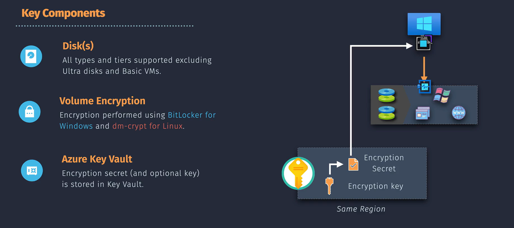

# Azure VM Disk Encryption

**Azure VM Disk Encryption** helps protect and safeguard your data by encrypting the OS and data disks of your Azure virtual machines (VMs). It uses industry-standard encryption methods to ensure that your data is secure both at rest and during transfer.


## Benefits

- **High Security**: Protects sensitive data from unauthorized access.
- **Compliance**: Helps meet organizational security and compliance requirements.
- **Transparency**: Encryption is transparent to users and does not impact VM performance.

## Key Components



### Supported Disks

Azure Disk Encryption supports both **OS disks** and **data disks** for Windows and Linux virtual machines (VMs). It uses **BitLocker** for Windows and **DM-Crypt** for Linux to provide volume encryption. However, it's not supported for Ultra disks and Basic, A-series VMs, or VMs with less than 2 GB of memory.

### Disk Encryption Types

There are several types of encryption available for managed disks in Azure:

#### **1. Azure Disk Encryption (ADE)**

- **Description:** Uses `BitLocker` for `Windows` VMs and `DM-Crypt` for `Linux` VMs to provide volume encryption for the OS and data disks.
- **Features:**
  - Integrates with Azure Key Vault for managing encryption keys.
  - Supports encryption of both OS and data disks.
  - Enhances data protection and compliance.

#### **2. Server-Side Encryption (SSE)**

- **Description:** Automatically encrypts data before storing it in Azure Storage using 256-bit AES encryption.
- **Features:**
  - Transparent encryption and decryption.
  - No need to manage encryption keys manually.
  - Applies to all data stored in Azure Storage (e.g., blobs, files).

#### **3. Encryption at Host**

Enhances SSE by ensuring that all temporary disks and disk caches are encrypted.

### Azure Key Vault

1. **Secure Key Management**: Azure Key Vault securely stores and manages the encryption keys used for encrypting and decrypting VM disks, ensuring that only authorized users and applications can access and manage these keys.

2. **Enhanced Security and Compliance**: Azure Key Vault integrates with Hardware Security Modules (HSMs) for enhanced security and provides audit logs for tracking key usage, helping meet regulatory compliance and security requirements.

3. **Flexibility with Customer-Managed Keys**: Users can generate and manage their own encryption keys, providing greater control over key rotation, lifecycle management, and enforcing custom security policies to meet specific organizational needs.

## How to Enable Disk Encryption

### Using Azure Portal

1. **Navigate to the VM:**

   - Go to the [Azure Portal](https://portal.azure.com/).
   - Select **"Virtual Machines"** from the left-hand menu.
   - Click on the VM you want to encrypt.

2. **Enable Disk Encryption:**
   - In the VM's menu, scroll down to **"Disks"**.
   - Click on **"Encryption"**.
   - Choose between **Azure Disk Encryption** and **Azure Storage Service Encryption**.
   - Follow the prompts to configure encryption settings, including selecting or creating a Key Vault if using ADE.
   - Click **"Enable"** to start the encryption process.

### Using Azure CLI

```bash
# Log in to Azure
az login

# Variables
RESOURCE_GROUP="MyResourceGroup"
VM_NAME="MyVM"
KEYVAULT_NAME="MyKeyVault"
KEY_NAME="MyEncryptionKey"

# Create a Key Vault and generate a key (if not already created)
az keyvault create --name $KEYVAULT_NAME --resource-group $RESOURCE_GROUP --location eastus
az keyvault key create --vault-name $KEYVAULT_NAME --name $KEY_NAME --protection software

# Enable Azure Disk Encryption
az vm encryption enable --resource-group $RESOURCE_GROUP --name $VM_NAME \
  --disk-encryption-keyvault $KEYVAULT_NAME \
  --key-encryption-key $KEY_NAME
```

## Additional Resources

For more detailed information, you can refer to the [Azure Disk Encryption Overview](https://learn.microsoft.com/en-us/azure/virtual-machines/disk-encryption-overview) on Microsoft Learn.
