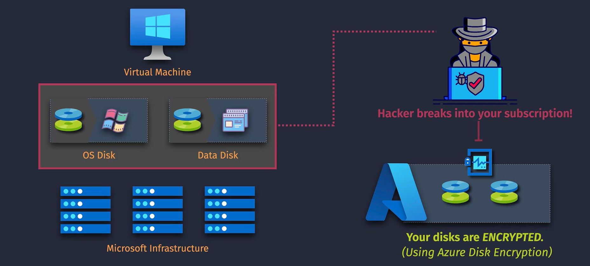

# Azure VM Disk Encryption

Encrypting your Virtual Machine (VM) disks is essential for protecting sensitive data and ensuring compliance with security standards. Azure offers robust disk encryption options to safeguard your data at rest.




## Table of Contents

1. [What is VM Disk Encryption?](#what-is-vm-disk-encryption)
2. [Types of Disk Encryption](#types-of-disk-encryption)
   - [Azure Disk Encryption (ADE)](#azure-disk-encryption-ade)
   - [Azure Storage Service Encryption (SSE)](#azure-storage-service-encryption-sse)
3. [How to Implement VM Disk Encryption](#how-to-implement-vm-disk-encryption)
   - [Using Azure Portal](#using-azure-portal)
   - [Using Azure CLI](#using-azure-cli)
4. [Best Practices](#best-practices)
5. [💡 Key Takeaways](#-key-takeaways)
6. [📌 Final Summary](#-final-summary)

## What is VM Disk Encryption?

**VM Disk Encryption** in Azure protects your data by encrypting the disks of your virtual machines. This ensures that your data remains secure even if the physical storage is compromised.

- **Encryption at Rest:** Data is encrypted while stored on Azure disks.
- **Protection Against Unauthorized Access:** Prevents unauthorized users from accessing your data.

## Types of Disk Encryption

Azure provides two primary disk encryption options for VMs:

### Azure Disk Encryption (ADE)

- **Description:** Uses `BitLocker` for `Windows` VMs and `DM-Crypt` for `Linux` VMs to provide volume encryption for the OS and data disks.
- **Features:**
  - Integrates with Azure Key Vault for managing encryption keys.
  - Supports encryption of both OS and data disks.
  - Enhances data protection and compliance.

### Azure Storage Service Encryption (SSE)

- **Description:** Automatically encrypts data before storing it in Azure Storage using 256-bit AES encryption.
- **Features:**
  - Transparent encryption and decryption.
  - No need to manage encryption keys manually.
  - Applies to all data stored in Azure Storage (e.g., blobs, files).

## How to Implement VM Disk Encryption

### Using Azure Portal

1. **Navigate to the VM:**

   - Go to the [Azure Portal](https://portal.azure.com/).
   - Select **"Virtual Machines"** from the left-hand menu.
   - Click on the VM you want to encrypt.

2. **Enable Disk Encryption:**
   - In the VM's menu, scroll down to **"Disks"**.
   - Click on **"Encryption"**.
   - Choose between **Azure Disk Encryption** and **Azure Storage Service Encryption**.
   - Follow the prompts to configure encryption settings, including selecting or creating a Key Vault if using ADE.
   - Click **"Enable"** to start the encryption process.

### Using Azure CLI

```bash
# Log in to Azure
az login

# Variables
RESOURCE_GROUP="MyResourceGroup"
VM_NAME="MyVM"
KEYVAULT_NAME="MyKeyVault"
KEY_NAME="MyEncryptionKey"

# Create a Key Vault and generate a key (if not already created)
az keyvault create --name $KEYVAULT_NAME --resource-group $RESOURCE_GROUP --location eastus
az keyvault key create --vault-name $KEYVAULT_NAME --name $KEY_NAME --protection software

# Enable Azure Disk Encryption
az vm encryption enable --resource-group $RESOURCE_GROUP --name $VM_NAME \
  --disk-encryption-keyvault $KEYVAULT_NAME \
  --key-encryption-key $KEY_NAME
```

## Best Practices

1. **Use Azure Key Vault:**

   - Securely manage your encryption keys and secrets.
   - Implement access policies to restrict key access.

2. **Regularly Rotate Keys:**

   - Update encryption keys periodically to enhance security.

3. **Backup Key Vault:**

   - Ensure you have backup and recovery plans for your Key Vault.

4. **Enable Encryption Early:**

   - Apply disk encryption during the initial VM setup to simplify management.

5. **Monitor Encryption Status:**

   - Use Azure Monitor to keep track of your encryption deployments and statuses.

6. **Integrate with Security Solutions:**
   - Combine disk encryption with other Azure security features like Network Security Groups (NSGs) and Azure Security Center.

## 💡 Key Takeaways

1. **Protect Your Data:** Disk encryption safeguards your VM data against unauthorized access and breaches.
2. **Choose the Right Encryption Type:** Use **Azure Disk Encryption (ADE)** for comprehensive disk protection and **Azure Storage Service Encryption (SSE)** for encrypting data stored in Azure Storage.
3. **Leverage Azure Key Vault:** Securely manage and store your encryption keys using Azure Key Vault.
4. **Maintain Compliance:** Encryption helps meet industry and regulatory standards for data security.
5. **Simplify Management:** Azure provides seamless integration and automation for disk encryption, minimizing the impact on VM performance and operations.

## 📌 Final Summary

**Azure VM Disk Encryption** is a vital security feature that ensures your virtual machine data remains protected at rest. By utilizing **Azure Disk Encryption (ADE)** and **Azure Storage Service Encryption (SSE)**, you can secure your operating system and data disks, as well as your data stored in Azure Storage services. Implementing disk encryption not only enhances data security but also helps you comply with various regulatory requirements.

To maximize the benefits of disk encryption:

- **Integrate with Azure Key Vault** for secure key management.
- **Follow best practices** such as regular key rotation and monitoring encryption statuses.
- **Choose the appropriate encryption type** based on your specific needs and use cases.
