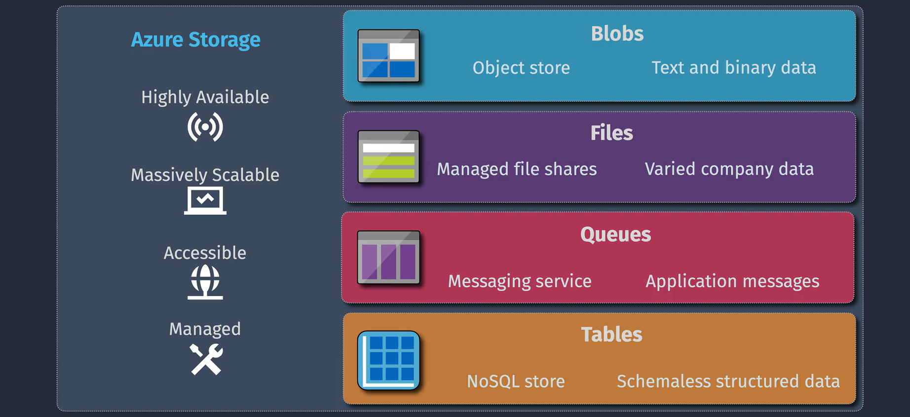
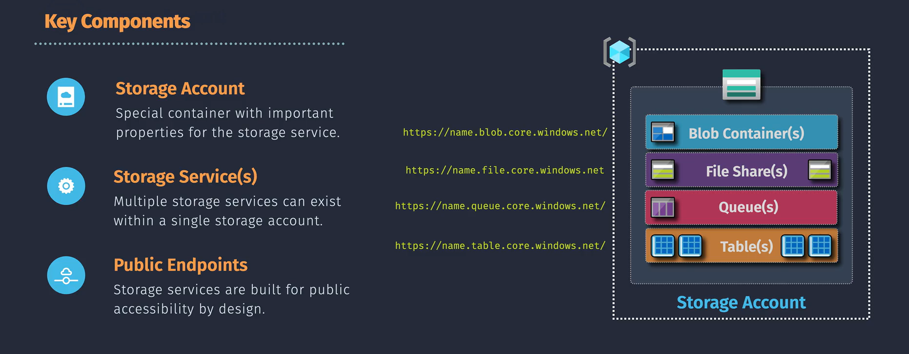
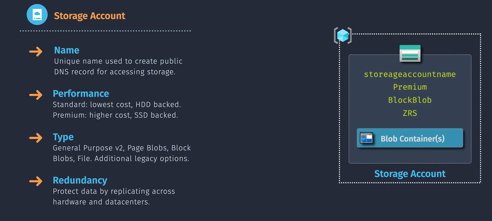
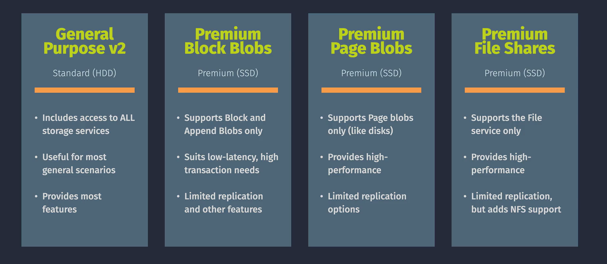

# Introduction to Azure Storage

Welcome to the dynamic world of **Azure Storage**—a **powerful**, **highly scalable**, and **secure** cloud storage solution tailored to meet your diverse data needs. Whether you're managing documents, images, videos, or complex datasets, Azure Storage offers versatile options that seamlessly integrate with your applications. Let’s embark on an exciting journey to discover how Azure Storage can revolutionize your data management!

## Types of Azure Storage

Azure Storage isn't a one-size-fits-all solution. Instead, it offers a variety of storage types, each crafted to address specific scenarios and requirements. Here's a snapshot of what Azure has in store for you:

### 1. **Blob Storage** – Your Data's Best Friend

Imagine having a vast digital library where you can store **unlimited** amounts of data—documents, images, videos, and more. That's what **Blob Storage** offers! With its **Hot**, **Cool**, and **Archive** access tiers, you can effortlessly optimize costs based on how frequently you access your data. Whether you're streaming media to millions or archiving important records, Blob Storage scales effortlessly to meet your demands.

### 2. **File Storage** – Shared Access Made Simple

Think of **File Storage** as your cloud-based shared drive. Accessible via the **SMB protocol**, it allows multiple virtual machines (VMs) to access the same files simultaneously without the headaches of managing physical hardware. Perfect for migrating legacy applications to the cloud or enabling seamless collaboration across your team, File Storage ensures your files are always accessible and secure.

### 3. **Queue Storage** – Streamline Your Messaging

Building flexible and scalable applications often means managing countless messages. **Queue Storage** is your go-to solution for handling large volumes of messages that need to be processed asynchronously. By decoupling different parts of your application, Queue Storage enhances both flexibility and scalability. Whether you're developing a resilient web application or managing background tasks, Queue Storage keeps your message flow smooth and efficient.

### 4. **Table Storage** – Structured Data, Simplified

Meet **Table Storage**, a robust NoSQL key-value store designed for vast amounts of structured data. Perfect for applications that require rapid development and the ability to handle massive semi-structured datasets without rigid schemas, Table Storage is ideal for everything from user profiles to device information. Its flexibility ensures you can adapt quickly as your data needs evolve.

## Key Components

Understanding the building blocks of Azure Storage empowers you to leverage its full potential. Let’s break down the essential components:

### 1. **Storage Account** – Your Data’s Home Base

A **storage account** is the foundational container that holds all your Azure Storage data objects—blobs, files, queues, and tables. It provides a **unique namespace** for your data, ensuring your resources are securely and uniquely identified within Azure. Think of it as your personal vault in the cloud where all your data safely resides.

### 2. **Storage Services** – Tailored for Every Need

Azure Storage encompasses various **storage services**—Blob Storage, File Storage, Queue Storage, and Table Storage—each designed to cater to different data storage needs. This diversity allows you to choose the right service for your specific use case, ensuring optimal performance and cost-efficiency.

### 3. **Public Endpoints** – Seamless Access Anywhere

**Public endpoints** are the URLs through which you can access your storage account resources over the internet. They enable seamless integration with your applications and services, allowing you to interact with your data from anywhere in the world securely. Whether you're developing a global application or accessing your data on the go, public endpoints make it effortless.

## Azure Storage account

A **storage account** is your gateway to Azure Storage, providing a unique namespace for all your data. Every interaction with Azure Storage—whether uploading a blob, accessing a file share, or sending a message to a queue—occurs through your storage account.

### Key Properties of a Storage Account

Let’s explore the essential properties that define your storage account:

#### 1. **Name** – Your Unique Identifier

Your storage account **name** serves as a unique identifier within Azure. It acts as a **DNS record**, making it easy to access your storage resources via URLs like `https://<account-name>.blob.core.windows.net/`. Choose a name that reflects its purpose to keep things organized and easily identifiable.

#### 2. **Performance** – Tailor to Your Needs

Choose between **Standard** and **Premium** performance tiers based on your application’s speed and throughput requirements:

- **Standard**: Cost-effective for general-purpose workloads.
- **Premium**: Delivers high performance for I/O-intensive applications, ensuring fast and reliable data access.

#### 3. **Type** – Versatility at Its Best

Azure offers various **storage account types** to suit different workloads:

- **General Purpose v2**: Versatile and cost-effective, suitable for most scenarios with access tiers (Hot, Cool, Archive).
- **Premium Block Blobs**: Ideal for scenarios requiring low latency and high throughput.
- **Premium Page Blobs**: Designed for I/O-intensive workloads like databases.
- **Premium File Shares**: High-performance file shares supporting both SMB and NFS protocols for enterprise applications.

#### 4. **Redundancy** – Ensuring Data Safety

Protect your data with Azure’s redundancy options, ensuring availability and durability:

- **Locally Redundant Storage (LRS)**: Keeps multiple copies within a single datacenter.
- **Zone-Redundant Storage (ZRS)**: Distributes copies across multiple datacenters within a region.
- **Geo-Redundant Storage (GRS)**: Replicates data to a secondary region for disaster recovery.
- **Read-Access Geo-Redundant Storage (RA-GRS)**: Offers read access to the secondary region, enhancing data accessibility during outages.

### Pricing – Flexible and Competitive

Azure Storage pricing is designed to be **flexible** and **competitive**, based on several factors:

#### 1. **General Purpose v2**

- Includes access to All Storage Services
- Useful for most general scenarios
- Provides most features

#### 2. **Premium Block Blobs**

- Supports Block and Append Blobs only
- Suit low-latency, high transaction needs
- Limited replication and other features

#### 3. **Premium Page Blobs**

- Supports Page blobs only (like disks)
- Provides high-performance
- Limited replication options

#### 4. **Premium File Shares**

- Supports the file service only
- Provide high-Performance
- Limited replication, but adds NFS support
