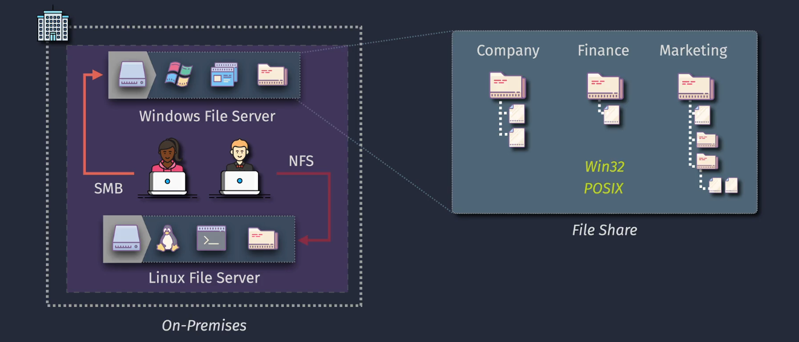
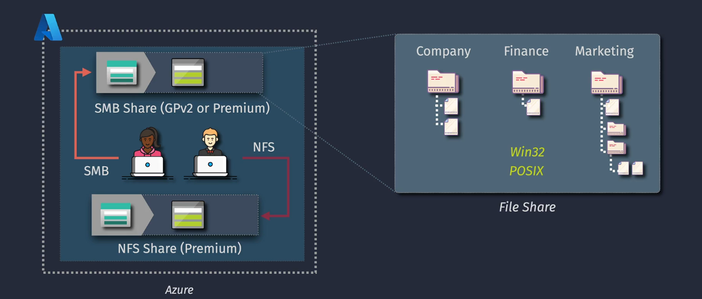
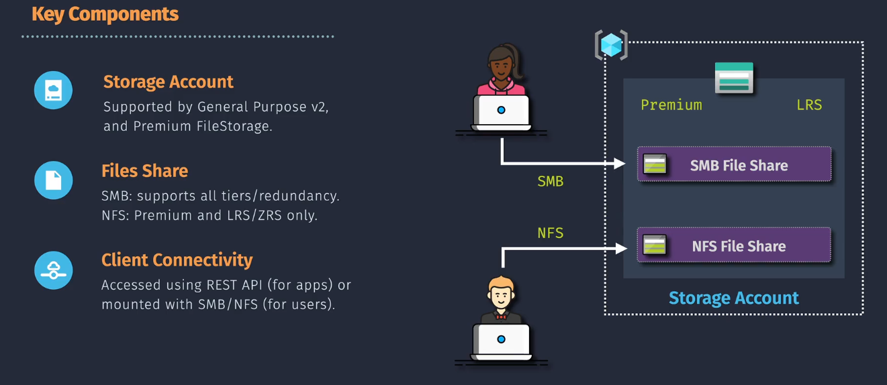
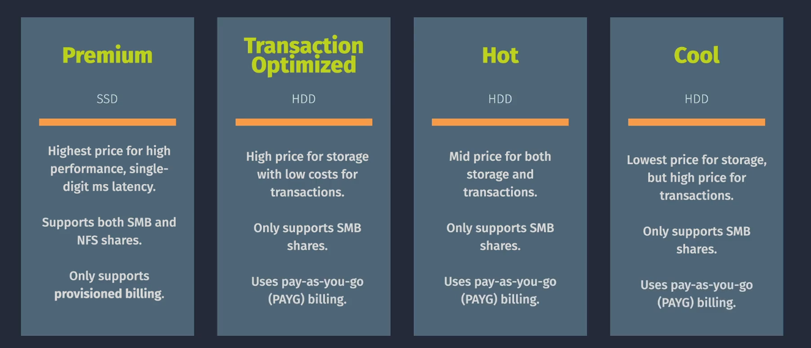

# Azure Files

Azure Files is a fully managed file share service provided by Microsoft Azure. It allows organizations to create file shares in the cloud, accessible using standard file system protocols like `SMB` (Server Message Block) and `NFS` (Network File System). Azure Files is a versatile and scalable solution for file storage and is designed to support both cloud-only and hybrid cloud scenarios.

## Comparison: On-Premises vs Azure File Server

### On-Premises File Server

- Requires physical hardware and software management.
- High operational costs for maintenance and upgrades.
- Limited scalability tied to physical infrastructure.
- Data backup and disaster recovery rely on additional tools.

### Azure File Server

- Fully managed and eliminates the need for infrastructure management.
- Highly scalable and flexible based on workloads.
- Built-in data redundancy and disaster recovery.
- Seamless integration with on-premises systems through Azure File Sync.

## Key Components of Azure Files

Azure Files is built upon several core components:

1. **Storage Account**

   - Acts as the container for Azure Files resources.
   - Provides access to file shares and defines redundancy and replication settings.

2. **File Shares**

   - Network-accessible storage units created within a storage account.
   - Supports both SMB and NFS protocols for compatibility with various platforms.

3. **Azure File Sync**

   - Extends Azure Files to on-premises environments by caching frequently used files on local servers.
   - Enables hybrid cloud scenarios with centralized management and local performance.

4. **Authentication and Access**
   - Integrates with `Azure Active Directory` (AAD) and `Active Directory Domain Services` (AD DS) for identity-based access.
   - Supports encryption at rest and in transit to ensure data security.

## Azure Files Storage Tiers

Azure Files offers multiple storage tiers to meet different cost and performance needs:

1. **Premium Tier**

   - High performance with low latency.
   - Suitable for I/O-intensive workloads like databases and applications requiring fast access.

2. **Hot Tier**

   - Optimized for frequently accessed data.
   - Ideal for collaboration and general-purpose file sharing.

3. **Cool Tier**

   - Cost-effective storage for infrequently accessed data.
   - Best for backups and archival.

4. **Archive Tier**
   - Ultra-low-cost storage for rarely accessed data.
   - Suitable for long-term retention and compliance.

## Use Cases

### 1. **File Server Modernization**

- Replace traditional file servers with Azure Files to reduce operational complexity and costs.

### 2. **Application Lift-and-Shift**

- Migrate legacy applications that rely on file shares without requiring code changes.

### 3. **Hybrid Cloud Scenarios**

- Use Azure File Sync to cache file shares locally while keeping a centralized copy in the cloud.

### 4. **Backup and Disaster Recovery**

- Utilize Azure Files for reliable backups and ensure quick recovery during disasters.

## Getting Started with Azure Files

1. **Create a Storage Account**

   - Use the Azure Portal, CLI, or PowerShell to create a new storage account.

2. **Configure a File Share**

   - Set up a file share in the storage account and define its quota.

3. **Mount the File Share**

   - Mount the file share on a local machine using SMB/NFS protocols.

4. **Manage Permissions**

   - Use Azure role-based access control (RBAC) or Active Directory to manage access.

5. **Set Up Azure File Sync** _(Optional)_
   - Deploy the Azure File Sync agent on on-premises servers for hybrid integration.

## Advantages of Azure Files

- **Simplicity**: Easy to set up and manage.
- **Scalability**: Automatically adjusts to growing storage needs.
- **Cost-Effective**: Flexible pricing tiers for different workloads.
- **Security**: Built-in encryption and identity-based access.
- **Integration**: Works seamlessly with on-premises and cloud applications.
