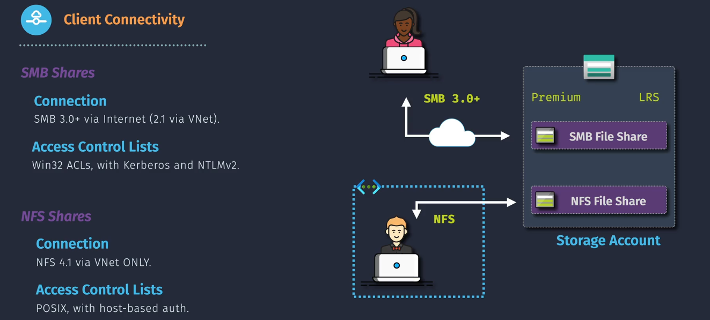
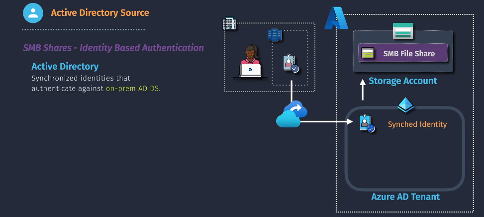
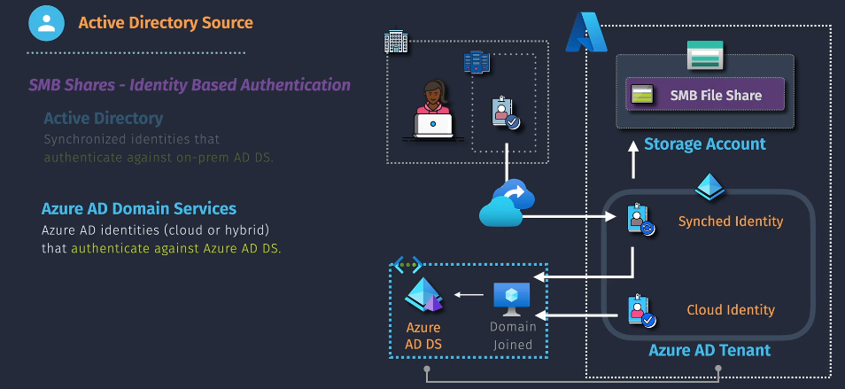
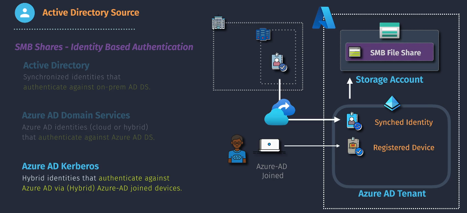

# 🔞Azure Files Connectivity and Access Control

Azure Files provides multiple connectivity options and robust access control mechanisms to securely and efficiently manage file shares. This ensures compatibility with various platforms and scenarios, including hybrid environments, while maintaining data security and compliance.

## Connectivity Options for Azure Files

Azure Files supports a range of connectivity methods to suit diverse requirements:

### 1. **SMB Protocol**

- **Overview**: Server Message Block (SMB) is a network file-sharing protocol supported by Windows, Linux, and macOS.
- **Versions Supported**:
  - SMB 2.1: Ensures backward compatibility.
  - SMB 3.0: Provides enhanced security with encryption and performance optimizations.
- **Use Cases**:
  - General-purpose file sharing.
  - Integration with legacy systems.

### 2. **NFS Protocol**

- **Overview**: Network File System (NFS) protocol is primarily used for Linux and UNIX-based systems.
- **Versions Supported**:
  - NFS v3: Basic compatibility for older systems.
  - NFS v4.1: Adds enhanced security and performance features.
- **Use Cases**:
  - Linux-based workloads and applications.
  - Shared data for **containerized applications.**

### 3. **REST API**

- **Overview**: Provides programmatic access to Azure Files resources via HTTPS.
- **Capabilities**:
  - File uploads, downloads, and management.
  - Metadata configuration and access control.
- **Use Cases**:
  - Integration with custom applications.
  - Automating file operations.

### 4. **Azure File Sync**

- **Overview**: Synchronizes file shares between on-premises Windows Servers and Azure Files.
- **Capabilities**:
  - Local caching for improved performance.
  - Centralized file share management in the cloud.
- **Use Cases**:
  - Hybrid cloud scenarios.
  - Low-latency access to frequently used files.

## Protocols Ports

This table shows the availability of various protocols (SMB, NFS, FileREST) across different types of endpoints (Unrestricted Public Endpoint, Restricted Public Endpoint, Private Endpoint) and the required ports for each protocol.

| Protocol Name | Unrestricted Public Endpoint | Restricted Public Endpoint | Private Endpoint | Required Port                  |
| ------------- | ---------------------------- | -------------------------- | ---------------- | ------------------------------ |
| SMB           | ✅                           | ✅                         | ✅               | TCP 445                        |
| NFS           | ❌                           | ✅                         | ✅               | TCP 2049                       |
| FileREST      | ✅                           | ✅                         | ✅               | TCP 443 (HTTPS), TCP 80 (HTTP) |

## Access Control for Azure Files Identity-Based Access Control

Azure Files supports robust identity-based access control mechanisms to ensure secure and efficient management of file shares. These mechanisms align with diverse deployment scenarios, enabling seamless integration with on-premises, cloud, or hybrid environments. The key options include:

### 1. **Active Directory (AD)**

- **Overview**: Enables Azure Files to authenticate users against an on-premises Active Directory Domain Services (AD DS).
- **How It Works**:
  - Synchronize identities from on-premises AD DS to Azure AD using Azure AD Connect.
  - File share authentication occurs against the on-premises AD DS.
- **Use Cases**:
  - Organizations with existing on-premises Active Directory setups.
  - Scenarios requiring hybrid identity management.

### 2. **Azure AD Domain Services (Azure AD DS)**

- **Overview**: Azure AD DS provides domain services managed within Azure, enabling Azure AD-based identities (cloud-only or hybrid) to authenticate.
- **How It Works**:
  - Supports users authenticated through Azure AD or synchronized from on-premises to Azure AD.
  - Leverages Azure AD DS to manage domain-related tasks.
- **Use Cases**:
  - Cloud-native organizations using Azure AD.
  - Scenarios requiring managed domain services in Azure.

### 3. **Azure AD Kerberos**

- **Overview**: Allows hybrid identities to authenticate directly against Azure AD using Azure AD-joined devices.
- **How It Works**:
  - Requires devices to be Azure AD-joined or hybrid Azure AD-joined.
  - Uses Kerberos protocol to authenticate users via Azure AD.
- **Use Cases**:
  - Organizations moving towards cloud-native identity solutions.
  - Environments with hybrid identity deployments leveraging Azure AD.

## Benefits of Identity-Based Access Control

- Centralized identity management.
- Seamless integration with hybrid and cloud environments.
- Enhanced security through encryption and identity-based policies.
- Simplified user experience with Single Sign-On (SSO) capabilities.
