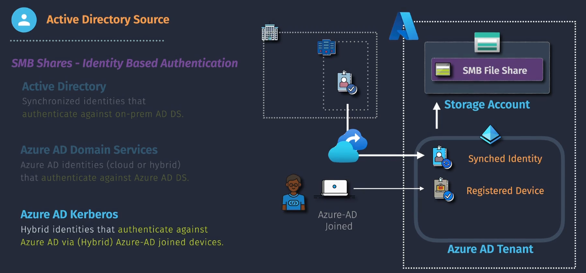

# Azure Files Connectivity and Access Control

Azure Files provides multiple connectivity options and robust access control mechanisms to securely and efficiently manage file shares. This ensures compatibility with various platforms and scenarios, including hybrid environments, while maintaining data security and compliance.

## Connectivity Options for Azure Files

Azure Files supports a range of connectivity methods to suit diverse requirements:

### 1. **SMB Protocol**

- **Overview**: Server Message Block (SMB) is a network file-sharing protocol supported by Windows, Linux, and macOS.
- **Versions Supported**:
  - SMB 2.1: Ensures backward compatibility.
  - SMB 3.0: Provides enhanced security with encryption and performance optimizations.
- **Use Cases**:
  - General-purpose file sharing.
  - Integration with legacy systems.

### 2. **NFS Protocol**

- **Overview**: Network File System (NFS) protocol is primarily used for Linux and UNIX-based systems.
- **Versions Supported**:
  - NFS v3: Basic compatibility for older systems.
  - NFS v4.1: Adds enhanced security and performance features.
- **Use Cases**:
  - Linux-based workloads and applications.
  - Shared data for containerized applications.

### 3. **REST API**

- **Overview**: Provides programmatic access to Azure Files resources via HTTPS.
- **Capabilities**:
  - File uploads, downloads, and management.
  - Metadata configuration and access control.
- **Use Cases**:
  - Integration with custom applications.
  - Automating file operations.

### 4. **Azure File Sync**

- **Overview**: Synchronizes file shares between on-premises Windows Servers and Azure Files.
- **Capabilities**:
  - Local caching for improved performance.
  - Centralized file share management in the cloud.
- **Use Cases**:
  - Hybrid cloud scenarios.
  - Low-latency access to frequently used files.

## Access Control for Azure Files

Azure Files ensures secure access to file shares through a combination of identity-based and network-level mechanisms:

### 1. **Identity-Based Access Control**

#### Types

- **Azure Active Directory (Azure AD)**
  - Provides access control using Azure AD identities.
  - Ideal for modern applications and hybrid environments.
  - Supported for SMB protocol only.
- **Active Directory Domain Services (AD DS)**
  - Uses traditional AD credentials for file access.
  - Supports SMB protocol and integration with on-premises AD.
- **RBAC (Role-Based Access Control)**
  - Enables granular permissions at the Azure resource level.
  - Common roles:
    - Storage File Data SMB Share Reader/Contributor.
    - Storage File Data NFS Share Reader/Contributor.

#### Implementation

### 2. **Network-Level Access Control**

- **Private Endpoints**
  - Secure Azure Files access via a private IP address within a Virtual Network (VNet).
  - Ensures data never travels over the public internet.
- **Service Endpoints**
  - Extends Azure Files connectivity to VNets.
  - Uses the public endpoint of the storage account while ensuring traffic remains within the Azure backbone network.
- **Firewall Rules**
  - Restricts access based on IP address ranges.
  - Configurable through the Azure Portal, CLI, or PowerShell.

### 3. **Encryption and Security**

- **Encryption at Rest**
  - Data stored in Azure Files is encrypted using Microsoft-managed keys or customer-managed keys.
- **Encryption in Transit**
  - SMB 3.0 and HTTPS ensure secure data transfer.
- **Secure Access Signature (SAS)**
  - Provides time-limited access to file shares and resources.
  - Ideal for sharing data securely with external parties.

## Configuring Connectivity and Access Control

### 1. **Setting Up SMB/NFS Access**

- Use the Azure Portal, Azure CLI, or PowerShell to create a file share.
- Mount the share using the provided connection string.
- Configure identity-based authentication if needed (e.g., Azure AD or AD DS).

### 2. **Configuring Private Endpoints**

- Create a private endpoint for the storage account within the desired VNet.
- Update DNS settings to resolve the storage account name to the private endpoint IP.

### 3. **Enforcing Network Security**

- Define firewall rules to restrict access to specific IP ranges.
- Use Azure Policies to enforce private endpoint usage.

### 4. **Managing Permissions**

- Assign RBAC roles to users or groups at the storage account or file share level.
- Use AD groups to manage large-scale permissions efficiently.

## Best Practices

- **Enable Azure AD Integration:** For secure and seamless identity-based authentication.
- **Use Private Endpoints:** To minimize exposure to public internet risks.
- **Leverage RBAC:** For fine-grained control over access permissions.
- **Implement Encryption:** Ensure both at-rest and in-transit encryption for sensitive data.
- **Monitor Access:** Use Azure Monitor and logs to track access and detect anomalies.
