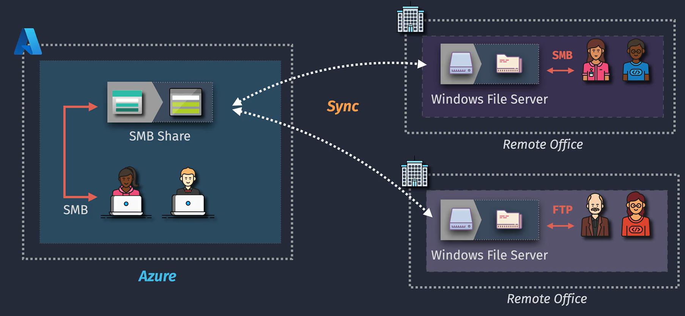
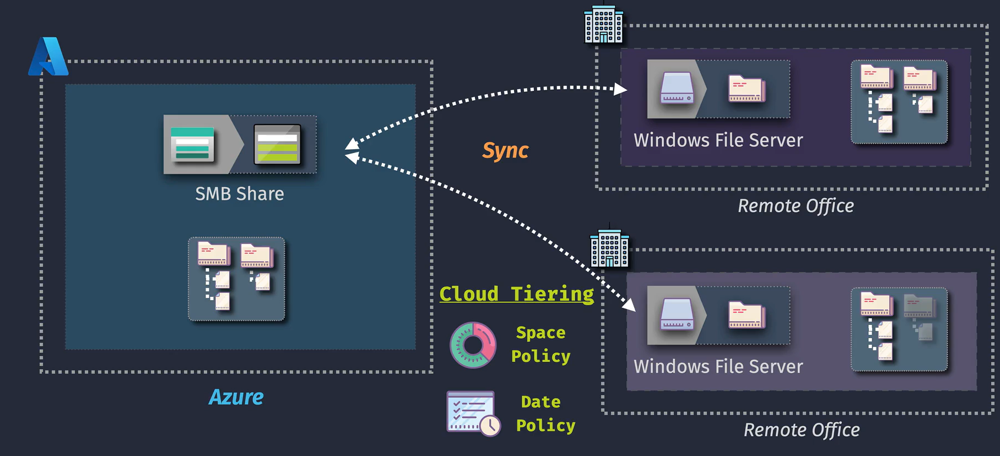
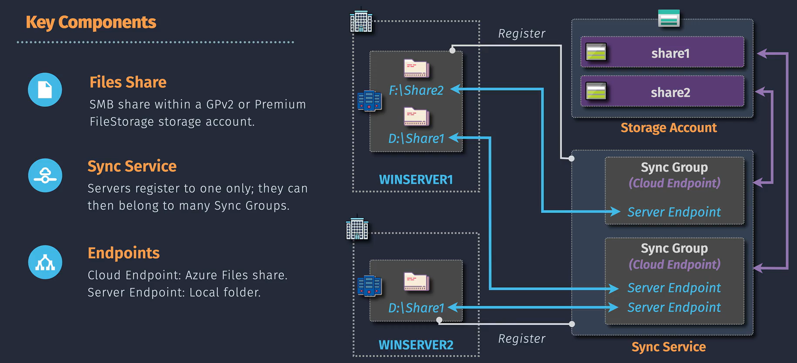

# Azure File Sync

Azure File Sync is a cloud-based solution that enables organizations to centralize their file shares in Azure while maintaining local file server performance. It is ideal for hybrid cloud scenarios, offering seamless integration between on-premises Windows Servers and Azure Files.

## Key Features

1. **Centralized Storage**: Synchronizes multiple file servers with a single Azure file share.
2. **Cloud Tiering**: Automatically offloads infrequently accessed files to Azure, reducing local storage costs.
3. **Multi-Site Access**: Ensures consistent file access across multiple on-premises locations.
4. **Disaster Recovery**: Provides a built-in backup solution by replicating server data to Azure.
5. **Integration**: Works with Azure Backup for comprehensive data protection.

## How It Works

1. **Azure File Share**: Acts as the centralized cloud repository.
2. **Sync Agent**: Installed on on-premises Windows Servers to manage synchronization.
3. **Sync Groups**: Define the file share and server endpoints to coordinate data replication.
4. **Cloud Tiering**: Automatically manages file storage based on usage patterns.

## Benefits

- **Cost Efficiency**: Reduces the need for local storage infrastructure.
- **Scalability**: Dynamically scales with business growth.
- **High Availability**: Ensures data accessibility even during hardware failures.
- **Performance**: Combines local server performance with cloud scalability.
