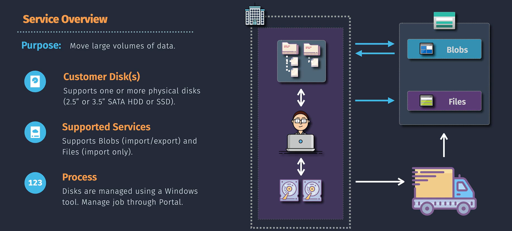
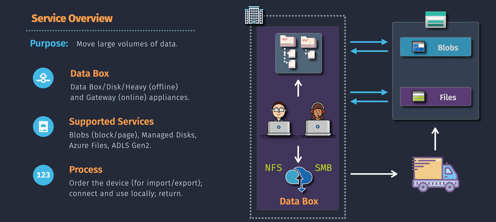
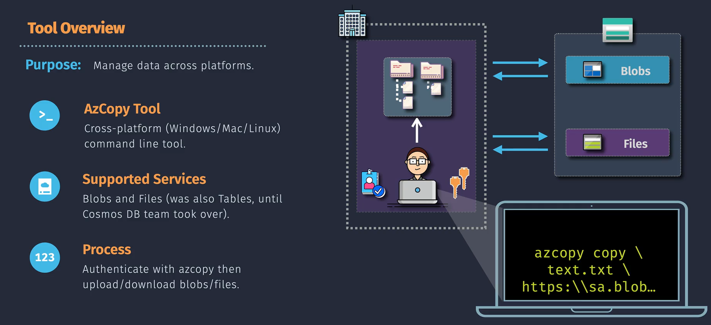

# Azure Storage Data Transfer Tools

Azure provides tools to move data to and from Azure Storage. These tools help transfer small and large datasets securely and reliably.

## Key Tools

### 1. Custom Disk Import/Export Service



- **Overview**: You send your own hard drives (HDDs or SSDs) to Microsoft, and they upload your data into Azure. This is great if your internet is slow or unstable.
- **How It Works**:
  1. Use a tool to prepare your disk.
  2. Encrypt your disk for safety.
  3. Ship your disk to Microsoft.
  4. Microsoft uploads the data to your Azure account.
- **Command Example**:

  ```bash
  waimportexport prepimport /j:<journal-file-path> /id:<job-id> /sk:<storage-account-key>
  ```

- **Why Use It**:
  - Move large amounts of data.
  - Keep sensitive data safe during transfer.

### 2. Azure Data Box



- **Overview**: Microsoft sends you a special device (a "Data Box") to copy your data onto. You return it, and they upload the data to Azure.
- **How It Works**:
  1. Order the Data Box.
  2. Copy your data onto it.
  3. Ship it back to Microsoft.
  4. They upload your data to Azure.
- **Why Use It**:
  - For massive data (terabytes or petabytes).
  - To avoid using internet for transfer.

### 3. AzCopy



- **Overview**: A simple tool to copy files over the internet to Azure Storage. Fast and script-friendly.
- **How It Works**:

  - Upload files:

    ```bash
    azcopy copy '<local-file-path>' 'https://<storage-account-name>.blob.core.windows.net/<container-name>/<blob-name>?<SAS-token>'
    ```

  - Download files:

    ```bash
    azcopy copy 'https://<storage-account-name>.blob.core.windows.net/<container-name>/<blob-name>?<SAS-token>' '<local-file-path>'
    ```

  - Sync directories:

    ```bash
    azcopy sync '<local-directory>' 'https://<storage-account-name>.blob.core.windows.net/<container-name>?<SAS-token>'
    ```

- **Why Use It**:
  - Fast file uploads or downloads.
  - Easy to automate with scripts.

## Choosing the Right Tool

- Use **Custom Disk Import/Export Service** if you want to send your own disks for offline transfer.
- Pick **Azure Data Box** for huge datasets that need offline transfer.
- Choose **AzCopy** for online transfers that are fast and scriptable.

## Benefits of Azure Tools

- **Scalability**: Handles everything from small to massive data.
- **Security**: Your data stays encrypted and safe.
- **Flexibility**: Tools for both offline and online needs.
- **Speed**: Optimized for fast transfers.
