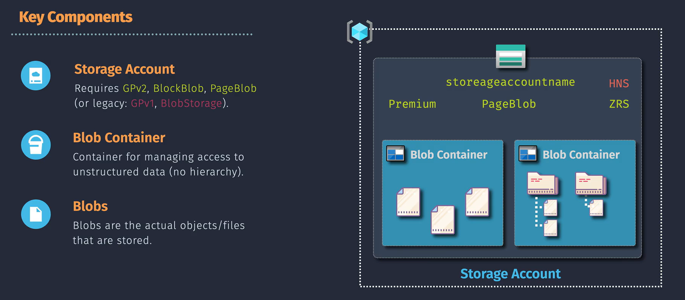
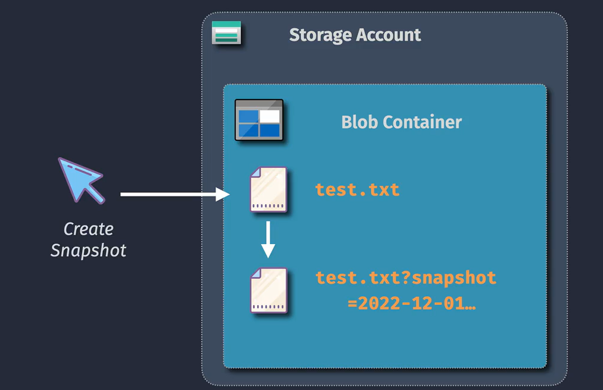
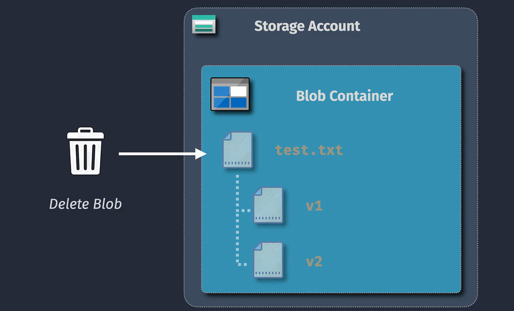

# Azure Blob Storage

Welcome to the vibrant and versatile world of **Azure Blob Storage**! Whether you're a developer, IT professional, or data enthusiast, Azure Blob Storage offers a **powerful**, **scalable**, and **flexible** solution to meet all your unstructured data needs. Let’s explore the exciting features and components that make Azure Blob Storage a cornerstone of modern cloud storage.

## Blob Key Components

Understanding the core components of Azure Blob Storage is essential to harness its full potential. Let’s break down the key elements that make up this dynamic storage solution:

### 1. **Storage Account**

Think of the **Storage Account** as your personal vault in the cloud. It serves as the foundational container that holds all your data objects, including blobs, files, queues, and tables. Each storage account provides a **unique namespace**, ensuring your data is securely and uniquely identified within Azure. This means you can effortlessly manage and access your data without worrying about naming conflicts or security issues.

### 2. **Blob Container**

Within your storage account lies the **Blob Container**—a logical grouping that organizes your blobs. Imagine it as a folder within your vault, where you can neatly categorize and manage your data. Containers help in managing access permissions and keeping your data structured, making it easier to locate and handle specific blobs when needed.

### 3. **Blobs**

At the heart of Azure Blob Storage are the **Blobs** themselves. These are the actual data objects you store, such as documents, images, videos, and backups. Blobs come in different types to cater to various storage needs, ensuring you have the right tool for every job.

## Blob Types

Azure Blob Storage offers three distinct types of blobs, each designed to handle specific scenarios with ease and efficiency. Let’s dive into the exciting variety of blobs you can leverage:

### 1. **Block Blobs** – Perfect for Streaming and Storage

**Block Blobs** are optimized for storing large amounts of text or binary data, making them ideal for scenarios like media streaming, file storage, and backup solutions. They’re composed of blocks, each of which can be managed individually. This means you can upload large files efficiently by breaking them down into smaller, manageable blocks, uploading them in parallel, and then committing them together.

**Use Cases:**

- Streaming videos and audio files
- Storing documents and images
- Backup and disaster recovery

### 2. **Append Blobs** – Ideal for Logging and Real-Time Data

**Append Blobs** are specifically designed for scenarios where data needs to be added continuously, such as logging, telemetry, and real-time data feeds. Unlike Block Blobs, Append Blobs are optimized for append operations, allowing you to efficiently add new data blocks to the end of the blob without modifying existing data.

**Use Cases:**

- Application and system logging
- Real-time data collection
- Event sourcing

### 3. **Page Blobs** – Built for High-Performance and I/O-Intensive Applications

**Page Blobs** are tailored for scenarios that require high-performance and frequent read/write operations, such as virtual hard drives (VHDs) used by Azure Virtual Machines. They consist of pages, each of which can be accessed and modified independently, providing efficient random read/write access to large files.

**Use Cases:**

- Virtual machine disks (VHDs)
- Databases requiring high I/O throughput
- High-performance applications

## Blob Sub-Types

Azure Blob Storage doesn’t just stop at the primary blob types; it also offers powerful **sub-types** that enhance data management and recovery capabilities. Let’s explore these sub-types that add an extra layer of flexibility and resilience to your storage strategy:

### 1. **Blob Version**

**Blob Versioning** automatically maintains previous versions of an object. Every time you update a blob, Azure Blob Storage saves the previous version, allowing you to **recover** or **restore** data if needed. This feature is a lifesaver for protecting against accidental deletions or overwrites.

**Benefits:**

- Easy recovery of previous data states
- Protection against accidental changes
- Simplified data auditing and tracking

### 2. **Blob Snapshot**

A **Blob Snapshot** is a read-only version of a blob taken at a specific point in time. Snapshots are perfect for creating backups before making significant changes, enabling you to revert to the snapshot if something goes wrong. They provide a **consistent point-in-time view** of your data without affecting the live blob.

**Benefits:**

- Quick and easy backups
- Safe testing and development environments
- Efficient data recovery without impacting live data

### 3. **Soft Deleted Blob**

**Soft Delete** allows you to recover blobs that have been mistakenly deleted. When soft delete is enabled, deleted blobs are retained for a specified retention period, giving you a safety net to restore them if needed. This feature adds an extra layer of data protection and peace of mind.

**Benefits:**

- Protection against accidental deletions
- Ability to restore data within the retention period
- Enhanced data security and compliance

## Why Choose Azure Blob Storage?

Azure Blob Storage isn’t just another storage service—it’s a **comprehensive, flexible, and robust** solution designed to meet the evolving needs of modern applications and businesses. Here’s why Azure Blob Storage stands out:

- **Scalability:** Handle petabytes of data effortlessly, scaling up or down based on your needs without any performance compromise.
- **Security:** Benefit from enterprise-grade security features, including encryption at rest and in transit, role-based access control, and advanced threat protection.
- **Cost-Effective:** Optimize your storage costs with tiered pricing options (Hot, Cool, Archive) that match your data access patterns.
- **Integration:** Seamlessly integrate with other Azure services and third-party applications, enhancing your overall cloud ecosystem.
- **Reliability:** Ensure high availability and durability with Azure’s robust infrastructure and multiple redundancy options.

## Getting Started with Azure Blob Storage

Ready to unlock the full potential of your data with Azure Blob Storage? Here’s a simple roadmap to get you started:

1. **Create a Storage Account:** Begin by setting up a storage account in the Azure portal, providing a unique name and selecting your preferred region.
2. **Set Up Blob Containers:** Organize your data by creating blob containers within your storage account, categorizing your blobs for easy management.
3. **Choose Your Blob Type:** Select the appropriate blob type (Block, Append, Page) based on your specific use case and data requirements.
4. **Upload Your Data:** Start uploading your unstructured data to Azure Blob Storage, leveraging its powerful features to manage and protect your information.
5. **Leverage Advanced Features:** Explore blob versioning, snapshots, and soft delete to enhance your data management and recovery strategies.

**Embrace the Future of Data Storage with Azure Blob Storage!**  
Azure Blob Storage offers unparalleled flexibility, scalability, and security to meet all your unstructured data needs. Whether you’re a startup scaling rapidly or an enterprise optimizing your data infrastructure, Azure Blob Storage is your reliable partner in the cloud.

**Ready to Transform Your Data Management?**  
Dive deeper into Azure Blob Storage and experience the benefits firsthand. If you have any questions or need further assistance, feel free to reach out—we’re here to help you succeed!
