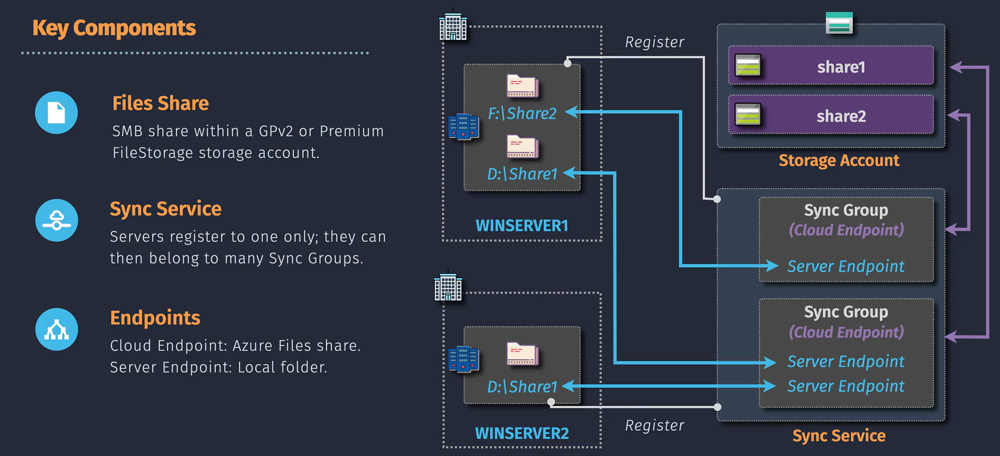
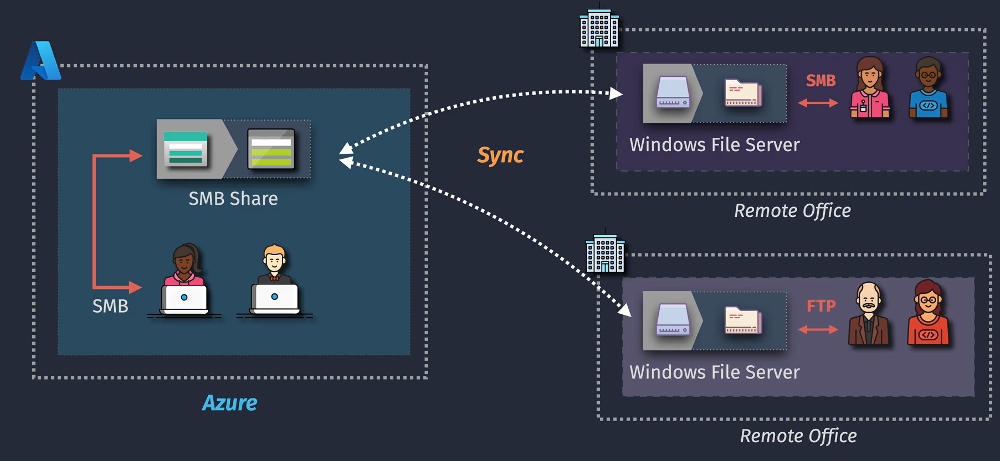

# Azure Storage Access Control

Managing access to your Azure Storage accounts is crucial for ensuring that your data remains secure and is only accessible to authorized users and applications. Azure provides several access control mechanisms to help you manage permissions effectively.





## Table of Contents

1. [What is Azure Storage Access Control?](#what-is-azure-storage-access-control)
2. [Types of Access Control](#types-of-access-control)
   - [1. Azure Role-Based Access Control (RBAC)](#1-azure-role-based-access-control-rbac)
   - [2. Shared Access Signatures (SAS)](#2-shared-access-signatures-sas)
   - [3. Access Keys](#3-access-keys)
3. [Implementing Access Control](#implementing-access-control)
   - [Using Azure Portal](#using-azure-portal)
   - [Using Azure CLI](#using-azure-cli)
4. [Best Practices](#best-practices)
5. [Summary Table](#summary-table)
6. [💡 Key Takeaways](#-key-takeaways)
7. [📌 Final Summary](#-final-summary)

## What is Azure Storage Access Control?

**Azure Storage Access Control** refers to the methods and mechanisms used to manage who can access your Azure Storage resources (such as Blob Storage, File Storage, Queue Storage, and Table Storage) and what actions they can perform. Proper access control ensures that your data is secure and only accessible to authorized users and applications.

## Types of Access Control

Azure offers several ways to control access to your storage accounts:

### 1. Azure Role-Based Access Control (RBAC)


**Azure RBAC** allows you to assign roles to users, groups, or applications to grant specific permissions to Azure resources.

- **Roles:** Define a set of permissions. Common roles include:

  - **Owner:** Full access to all resources.
  - **Contributor:** Can create and manage resources but cannot grant access.
  - **Reader:** Can view existing resources.
  - **Storage Blob Data Contributor:** Can read and write Blob data.
  - **Storage Blob Data Reader:** Can read Blob data.

- **Scopes:** Determine where the roles apply. Scopes can be:
  - **Subscription:** Applies to all resources within a subscription.
  - **Resource Group:** Applies to all resources within a resource group.
  - **Resource:** Applies to a specific resource, like a storage account.

**Use Case:** Granting a developer access to manage Blob Storage without giving them full access to the entire storage account.

### 2. Shared Access Signatures (SAS)


**SAS** provides a way to grant limited access to your storage resources without sharing your account keys.

- **Types of SAS:**

  - **Service SAS:** Grants access to specific services (Blob, File, Queue, Table).
  - **Account SAS:** Grants access to multiple services within a storage account.
  - **User Delegation SAS:** Uses Azure AD credentials for enhanced security.

- **Parameters:** Define what the SAS can access, permissions (read, write, delete), and the time frame for access.

**Use Case:** Allowing a client application to upload files to Blob Storage without exposing your storage account keys.

### 3. Access Keys


**Access Keys** are the primary keys that provide full access to your storage account.

- **Types:**

  - **Primary Key:** Full access to all storage services.
  - **Secondary Key:** Can be used interchangeably with the primary key for redundancy.

- **Usage:** Typically used for administrative tasks or when integrating with applications that require full access.

**Use Case:** Configuring an application that needs to manage all aspects of a storage account.

## Implementing Access Control

You can manage Azure Storage Access Control using various tools:

### Using Azure Portal

1. **Navigate to Storage Account:**

   - Log in to the [Azure Portal](https://portal.azure.com/).
   - Go to **"Storage Accounts"** and select your storage account.

2. **Configure RBAC:**

   - Click on **"Access Control (IAM)"**.
   - Click **"Add role assignment"**.
   - Select the desired role and assign it to a user, group, or application.

3. **Generate SAS:**
   - In the storage account, navigate to **"Shared access signature"**.
   - Configure the permissions, services, and expiry time.
   - Click **"Generate SAS and connection string"**.
   - Use the provided SAS token in your application.

### Using Azure CLI

```bash
# Log in to Azure
az login

# Assign RBAC role
az role assignment create \
  --assignee <UserPrincipalName> \
  --role "Storage Blob Data Contributor" \
  --scope "/subscriptions/<SubscriptionId>/resourceGroups/<ResourceGroup>/providers/Microsoft.Storage/storageAccounts/<StorageAccount>"

# Generate SAS Token
az storage blob generate-sas \
  --account-name <StorageAccount> \
  --container-name <ContainerName> \
  --name <BlobName> \
  --permissions rwdl \
  --expiry $(date -u -d "1 hour" '+%Y-%m-%dT%H:%MZ') \
  --output tsv
```

## Best Practices

1. **Use RBAC Over Access Keys:**

   - Prefer RBAC for managing permissions as it offers more granular control and better security.

2. **Limit SAS Token Permissions and Lifetimes:**

   - Grant only the necessary permissions and set appropriate expiry times to minimize security risks.

3. **Rotate Access Keys Regularly:**

   - If you must use access keys, rotate them regularly to reduce the risk of unauthorized access.

4. **Leverage Azure Key Vault:**

   - Store and manage your SAS tokens and access keys securely using Azure Key Vault.

5. **Monitor and Audit Access:**

   - Use Azure Monitor and Azure Activity Logs to track access and detect any unusual activities.

6. **Implement Network Security:**

   - Restrict access to your storage accounts using Network Security Groups (NSGs) and firewall rules.

7. **Use HTTPS:**
   - Ensure that all access to your storage accounts is done over secure HTTPS connections to protect data in transit.

## Summary Table

| **Feature**     | **Azure RBAC**                                     | **Shared Access Signatures (SAS)**              | **Access Keys**                                           |
| --------------- | -------------------------------------------------- | ----------------------------------------------- | --------------------------------------------------------- |
| **Purpose**     | Assign specific roles to users/groups/applications | Grant limited access to storage resources       | Provide full access to storage account                    |
| **Granularity** | Fine-grained control over permissions              | Controlled permissions with time limits         | Full control without restrictions                         |
| **Security**    | High - uses Azure AD for authentication            | Medium - exposure risk if SAS tokens are leaked | Low - high risk if keys are compromised                   |
| **Management**  | Managed through Azure IAM                          | Managed per resource with specific parameters   | Requires secure storage and regular rotation              |
| **Use Cases**   | Assigning roles like Reader, Contributor           | Temporary access for clients/applications       | Administrative tasks and applications needing full access |
| **Integration** | Seamlessly integrates with Azure services          | Can be used in URLs and APIs                    | Used in application configurations and scripts            |

## 💡 Key Takeaways

1. **Multiple Access Control Options:** Azure provides RBAC, SAS, and Access Keys to manage access to storage resources, each serving different needs and security levels.
2. **Prefer RBAC for Security:** Role-Based Access Control offers the most secure and manageable way to assign permissions, leveraging Azure AD.
3. **Use SAS for Temporary Access:** Shared Access Signatures are ideal for granting limited and time-bound access to storage resources without exposing account keys.
4. **Protect Access Keys:** If you need full access, ensure that Access Keys are stored securely and rotated regularly to minimize security risks.
5. **Implement Best Practices:** Combine RBAC with SAS and Access Keys, enforce HTTPS, restrict network access, and monitor access logs to maintain a secure storage environment.

## 📌 Final Summary

**Azure Storage Access Control** is essential for protecting your data and ensuring that only authorized users and applications can access your storage resources. By understanding and utilizing the different access control mechanisms—**Azure Role-Based Access Control (RBAC)**, **Shared Access Signatures (SAS)**, and **Access Keys**—you can effectively manage permissions, enhance security, and maintain compliance with organizational policies.

**Key Actions:**

- **Implement RBAC:** Assign roles to users and groups based on their needs to ensure the principle of least privilege.
- **Use SAS for Limited Access:** Provide temporary and restricted access to storage resources without exposing sensitive account keys.
- **Secure Access Keys:** If using Access Keys, store them securely, rotate them regularly, and monitor their usage to prevent unauthorized access.
- **Adopt Best Practices:** Enforce HTTPS, restrict network access, monitor and audit access, and leverage Azure Key Vault for managing secrets.
